# Architecture & Components

<cite>
**Referenced Files in This Document**
- [main.jsx](file://src/main.jsx)
- [App.jsx](file://src/App.jsx)
- [portfolioData.js](file://src/data/portfolioData.js)
- [Navbar.jsx](file://src/components/Navbar.jsx)
- [Hero.jsx](file://src/components/Hero.jsx)
- [About.jsx](file://src/components/About.jsx)
- [Skills.jsx](file://src/components/Skills.jsx)
- [Projects.jsx](file://src/components/Projects.jsx)
- [Experience.jsx](file://src/components/Experience.jsx)
- [Certificates.jsx](file://src/components/Certificates.jsx)
- [Contact.jsx](file://src/components/Contact.jsx)
- [Footer.jsx](file://src/components/Footer.jsx)
- [DynamicBackground.jsx](file://src/components/DynamicBackground.jsx)
- [emailjs.js](file://src/config/emailjs.js)
- [package.json](file://package.json)
</cite>

## Table of Contents
1. Introduction
2. Project Structure
3. Core Components
4. Architecture Overview
5. Detailed Component Analysis
6. Dependency Analysis
7. Performance Considerations
8. Troubleshooting Guide
9. Conclusion

## Introduction
This document describes the architecture and component design of a React portfolio application built with Vite and Tailwind CSS. It explains how the root application composes page sections, how state is managed using React hooks, and how data flows from a centralized data module into UI components. It also documents the theme system, responsive design patterns, and performance considerations such as canvas-based animations, intersection observers, and memoization.

## Project Structure
The application follows a feature-oriented layout:
- Entry point renders the root App inside React StrictMode.
- App orchestrates top-level state (theme), global background, navigation, and page sections.
- Each section is a self-contained component that imports shared static data from a single data module.
- Styling uses Tailwind utility classes and CSS custom properties for theming.
- External integrations include EmailJS for contact form delivery and canvas-confetti for success feedback.

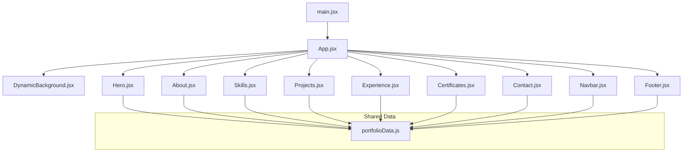

**Diagram sources**
- [main.jsx:1-11](file://src/main.jsx#L1-L11)
- [App.jsx:1-51](file://src/App.jsx#L1-L51)
- [portfolioData.js:1-800](file://src/data/portfolioData.js#L1-L800)

**Section sources**
- [main.jsx:1-11](file://src/main.jsx#L1-L11)
- [App.jsx:1-51](file://src/App.jsx#L1-L51)
- [package.json:1-30](file://package.json#L1-L30)

## Core Components
- Root composition: App mounts all sections and manages global theme state persisted to localStorage.
- Theme system: App sets a data-theme attribute on the document element; components consume CSS variables derived from this theme.
- Centralized data: All content modules export plain JavaScript objects and arrays consumed by components via direct imports.
- Section components: Hero, About, Skills, Projects, Experience, Certificates, Contact, Footer each render a dedicated section and manage local UI state (filters, modals, search).
- Background: DynamicBackground provides an animated canvas backdrop with per-section color palettes and mouse interactions.
- Contact integration: Contact uses EmailJS to send messages and displays toast notifications and confetti on success.

Key responsibilities:
- Navbar: scroll-aware active section highlighting, mobile menu, theme toggle passthrough.
- Hero: dynamic tagline typing effect, social links, quick stats.
- About: education timeline and profile snapshot.
- Skills: category tabs and skill meters.
- Projects: filtering, modal details, interactive architecture simulator.
- Certificates: category filters, search, animated counters, PDF/image viewer modal.
- Contact: form validation, EmailJS submission, copy-to-clipboard utilities.
- Footer: quick navigation, social links, certificate bundle download.

**Section sources**
- [App.jsx:14-49](file://src/App.jsx#L14-L49)
- [Navbar.jsx:1-163](file://src/components/Navbar.jsx#L1-L163)
- [Hero.jsx:1-245](file://src/components/Hero.jsx#L1-L245)
- [About.jsx:1-162](file://src/components/About.jsx#L1-L162)
- [Skills.jsx:1-152](file://src/components/Skills.jsx#L1-L152)
- [Projects.jsx:1-260](file://src/components/Projects.jsx#L1-L260)
- [Experience.jsx:1-84](file://src/components/Experience.jsx#L1-L84)
- [Certificates.jsx:1-597](file://src/components/Certificates.jsx#L1-L597)
- [Contact.jsx:1-373](file://src/components/Contact.jsx#L1-L373)
- [Footer.jsx:1-144](file://src/components/Footer.jsx#L1-L144)
- [DynamicBackground.jsx:1-341](file://src/components/DynamicBackground.jsx#L1-L341)
- [emailjs.js](file://src/config/emailjs.js)

## Architecture Overview
The app uses a unidirectional data flow:
- Static data lives in portfolioData.js and is imported directly by components.
- App holds global theme state and passes it down where needed (e.g., Navbar).
- Sections are independent presentational units with their own local state for interactivity.
- Side effects (EmailJS, canvas animation, IntersectionObserver) are encapsulated within components.

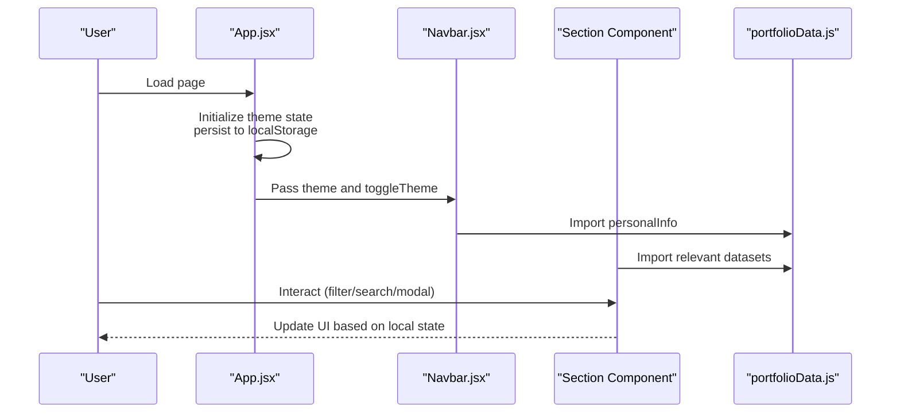

**Diagram sources**
- [App.jsx:14-49](file://src/App.jsx#L14-L49)
- [Navbar.jsx:1-163](file://src/components/Navbar.jsx#L1-L163)
- [portfolioData.js:1-800](file://src/data/portfolioData.js#L1-L800)

## Detailed Component Analysis

### Application Shell and Theme Management
- App initializes theme from localStorage or defaults to dark.
- On mount and theme change, it sets document.documentElement data-theme and persists the value.
- Renders a layered structure: DynamicBackground behind a relative foreground containing Navbar, main sections, Footer, and BackgroundMusic.

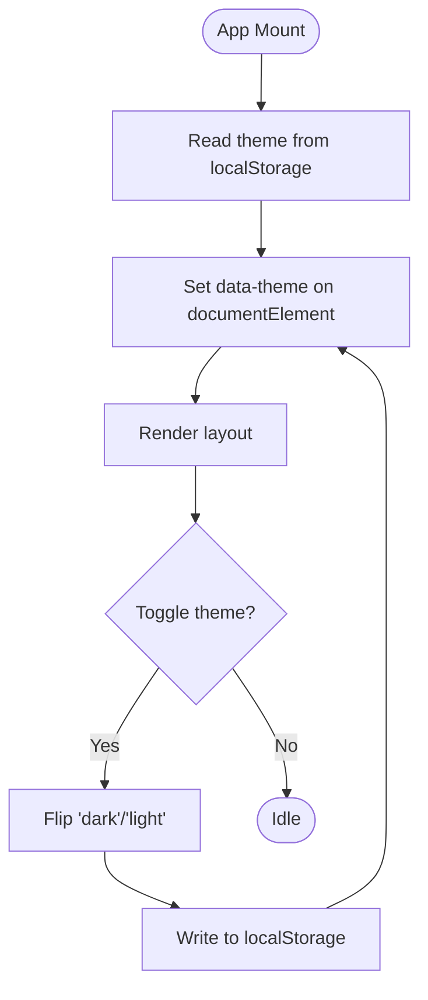

**Diagram sources**
- [App.jsx:14-26](file://src/App.jsx#L14-L26)

**Section sources**
- [App.jsx:14-49](file://src/App.jsx#L14-L49)

### Navigation and Active Section Tracking
- Navbar tracks scroll position to highlight the current section and toggles mobile menu visibility.
- Uses a fixed header with glass morphism styling and adapts appearance on scroll.
- Theme toggle button delegates to App’s toggleTheme.

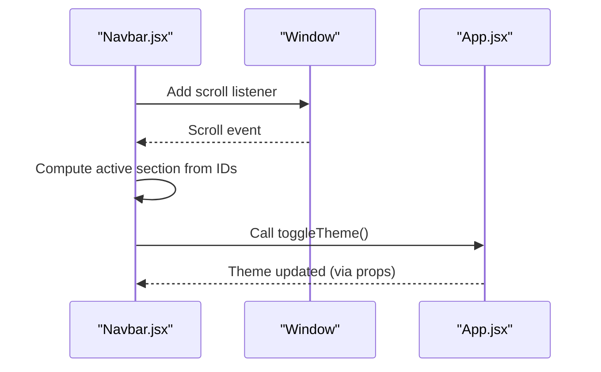

**Diagram sources**
- [Navbar.jsx:11-38](file://src/components/Navbar.jsx#L11-L38)
- [Navbar.jsx:88-125](file://src/components/Navbar.jsx#L88-L125)
- [App.jsx:24-26](file://src/App.jsx#L24-L26)

**Section sources**
- [Navbar.jsx:1-163](file://src/components/Navbar.jsx#L1-L163)

### Hero Section
- Displays name, role, and a typing effect cycling through taglines sourced from personalInfo.
- Provides CTAs and social links; includes a profile card with quick stats.

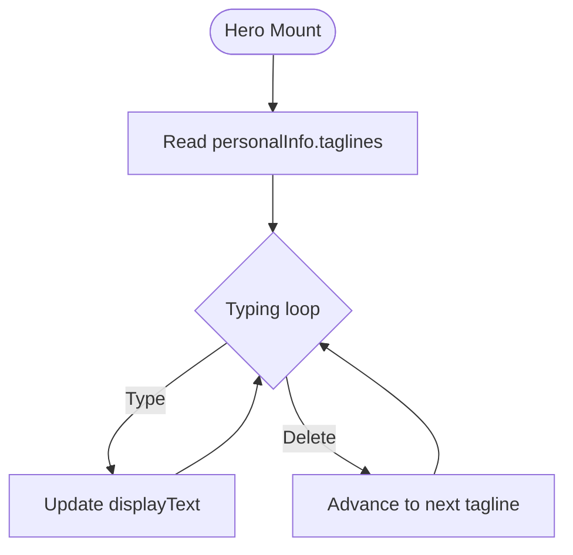

**Diagram sources**
- [Hero.jsx:17-42](file://src/components/Hero.jsx#L17-L42)
- [portfolioData.js:1-25](file://src/data/portfolioData.js#L1-L25)

**Section sources**
- [Hero.jsx:1-245](file://src/components/Hero.jsx#L1-L245)

### About Section
- Renders an academic timeline using educationData and a profile snapshot from personalInfo.
- Highlights creative interests with icon cards.

**Section sources**
- [About.jsx:1-162](file://src/components/About.jsx#L1-L162)
- [portfolioData.js:27-55](file://src/data/portfolioData.js#L27-L55)

### Skills Section
- Implements category tabs to filter skillsCategoryData.
- Displays skill levels with animated progress bars and tags.

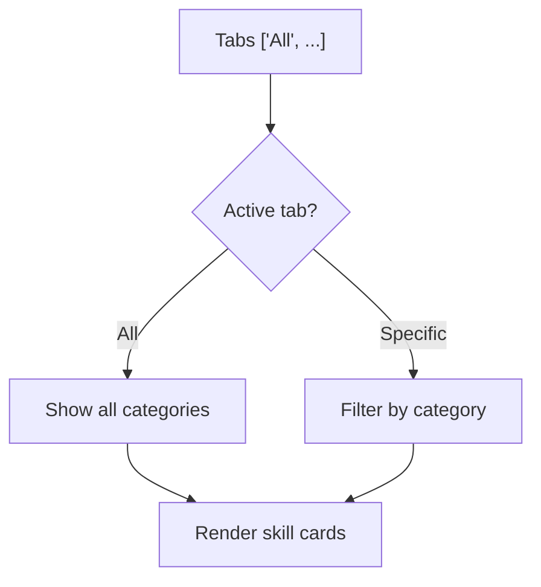

**Diagram sources**
- [Skills.jsx:36-44](file://src/components/Skills.jsx#L36-L44)
- [portfolioData.js:57-99](file://src/data/portfolioData.js#L57-L99)

**Section sources**
- [Skills.jsx:1-152](file://src/components/Skills.jsx#L1-L152)

### Projects Section
- Filters projects by category and opens a modal with detailed view.
- Includes an interactive simulation for one project’s architecture workflow.

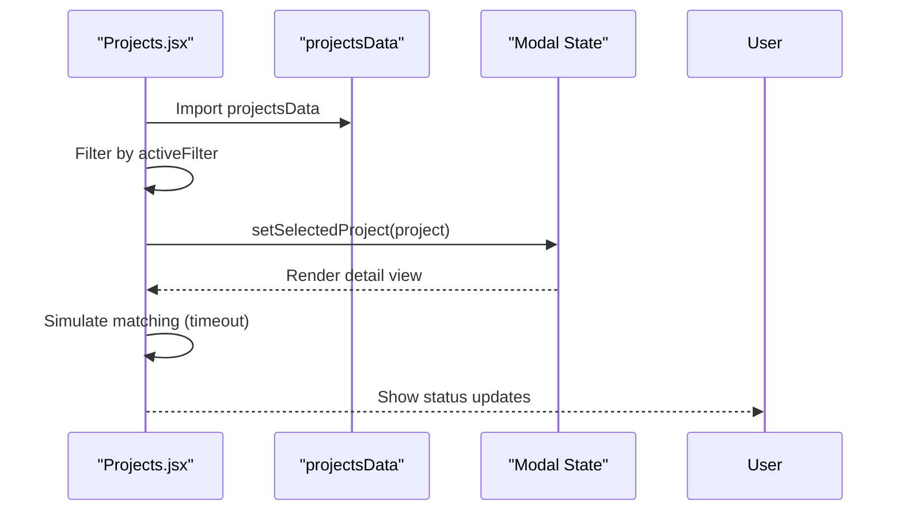

**Diagram sources**
- [Projects.jsx:18-38](file://src/components/Projects.jsx#L18-L38)
- [Projects.jsx:75-147](file://src/components/Projects.jsx#L75-L147)
- [Projects.jsx:149-254](file://src/components/Projects.jsx#L149-L254)
- [portfolioData.js:101-257](file://src/data/portfolioData.js#L101-L257)

**Section sources**
- [Projects.jsx:1-260](file://src/components/Projects.jsx#L1-L260)

### Experience Section
- Presents internship experience with role, duration, location, and responsibilities.

**Section sources**
- [Experience.jsx:1-84](file://src/components/Experience.jsx#L1-L84)
- [portfolioData.js:259-273](file://src/data/portfolioData.js#L259-L273)

### Certificates Section
- Computes categories with counts, filters by category and search query, and animates counters when visible.
- Uses IntersectionObserver to reveal cards and trigger stats.
- Supports viewing certificates inline (PDF iframe or image) and downloading assets.

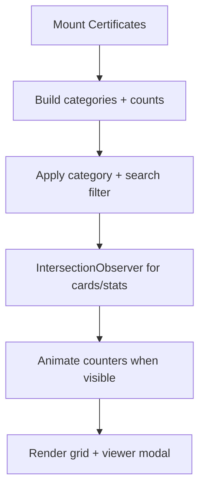

**Diagram sources**
- [Certificates.jsx:149-187](file://src/components/Certificates.jsx#L149-L187)
- [Certificates.jsx:189-219](file://src/components/Certificates.jsx#L189-L219)
- [Certificates.jsx:348-450](file://src/components/Certificates.jsx#L348-L450)
- [Certificates.jsx:503-593](file://src/components/Certificates.jsx#L503-L593)
- [portfolioData.js:275-800](file://src/data/portfolioData.js#L275-L800)

**Section sources**
- [Certificates.jsx:1-597](file://src/components/Certificates.jsx#L1-L597)

### Contact Section
- Validates form inputs, calls EmailJS to send messages, shows toast notifications, and triggers confetti on success.
- Provides copy-to-clipboard for email and phone, and a guide modal for EmailJS configuration.

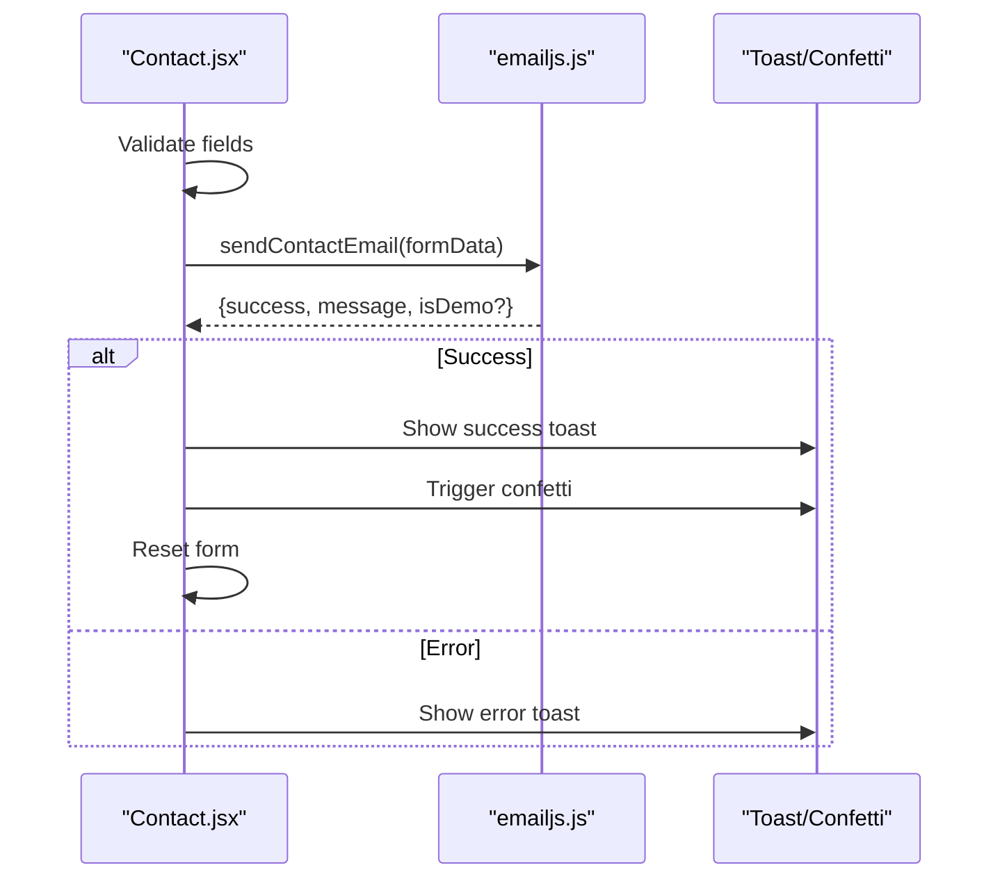

**Diagram sources**
- [Contact.jsx:20-93](file://src/components/Contact.jsx#L20-L93)
- [emailjs.js](file://src/config/emailjs.js)

**Section sources**
- [Contact.jsx:1-373](file://src/components/Contact.jsx#L1-L373)

### Footer
- Quick navigation links, social icons, and a downloadable certificate bundle link.

**Section sources**
- [Footer.jsx:1-144](file://src/components/Footer.jsx#L1-L144)

### Dynamic Background
- Observes sections to switch color palettes and smoothly interpolates between them.
- Renders particles, fireflies, shooting stars, aurora bands, and click bursts on a canvas.
- Responds to mouse movement with particle repulsion and beam effects.

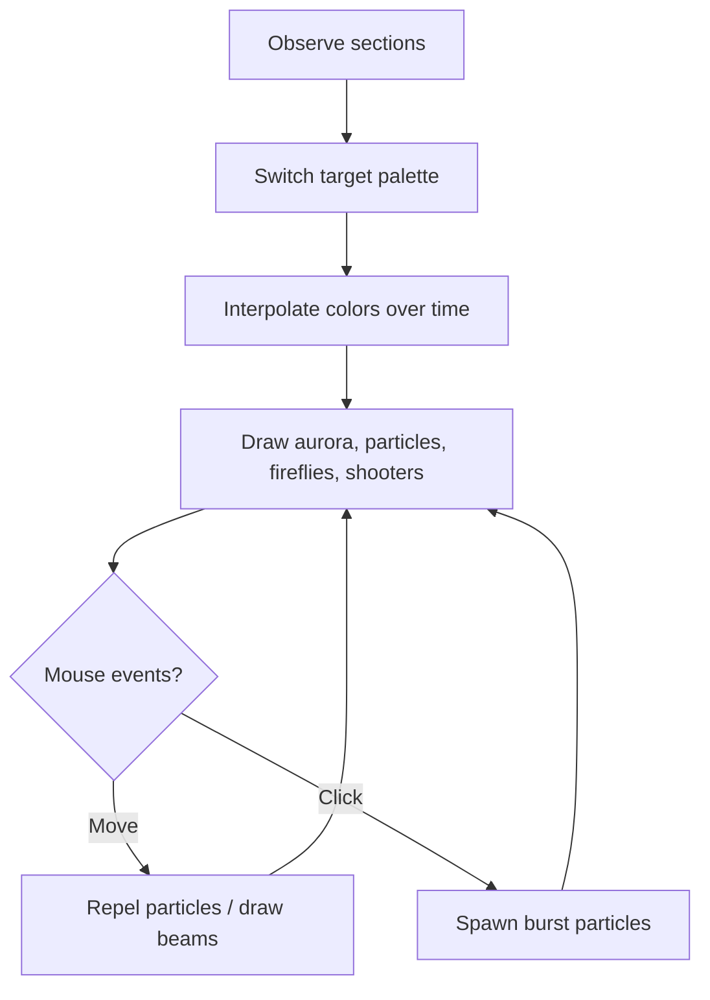

**Diagram sources**
- [DynamicBackground.jsx:39-59](file://src/components/DynamicBackground.jsx#L39-L59)
- [DynamicBackground.jsx:61-313](file://src/components/DynamicBackground.jsx#L61-L313)

**Section sources**
- [DynamicBackground.jsx:1-341](file://src/components/DynamicBackground.jsx#L1-L341)

## Dependency Analysis
- Data dependency: All sections import from portfolioData.js, creating a single source of truth for content.
- UI dependencies: Components rely on Tailwind classes and CSS custom properties for consistent theming.
- External libraries: lucide-react for icons, canvas-confetti for celebrations, @emailjs/browser for email delivery.
- Build tooling: Vite for dev/build, PostCSS/Autoprefixer, Tailwind for styling, Oxlint for linting.

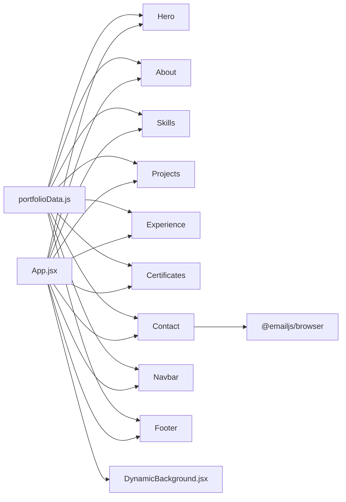

**Diagram sources**
- [App.jsx:1-51](file://src/App.jsx#L1-L51)
- [portfolioData.js:1-800](file://src/data/portfolioData.js#L1-L800)
- [package.json:12-28](file://package.json#L12-L28)

**Section sources**
- [package.json:1-30](file://package.json#L1-L30)

## Performance Considerations
- Canvas rendering: DynamicBackground uses requestAnimationFrame and limits particle counts based on viewport width to balance visuals and performance.
- Observers: IntersectionObserver is used to animate stats and reveal cards only when visible, reducing unnecessary work.
- Memoization: Certificates computes categories, filtered lists, and unique provider counts with useMemo to avoid recomputation on re-renders.
- Local state: Each section manages its own UI state (filters, modals, search), minimizing cross-component state complexity.
- Theme persistence: Theme stored in localStorage avoids repeated initialization logic and ensures consistent UX across reloads.
- Asset loading: Certificate viewer supports both images and PDFs; large PDFs should be optimized for faster preview.

[No sources needed since this section provides general guidance]

## Troubleshooting Guide
- Theme not applying: Ensure App sets data-theme on documentElement and that CSS variables are defined for both themes. Verify localStorage contains a valid key.
- EmailJS not sending: Confirm EMAILJS_CONFIG values are set in src/config/emailjs.js and that service/template/public keys are correct. Check browser console for errors and network requests.
- Certificates viewer blank: For PDFs, some browsers may block inline previews; use the download or open-in-new-tab options. For images, verify file paths exist under public/certificates.
- Mobile menu not closing: Ensure mobile menu state is toggled correctly and that link clicks reset the state.
- Active section not updating: Verify each section has a matching id and that Navbar’s scroll handler runs without errors.

**Section sources**
- [App.jsx:14-26](file://src/App.jsx#L14-L26)
- [Contact.jsx:43-93](file://src/components/Contact.jsx#L43-L93)
- [Certificates.jsx:503-593](file://src/components/Certificates.jsx#L503-L593)
- [Navbar.jsx:11-38](file://src/components/Navbar.jsx#L11-L38)

## Conclusion
This portfolio application demonstrates a clean, component-driven architecture with centralized static data and localized UI state. The theme system leverages CSS custom properties and a document-level attribute for consistent styling. Responsive design is achieved through Tailwind utilities, while performance is maintained via canvas optimizations, observers, and memoization. Integrations like EmailJS and canvas-confetti enhance user experience without complicating the core architecture.