# Component Hierarchy & Structure

<cite>
**Referenced Files in This Document**
- [main.jsx](file://src/main.jsx)
- [App.jsx](file://src/App.jsx)
- [Navbar.jsx](file://src/components/Navbar.jsx)
- [Hero.jsx](file://src/components/Hero.jsx)
- [About.jsx](file://src/components/About.jsx)
- [Skills.jsx](file://src/components/Skills.jsx)
- [Projects.jsx](file://src/components/Projects.jsx)
- [Experience.jsx](file://src/components/Experience.jsx)
- [Certificates.jsx](file://src/components/Certificates.jsx)
- [Contact.jsx](file://src/components/Contact.jsx)
- [Footer.jsx](file://src/components/Footer.jsx)
- [DynamicBackground.jsx](file://src/components/DynamicBackground.jsx)
- [BackgroundMusic.jsx](file://src/components/BackgroundMusic.jsx)
- [BrandIcons.jsx](file://src/components/BrandIcons.jsx)
- [GokulLogo.jsx](file://src/components/GokulLogo.jsx)
- [portfolioData.js](file://src/data/portfolioData.js)
- [emailjs.js](file://src/config/emailjs.js)
</cite>

## Table of Contents
1. Introduction
2. Project Structure
3. Core Components
4. Architecture Overview
5. Detailed Component Analysis
6. Dependency Analysis
7. Performance Considerations
8. Troubleshooting Guide
9. Conclusion

## Introduction
This document explains the React component hierarchy and structure for the portfolio application. It focuses on how the root App component orchestrates child sections, how data flows via props and shared data modules, and how to integrate new components consistently. The goal is to make the architecture clear for both technical and non-technical readers.

## Project Structure
The application is a single-page React app built with Vite. The entry point renders the root App component, which composes all visible sections as children. Data is centralized in a data module and consumed by components. Shared UI utilities (icons, logos) live under components.

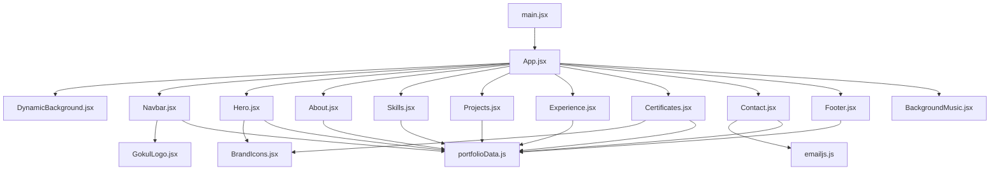

**Diagram sources**
- [main.jsx:1-11](file://src/main.jsx#L1-L11)
- [App.jsx:1-51](file://src/App.jsx#L1-L51)
- [Navbar.jsx:1-163](file://src/components/Navbar.jsx#L1-L163)
- [Hero.jsx:1-245](file://src/components/Hero.jsx#L1-L245)
- [About.jsx:1-162](file://src/components/About.jsx#L1-L162)
- [Skills.jsx:1-152](file://src/components/Skills.jsx#L1-L152)
- [Projects.jsx:1-260](file://src/components/Projects.jsx#L1-L260)
- [Experience.jsx:1-84](file://src/components/Experience.jsx#L1-L84)
- [Certificates.jsx:1-597](file://src/components/Certificates.jsx#L1-L597)
- [Contact.jsx:1-373](file://src/components/Contact.jsx#L1-L373)
- [Footer.jsx:1-144](file://src/components/Footer.jsx#L1-L144)
- [DynamicBackground.jsx:1-200](file://src/components/DynamicBackground.jsx#L1-L200)
- [BackgroundMusic.jsx:1-200](file://src/components/BackgroundMusic.jsx#L1-L200)
- [BrandIcons.jsx:1-200](file://src/components/BrandIcons.jsx#L1-L200)
- [GokulLogo.jsx:1-200](file://src/components/GokulLogo.jsx#L1-L200)
- [portfolioData.js:1-1123](file://src/data/portfolioData.js#L1-L1123)
- [emailjs.js:1-200](file://src/config/emailjs.js#L1-L200)

**Section sources**
- [main.jsx:1-11](file://src/main.jsx#L1-L11)
- [App.jsx:1-51](file://src/App.jsx#L1-L51)

## Core Components
- Root container: App manages global theme state and composes the page layout.
- Navigation: Navbar handles scroll-aware styling, active section detection, mobile menu, and theme toggle.
- Sections: Hero, About, Skills, Projects, Experience, Certificates, Contact present content and user interactions.
- Utilities: DynamicBackground provides animated background; BackgroundMusic adds audio; BrandIcons and GokulLogo are reusable visual assets.
- Data: portfolioData centralizes content used across sections.
- Integration: Contact uses emailjs for form submission.

Key responsibilities:
- App: Theme persistence, layout orchestration, passing theme/toggleTheme to Navbar.
- Navbar: Scroll effects, active link highlighting, responsive navigation, theme toggle.
- Hero: Typing animation, social links, CTAs, profile highlights.
- About: Education timeline, personal summary, hobbies grid.
- Skills: Category tabs, skill cards with progress bars.
- Projects: Filtering, modal details, interactive simulation for specific projects.
- Experience: Internship/work entries with responsibilities.
- Certificates: Search, category filters, animated stats, PDF/image viewer modal.
- Contact: Form validation, EmailJS integration, toast notifications, copy-to-clipboard.
- Footer: Quick nav, contact info, social links, back-to-top.

**Section sources**
- [App.jsx:14-49](file://src/App.jsx#L14-L49)
- [Navbar.jsx:6-163](file://src/components/Navbar.jsx#L6-L163)
- [Hero.jsx:16-245](file://src/components/Hero.jsx#L16-L245)
- [About.jsx:18-162](file://src/components/About.jsx#L18-L162)
- [Skills.jsx:36-152](file://src/components/Skills.jsx#L36-L152)
- [Projects.jsx:18-260](file://src/components/Projects.jsx#L18-L260)
- [Experience.jsx:10-84](file://src/components/Experience.jsx#L10-L84)
- [Certificates.jsx:139-597](file://src/components/Certificates.jsx#L139-L597)
- [Contact.jsx:20-373](file://src/components/Contact.jsx#L20-L373)
- [Footer.jsx:7-144](file://src/components/Footer.jsx#L7-L144)

## Architecture Overview
The application follows a unidirectional data flow:
- App holds theme state and passes it down to Navbar.
- Sections read from portfolioData for content.
- User interactions remain local to each component (e.g., filtering, modals).
- External integrations (EmailJS) are encapsulated within Contact.

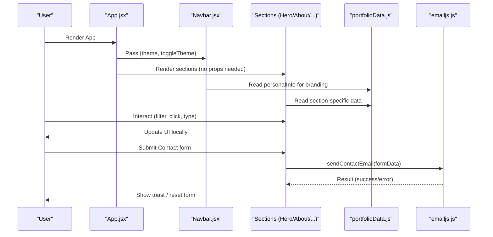

**Diagram sources**
- [App.jsx:14-49](file://src/App.jsx#L14-L49)
- [Navbar.jsx:6-163](file://src/components/Navbar.jsx#L6-L163)
- [Hero.jsx:16-245](file://src/components/Hero.jsx#L16-L245)
- [About.jsx:18-162](file://src/components/About.jsx#L18-L162)
- [Skills.jsx:36-152](file://src/components/Skills.jsx#L36-L152)
- [Projects.jsx:18-260](file://src/components/Projects.jsx#L18-L260)
- [Experience.jsx:10-84](file://src/components/Experience.jsx#L10-L84)
- [Certificates.jsx:139-597](file://src/components/Certificates.jsx#L139-L597)
- [Contact.jsx:20-373](file://src/components/Contact.jsx#L20-L373)
- [portfolioData.js:1-1123](file://src/data/portfolioData.js#L1-L1123)
- [emailjs.js:1-200](file://src/config/emailjs.js#L1-L200)

## Detailed Component Analysis

### Root Container: App.jsx
- Responsibilities:
  - Manages theme state persisted to localStorage.
  - Applies theme attribute to document element.
  - Composes layout: DynamicBackground, Navbar, main sections, Footer, BackgroundMusic.
  - Provides theme and toggleTheme to Navbar.
- Prop patterns:
  - Passes theme and toggleTheme to Navbar only.
  - Other sections receive no props; they consume shared data directly.
- Composition strategy:
  - Flat composition of top-level sections inside <main>.
  - Global background and music are siblings to content.

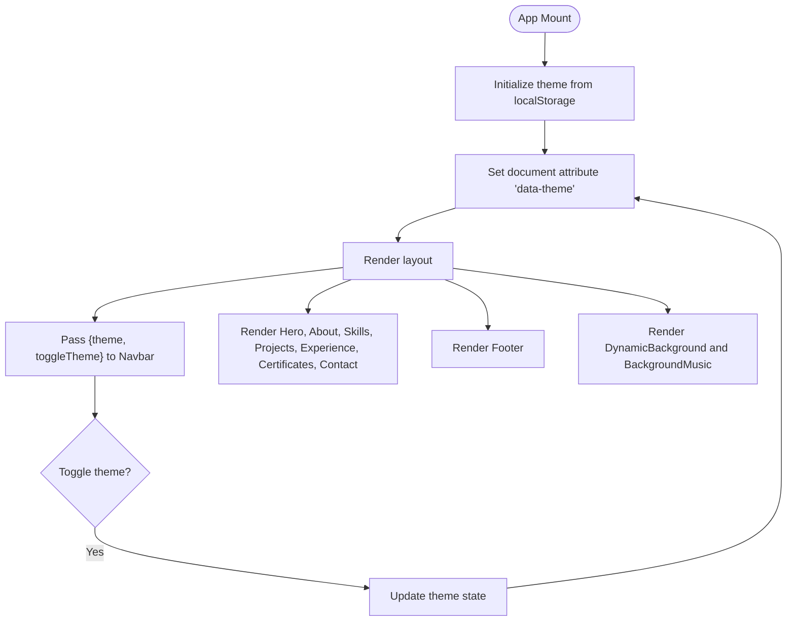

**Diagram sources**
- [App.jsx:14-49](file://src/App.jsx#L14-L49)

**Section sources**
- [App.jsx:14-49](file://src/App.jsx#L14-L49)

### Navigation: Navbar.jsx
- Responsibilities:
  - Detects scroll position to apply glassmorphism and highlight active section.
  - Renders desktop and mobile navigation with smooth anchor links.
  - Exposes theme toggle button that calls parent-provided toggleTheme.
- Props:
  - theme: string ('dark' | 'light')
  - toggleTheme: function to switch theme
- State:
  - scrolled: boolean for header style
  - mobileMenuOpen: boolean for mobile drawer
  - activeSection: string for current section highlight

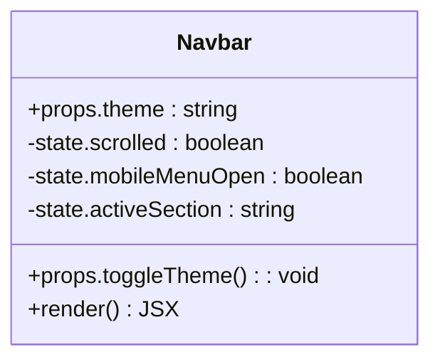

**Diagram sources**
- [Navbar.jsx:6-163](file://src/components/Navbar.jsx#L6-L163)

**Section sources**
- [Navbar.jsx:6-163](file://src/components/Navbar.jsx#L6-L163)

### Hero Section: Hero.jsx
- Responsibilities:
  - Displays name, taglines with typing effect, short bio, CTAs, and social links.
  - Uses BrandIcons for platform icons and GokulLogo for avatar.
  - Reads personalInfo from portfolioData.
- State:
  - taglineIndex, displayText, isDeleting for typing animation.
- Data source:
  - personalInfo for links and text.

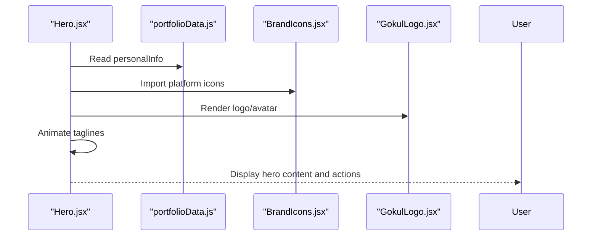

**Diagram sources**
- [Hero.jsx:16-245](file://src/components/Hero.jsx#L16-L245)
- [BrandIcons.jsx:1-200](file://src/components/BrandIcons.jsx#L1-L200)
- [GokulLogo.jsx:1-200](file://src/components/GokulLogo.jsx#L1-L200)
- [portfolioData.js:1-1123](file://src/data/portfolioData.js#L1-L1123)

**Section sources**
- [Hero.jsx:16-245](file://src/components/Hero.jsx#L16-L245)

### About Section: About.jsx
- Responsibilities:
  - Presents education timeline and personal summary.
  - Shows creative interests with icons and descriptions.
- Data source:
  - personalInfo.summary and languages
  - educationData array

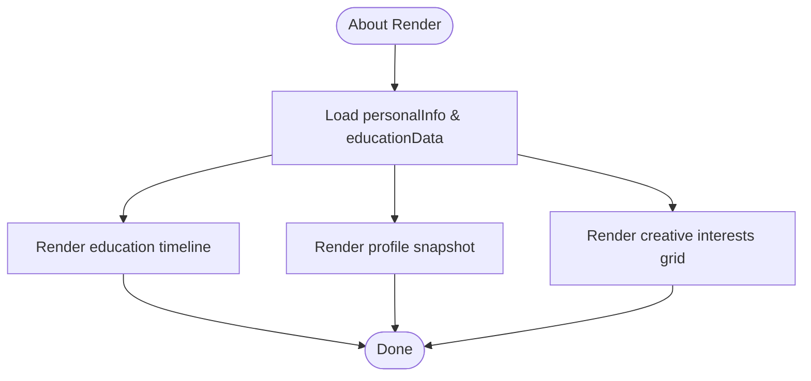

**Diagram sources**
- [About.jsx:18-162](file://src/components/About.jsx#L18-L162)
- [portfolioData.js:1-1123](file://src/data/portfolioData.js#L1-L1123)

**Section sources**
- [About.jsx:18-162](file://src/components/About.jsx#L18-L162)

### Skills Section: Skills.jsx
- Responsibilities:
  - Filters skills by category using tabs.
  - Renders skill cards with animated progress bars.
- Data source:
  - skillsCategoryData from portfolioData.
- State:
  - activeTab controls filtered view.

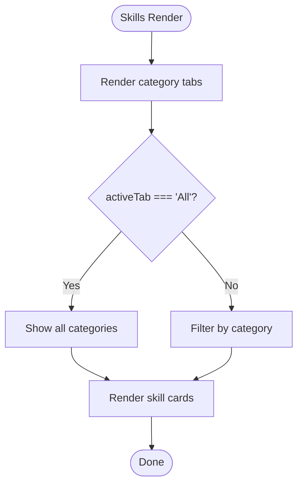

**Diagram sources**
- [Skills.jsx:36-152](file://src/components/Skills.jsx#L36-L152)
- [portfolioData.js:1-1123](file://src/data/portfolioData.js#L1-L1123)

**Section sources**
- [Skills.jsx:36-152](file://src/components/Skills.jsx#L36-L152)

### Projects Section: Projects.jsx
- Responsibilities:
  - Filters projects by category.
  - Opens modal with detailed project information.
  - Includes an interactive simulator for specific project architectures.
- Data source:
  - projectsData from portfolioData.
- State:
  - activeFilter, selectedProject, simulatedMatch, matchStatus.

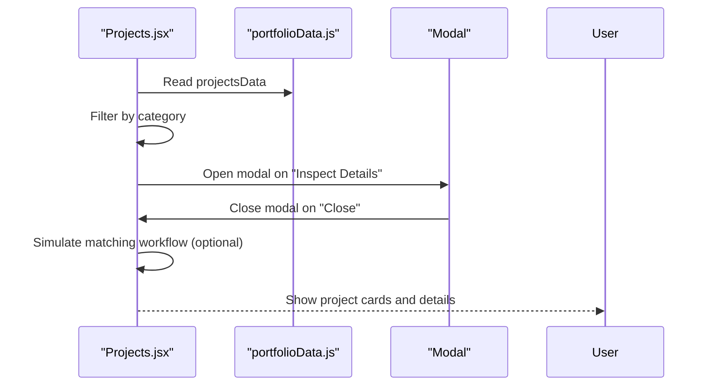

**Diagram sources**
- [Projects.jsx:18-260](file://src/components/Projects.jsx#L18-L260)
- [portfolioData.js:1-1123](file://src/data/portfolioData.js#L1-L1123)

**Section sources**
- [Projects.jsx:18-260](file://src/components/Projects.jsx#L18-L260)

### Experience Section: Experience.jsx
- Responsibilities:
  - Displays work/internship experience with roles, durations, locations, and responsibilities.
- Data source:
  - experienceData from portfolioData.

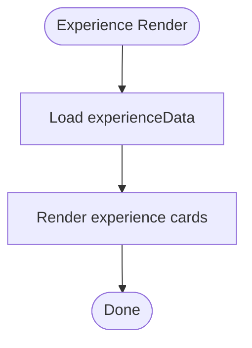

**Diagram sources**
- [Experience.jsx:10-84](file://src/components/Experience.jsx#L10-L84)
- [portfolioData.js:1-1123](file://src/data/portfolioData.js#L1-L1123)

**Section sources**
- [Experience.jsx:10-84](file://src/components/Experience.jsx#L10-L84)

### Certificates Section: Certificates.jsx
- Responsibilities:
  - Provides search and category filtering for certificates.
  - Animated statistics with IntersectionObserver.
  - 3D tilt card effects and full-screen viewer for images/PDFs.
  - Download all certificates bundle.
- Data source:
  - certificationsData and personalInfo from portfolioData.
- State:
  - activeCategory, viewerCert, searchQuery, visibleCards, statsVisible.

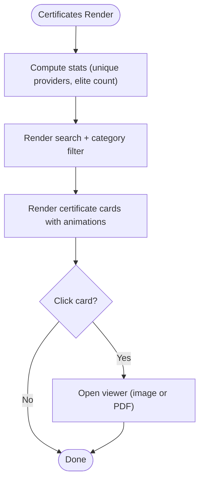

**Diagram sources**
- [Certificates.jsx:139-597](file://src/components/Certificates.jsx#L139-L597)
- [portfolioData.js:1-1123](file://src/data/portfolioData.js#L1-L1123)

**Section sources**
- [Certificates.jsx:139-597](file://src/components/Certificates.jsx#L139-L597)

### Contact Section: Contact.jsx
- Responsibilities:
  - Validates form inputs and submits via EmailJS.
  - Shows success/error toasts and optional confetti celebration.
  - Provides direct contact info and social links.
  - Offers a guide modal for EmailJS configuration.
- Integration:
  - Uses sendContactEmail from emailjs.js.
- State:
  - formData, loading, toast, copiedField, showConfigModal.

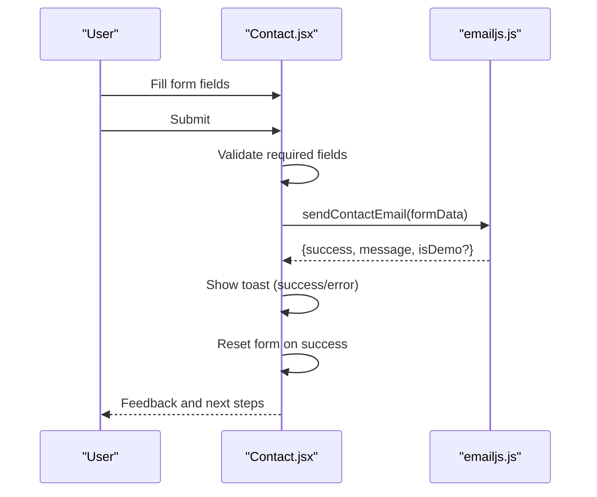

**Diagram sources**
- [Contact.jsx:20-373](file://src/components/Contact.jsx#L20-L373)
- [emailjs.js:1-200](file://src/config/emailjs.js#L1-L200)

**Section sources**
- [Contact.jsx:20-373](file://src/components/Contact.jsx#L20-L373)

### Footer: Footer.jsx
- Responsibilities:
  - Quick navigation links, contact info, social links, and back-to-top.
  - Certificate bundle download link.
- Data source:
  - personalInfo for links and name.

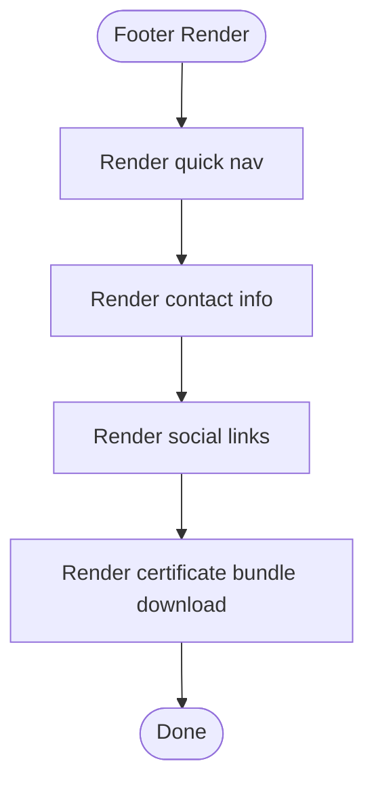

**Diagram sources**
- [Footer.jsx:7-144](file://src/components/Footer.jsx#L7-L144)
- [portfolioData.js:1-1123](file://src/data/portfolioData.js#L1-L1123)

**Section sources**
- [Footer.jsx:7-144](file://src/components/Footer.jsx#L7-L144)

## Dependency Analysis
- Centralized data: All sections import from portfolioData.js, ensuring consistency and easy updates.
- Shared UI: BrandIcons and GokulLogo are reused across multiple components to maintain brand consistency.
- External services: Contact integrates with emailjs.js for sending messages without a backend.
- Theme propagation: Only App and Navbar share theme state; other components remain theme-agnostic via CSS variables.

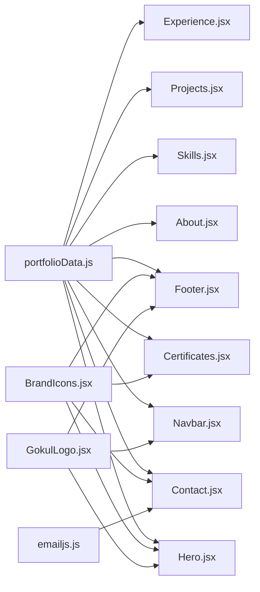

**Diagram sources**
- [portfolioData.js:1-1123](file://src/data/portfolioData.js#L1-L1123)
- [BrandIcons.jsx:1-200](file://src/components/BrandIcons.jsx#L1-L200)
- [GokulLogo.jsx:1-200](file://src/components/GokulLogo.jsx#L1-L200)
- [emailjs.js:1-200](file://src/config/emailjs.js#L1-L200)
- [Navbar.jsx:1-163](file://src/components/Navbar.jsx#L1-L163)
- [Hero.jsx:1-245](file://src/components/Hero.jsx#L1-L245)
- [About.jsx:1-162](file://src/components/About.jsx#L1-L162)
- [Skills.jsx:1-152](file://src/components/Skills.jsx#L1-L152)
- [Projects.jsx:1-260](file://src/components/Projects.jsx#L1-L260)
- [Experience.jsx:1-84](file://src/components/Experience.jsx#L1-L84)
- [Certificates.jsx:1-597](file://src/components/Certificates.jsx#L1-L597)
- [Contact.jsx:1-373](file://src/components/Contact.jsx#L1-L373)
- [Footer.jsx:1-144](file://src/components/Footer.jsx#L1-L144)

**Section sources**
- [portfolioData.js:1-1123](file://src/data/portfolioData.js#L1-L1123)
- [BrandIcons.jsx:1-200](file://src/components/BrandIcons.jsx#L1-L200)
- [GokulLogo.jsx:1-200](file://src/components/GokulLogo.jsx#L1-L200)
- [emailjs.js:1-200](file://src/config/emailjs.js#L1-L200)

## Performance Considerations
- Local state per section: Each section manages its own UI state (filters, modals), minimizing re-renders at the root level.
- Memoization: Certificates uses useMemo for computed categories and filtered lists to avoid unnecessary recalculations.
- Observers: IntersectionObserver triggers animations and counters only when sections enter viewport.
- Efficient rendering: Lists use stable keys (ids) to optimize diffing.
- Asset reuse: Icons and logos are imported once and reused across components.

[No sources needed since this section provides general guidance]

## Troubleshooting Guide
- Theme not persisting:
  - Ensure localStorage is accessible and the key matches exactly.
  - Verify document.documentElement attribute is set correctly.
- Active section not highlighting:
  - Check that each section has the correct id attribute matching Navbar’s expected ids.
  - Confirm scroll event listener is attached and offsets are calculated correctly.
- Contact form not sending:
  - Validate required fields before submission.
  - Ensure EmailJS keys are configured in emailjs.js and service/template IDs are correct.
  - Inspect network requests and console errors for failures.
- Certificates viewer not opening:
  - Verify fileUrl paths exist and are accessible.
  - For PDFs, ensure browser supports inline viewing; provide download fallback.

**Section sources**
- [App.jsx:14-49](file://src/App.jsx#L14-L49)
- [Navbar.jsx:11-38](file://src/components/Navbar.jsx#L11-L38)
- [Contact.jsx:43-93](file://src/components/Contact.jsx#L43-L93)
- [Certificates.jsx:503-593](file://src/components/Certificates.jsx#L503-L593)

## Conclusion
The portfolio application follows a clean, modular React architecture with a single root component orchestrating layout and global theme. Data is centralized and consumed by sections, while user interactions remain localized. Reusable assets and consistent prop patterns simplify maintenance and extension. To add new components:
- Create a new component under src/components.
- If it displays content, import relevant data from portfolioData.js.
- Compose it within App.jsx alongside existing sections.
- Follow existing patterns for state management, filtering, and modals.
- Use BrandIcons and GokulLogo for consistent visuals.

[No sources needed since this section summarizes without analyzing specific files]