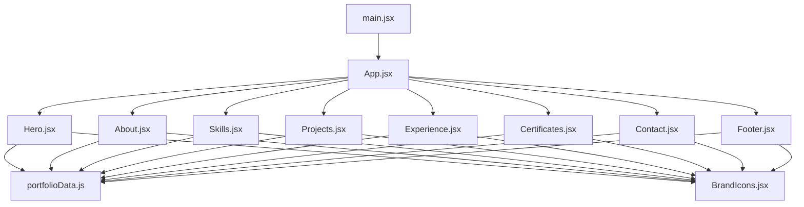
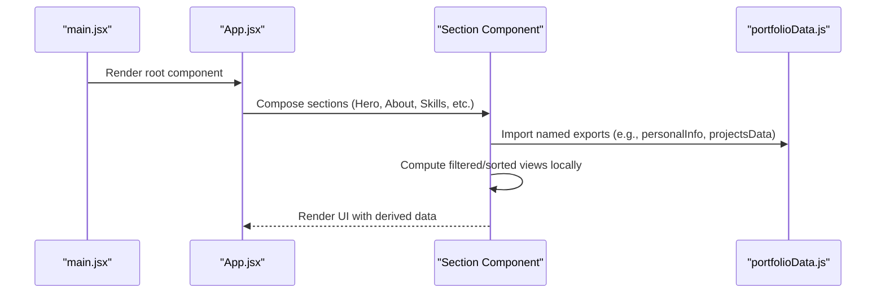
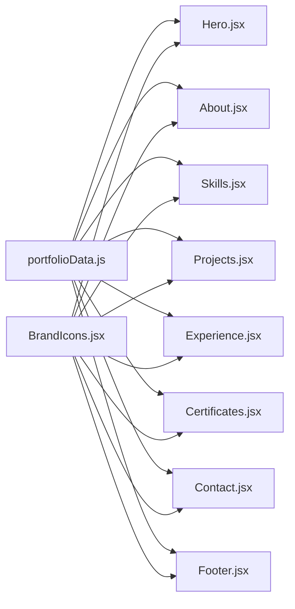

# Data Flow & Communication

<cite>
**Referenced Files in This Document**
- [portfolioData.js](file://src/data/portfolioData.js)
- [App.jsx](file://src/App.jsx)
- [main.jsx](file://src/main.jsx)
- [Hero.jsx](file://src/components/Hero.jsx)
- [About.jsx](file://src/components/About.jsx)
- [Skills.jsx](file://src/components/Skills.jsx)
- [Projects.jsx](file://src/components/Projects.jsx)
- [Experience.jsx](file://src/components/Experience.jsx)
- [Certificates.jsx](file://src/components/Certificates.jsx)
- [Contact.jsx](file://src/components/Contact.jsx)
- [Footer.jsx](file://src/components/Footer.jsx)
- [BrandIcons.jsx](file://src/components/BrandIcons.jsx)
</cite>

## Table of Contents
1. [Introduction](#introduction)
2. [Project Structure](#project-structure)
3. [Core Components](#core-components)
4. [Architecture Overview](#architecture-overview)
5. [Detailed Component Analysis](#detailed-component-analysis)
6. [Dependency Analysis](#dependency-analysis)
7. [Performance Considerations](#performance-considerations)
8. [Troubleshooting Guide](#troubleshooting-guide)
9. [Conclusion](#conclusion)
10. [Appendices](#appendices)

## Introduction
This document explains the centralized data management approach and component communication strategy used in the portfolio application. The single source of truth for all portfolio content is a dedicated data module that exports structured objects and arrays consumed by UI components via direct imports. Each section of the app renders its own domain (personal info, projects, skills, experience, certificates, contact), while sharing consistent access to the same dataset.

The goal is to make it easy to understand:
- Where data lives and how it is structured
- How components consume data through direct imports
- How to extend or modify the data model safely
- Performance implications of centralized static data loading and strategies to optimize rendering

## Project Structure
At a high level:
- Application entry point mounts the root component tree
- Root component composes top-level sections
- Each section component directly imports the relevant data from the central data module
- Shared assets like icons are imported from a local icon module

**Diagram sources**
- [main.jsx:1-11](file://src/main.jsx#L1-L11)
- [App.jsx:1-51](file://src/App.jsx#L1-L51)
- [Hero.jsx:1-245](file://src/components/Hero.jsx#L1-L245)
- [About.jsx:1-162](file://src/components/About.jsx#L1-L162)
- [Skills.jsx:1-152](file://src/components/Skills.jsx#L1-L152)
- [Projects.jsx:1-37](file://src/components/Projects.jsx#L1-L37)
- [Experience.jsx:1-84](file://src/components/Experience.jsx#L1-L84)
- [Certificates.jsx:1-597](file://src/components/Certificates.jsx#L1-L597)
- [Contact.jsx:1-373](file://src/components/Contact.jsx#L1-L373)
- [Footer.jsx:1-144](file://src/components/Footer.jsx#L1-L144)
- [BrandIcons.jsx:1-99](file://src/components/BrandIcons.jsx#L1-L99)
- [portfolioData.js:1-800](file://src/data/portfolioData.js#L1-L800)

**Section sources**
- [main.jsx:1-11](file://src/main.jsx#L1-L11)
- [App.jsx:1-51](file://src/App.jsx#L1-L51)

## Core Components
Centralized data module exports:
- personalInfo: personal profile, contact links, summary, languages, hobbies
- educationData: academic qualifications timeline
- skillsCategoryData: categorized skill groups with levels and tags
- projectsData: project entries with metadata, highlights, tools, architecture steps, and links
- experienceData: professional experiences and responsibilities
- certificationsData: extensive list of certificates with issuer, score, category, description, and file URLs

Components consume this data by importing the specific named exports they need. There is no prop drilling of raw data; each section owns its own data import and local state for filtering, searching, and interactions.

Key consumption patterns:
- Direct import of named exports per section
- Local state for filters/search (e.g., active filter tabs, search query)
- Derived data computed in-memory using array methods (filter, map, useMemo)
- Optional visual enhancements (counters, intersection observers) without altering source data

Examples of consumption patterns:
- Hero uses personalInfo for name, taglines, and social links
- About uses personalInfo.summary and educationData for timeline
- Skills uses skillsCategoryData with tab-based filtering
- Projects uses projectsData with category filtering
- Experience uses experienceData to render roles and responsibilities
- Certificates uses certificationsData with category and search filtering, plus stats derived from the dataset
- Contact uses personalInfo for email, phone, location, and social links
- Footer uses personalInfo for branding, navigation, and certificate bundle link

**Section sources**
- [portfolioData.js:1-800](file://src/data/portfolioData.js#L1-L800)
- [Hero.jsx:1-245](file://src/components/Hero.jsx#L1-L245)
- [About.jsx:1-162](file://src/components/About.jsx#L1-L162)
- [Skills.jsx:1-152](file://src/components/Skills.jsx#L1-L152)
- [Projects.jsx:1-37](file://src/components/Projects.jsx#L1-L37)
- [Experience.jsx:1-84](file://src/components/Experience.jsx#L1-L84)
- [Certificates.jsx:1-597](file://src/components/Certificates.jsx#L1-L597)
- [Contact.jsx:1-373](file://src/components/Contact.jsx#L1-L373)
- [Footer.jsx:1-144](file://src/components/Footer.jsx#L1-L144)

## Architecture Overview
The application follows a flat, section-based architecture where each component is responsible for its own presentation and local state. Data flows one-way: from the centralized data module into components via direct imports. Components do not mutate the source data; they compute derived views locally.

**Diagram sources**
- [main.jsx:1-11](file://src/main.jsx#L1-L11)
- [App.jsx:1-51](file://src/App.jsx#L1-L51)
- [portfolioData.js:1-800](file://src/data/portfolioData.js#L1-L800)

## Detailed Component Analysis

### Data Model: portfolioData.js
The data module defines several key structures:

- personalInfo
  - Purpose: Central profile and contact information
  - Fields include name, role, taglines, email, phone, location, social links, summary, CGPA, languages, hobbies, and a zip bundle URL for certificates
  - Used by: Hero, Contact, Footer

- educationData
  - Purpose: Academic timeline
  - Fields include degree, institution, year, score, badge, highlight, icon
  - Used by: About

- skillsCategoryData
  - Purpose: Grouped skills with proficiency levels and tags
  - Structure: Array of categories, each containing an array of skill objects with name, level, icon, tag
  - Used by: Skills

- projectsData
  - Purpose: Project catalog with rich metadata
  - Fields include id, title, subtitle, category, featured flag, description, tools, highlights, optional architecture steps, demoUrl, githubUrl
  - Used by: Projects

- experienceData
  - Purpose: Professional experiences
  - Fields include organisation, role, type, duration, period, location, responsibilities
  - Used by: Experience

- certificationsData
  - Purpose: Extensive certificate collection
  - Fields include id, title, issuer, score, tag, category, fileUrl, description, icon
  - Used by: Certificates

Complexity considerations:
- Rendering lists scales linearly with dataset size (O(n))
- Filtering and search operations are O(n) per interaction
- Memoization (useMemo) can reduce recomputation when inputs change infrequently

Error handling for missing data:
- Components assume fields exist; if a field is undefined, UI may render empty values or break
- Recommended defensive checks:
  - Use optional chaining and fallbacks when accessing nested fields
  - Provide default values for critical fields (e.g., empty arrays for lists)
  - Validate required fields before rendering lists

Extending the data model:
- Add new categories or items within existing arrays
- For certifications, add new issuers and ensure color mapping exists in the consuming component
- For skills, add new categories or update levels/tags consistently
- For projects, maintain unique ids and consistent structure for filtering and rendering

**Section sources**
- [portfolioData.js:1-800](file://src/data/portfolioData.js#L1-L800)

### Hero Component
Consumes personalInfo for:
- Name display
- Tagline rotation effect
- Social links (LinkedIn, GitHub, LeetCode, HackerRank, Twitter)
- Location and contact references

Communication pattern:
- Direct import of personalInfo
- Local state manages typing animation and tagline cycling
- No prop drilling; self-contained presentation logic

Performance notes:
- Animation timers are cleaned up on unmount
- Avoid heavy computations inside render loops

**Section sources**
- [Hero.jsx:1-245](file://src/components/Hero.jsx#L1-L245)
- [portfolioData.js:1-800](file://src/data/portfolioData.js#L1-L800)

### About Component
Consumes:
- personalInfo.summary and languages
- educationData for timeline rendering

Communication pattern:
- Direct import of both datasets
- Renders timeline cards and profile snapshot
- Uses local arrays for creative interests (not from data module)

Performance notes:
- Static lists rendered once per mount
- Minimal re-renders unless props change

**Section sources**
- [About.jsx:1-162](file://src/components/About.jsx#L1-L162)
- [portfolioData.js:1-800](file://src/data/portfolioData.js#L1-L800)

### Skills Component
Consumes:
- skillsCategoryData

Communication pattern:
- Direct import of skillsCategoryData
- Local state for active tab filtering
- Computes filteredCategories based on selection
- Maps skills to icons via a local iconMap

Performance notes:
- Filtering runs on tab change
- Icon lookup is constant-time via object map

**Section sources**
- [Skills.jsx:1-152](file://src/components/Skills.jsx#L1-L152)
- [portfolioData.js:1-800](file://src/data/portfolioData.js#L1-L800)

### Projects Component
Consumes:
- projectsData

Communication pattern:
- Direct import of projectsData
- Local state for activeFilter and selectedProject
- Filters projects by category
- Provides interactive elements (e.g., simulated matching flow)

Performance notes:
- Filtering runs on filter change
- Modal state isolated to component

**Section sources**
- [Projects.jsx:1-37](file://src/components/Projects.jsx#L1-L37)
- [portfolioData.js:1-800](file://src/data/portfolioData.js#L1-L800)

### Experience Component
Consumes:
- experienceData

Communication pattern:
- Direct import of experienceData
- Renders experience cards with responsibilities
- No complex local state beyond rendering

Performance notes:
- Straightforward list rendering
- Low computational overhead

**Section sources**
- [Experience.jsx:1-84](file://src/components/Experience.jsx#L1-L84)
- [portfolioData.js:1-800](file://src/data/portfolioData.js#L1-L800)

### Certificates Component
Consumes:
- certificationsData
- personalInfo (for social links and download bundle)

Communication pattern:
- Direct import of certificationsData and personalInfo
- Local state for activeCategory, viewerCert, searchQuery, visibleCards, statsVisible
- Computes categories with counts using useMemo
- Filters certificates by category and search query using useMemo
- Uses IntersectionObserver for scroll-triggered animations and counters
- Renders modal viewer for images/PDFs

Performance notes:
- useMemo reduces recomputation for categories, filteredCerts, unique providers, elite count
- IntersectionObserver optimizes reveal animations
- Large dataset handled efficiently with memoization and lazy visibility

**Section sources**
- [Certificates.jsx:1-597](file://src/components/Certificates.jsx#L1-L597)
- [portfolioData.js:1-800](file://src/data/portfolioData.js#L1-L800)

### Contact Component
Consumes:
- personalInfo for email, phone, location, and social links
- EmailJS configuration for sending messages

Communication pattern:
- Direct import of personalInfo
- Local form state and validation
- Asynchronous submission with error handling and user feedback
- Optional confetti animation on success

Performance notes:
- Form state updates are lightweight
- Error handling prevents crashes and provides clear feedback

**Section sources**
- [Contact.jsx:1-373](file://src/components/Contact.jsx#L1-L373)
- [portfolioData.js:1-800](file://src/data/portfolioData.js#L1-L800)

### Footer Component
Consumes:
- personalInfo for branding, navigation, and certificate bundle link

Communication pattern:
- Direct import of personalInfo
- Renders quick navigation and social links
- Provides back-to-top functionality

Performance notes:
- Static rendering with minimal interactivity

**Section sources**
- [Footer.jsx:1-144](file://src/components/Footer.jsx#L1-L144)
- [portfolioData.js:1-800](file://src/data/portfolioData.js#L1-L800)

## Dependency Analysis
Components depend on:
- Centralized data module for content
- BrandIcons for platform-specific SVG icons
- React hooks for local state and side effects

**Diagram sources**
- [portfolioData.js:1-800](file://src/data/portfolioData.js#L1-L800)
- [BrandIcons.jsx:1-99](file://src/components/BrandIcons.jsx#L1-L99)
- [Hero.jsx:1-245](file://src/components/Hero.jsx#L1-L245)
- [About.jsx:1-162](file://src/components/About.jsx#L1-L162)
- [Skills.jsx:1-152](file://src/components/Skills.jsx#L1-L152)
- [Projects.jsx:1-37](file://src/components/Projects.jsx#L1-L37)
- [Experience.jsx:1-84](file://src/components/Experience.jsx#L1-L84)
- [Certificates.jsx:1-597](file://src/components/Certificates.jsx#L1-L597)
- [Contact.jsx:1-373](file://src/components/Contact.jsx#L1-L373)
- [Footer.jsx:1-144](file://src/components/Footer.jsx#L1-L144)

**Section sources**
- [BrandIcons.jsx:1-99](file://src/components/BrandIcons.jsx#L1-L99)
- [portfolioData.js:1-800](file://src/data/portfolioData.js#L1-L800)

## Performance Considerations
Centralized static data loading:
- All data is loaded at build time and bundled with the app
- Initial load includes the entire dataset; consider splitting large datasets if growth continues
- Memory usage is proportional to dataset size; current structure is manageable but monitor growth

Rendering optimizations:
- Use useMemo for expensive computations (already used in Certificates for categories, filtering, and stats)
- Debounce search input to reduce frequent re-renders
- Virtualize long lists if datasets grow significantly (e.g., virtual scrolling for certificates)
- Lazy-load non-critical sections or defer heavy animations until needed

Interaction performance:
- Avoid heavy work in event handlers; offload to Web Workers if necessary
- Keep local state minimal and focused on UI concerns
- Ensure cleanup of timers and observers to prevent memory leaks

Scalability recommendations:
- Segment data by feature area (e.g., separate files for projects, skills, certifications)
- Introduce typed schemas or validators to enforce structure consistency
- Implement caching strategies for dynamic content if backend integration is added later

[No sources needed since this section provides general guidance]

## Troubleshooting Guide
Common issues and resolutions:
- Missing or undefined fields in data:
  - Symptoms: Blank text, broken layouts, or runtime errors
  - Resolution: Add defensive checks (optional chaining, defaults) in components; validate data structure before rendering
- Search/filter returns no results:
  - Symptoms: Empty states or misleading UI
  - Resolution: Provide helpful empty-state messaging; ensure case-insensitive search and robust matching logic
- Certificate viewer fails to load:
  - Symptoms: Blank iframe or image not displaying
  - Resolution: Offer download/open-in-new-tab options; handle unsupported formats gracefully
- Performance degradation with large datasets:
  - Symptoms: Slow filtering, laggy interactions
  - Resolution: Apply memoization, debounce search, virtualize lists, and split data modules

Error handling patterns observed:
- Contact form validates required fields and shows toast notifications
- Async submission handles success and error paths with user feedback
- Certificates component provides fallback actions for PDF/image viewing

**Section sources**
- [Contact.jsx:1-373](file://src/components/Contact.jsx#L1-L373)
- [Certificates.jsx:1-597](file://src/components/Certificates.jsx#L1-L597)

## Conclusion
The portfolio application employs a clean, centralized data management strategy with direct imports into section components. This approach simplifies data ownership, improves readability, and enables straightforward extension of the data model. Components manage their own local state for filtering, searching, and interactions, computing derived views efficiently. With careful attention to performance (memoization, debouncing, virtualization) and robust error handling, the system remains scalable and maintainable as content grows.

[No sources needed since this section summarizes without analyzing specific files]

## Appendices

### Data Consumption Patterns Reference
- Personal Info: Hero, Contact, Footer
- Education Timeline: About
- Skills Categories: Skills
- Projects Catalog: Projects
- Experience Entries: Experience
- Certificates Collection: Certificates

### Extending the Data Model
- Add new fields to existing objects carefully; update consumers to handle optional or new properties
- Maintain unique identifiers for list items (e.g., project.id, certification.id)
- Update color mappings or icon maps when adding new categories or issuers

[No sources needed since this section provides general guidance]