# State Management & Hooks

<cite>
**Referenced Files in This Document**
- [App.jsx](file://src/App.jsx)
- [Navbar.jsx](file://src/components/Navbar.jsx)
- [Hero.jsx](file://src/components/Hero.jsx)
- [DynamicBackground.jsx](file://src/components/DynamicBackground.jsx)
- [BackgroundMusic.jsx](file://src/components/BackgroundMusic.jsx)
- [Contact.jsx](file://src/components/Contact.jsx)
- [Certificates.jsx](file://src/components/Certificates.jsx)
- [Skills.jsx](file://src/components/Skills.jsx)
- [About.jsx](file://src/components/About.jsx)
- [main.jsx](file://src/main.jsx)
</cite>

## Table of Contents
1. [Introduction](#introduction)
2. [Project Structure](#project-structure)
3. [Core Components](#core-components)
4. [Architecture Overview](#architecture-overview)
5. [Detailed Component Analysis](#detailed-component-analysis)
6. [Dependency Analysis](#dependency-analysis)
7. [Performance Considerations](#performance-considerations)
8. [Troubleshooting Guide](#troubleshooting-guide)
9. [Conclusion](#conclusion)

## Introduction
This document explains how the application manages state using React hooks across components. It focuses on:
- Local component state with useState
- Side effects and lifecycle patterns with useEffect
- Animation and interactive states
- Theme management at the app level
- Navigation state handling in the navbar
- Performance considerations to avoid unnecessary re-renders
- The relationship between local component state and global application state (theme)

The goal is to help developers understand where and why state is used, how it flows through the app, and how to maintain performance while delivering rich interactions.

## Project Structure
At a high level:
- App.jsx holds the global theme state and passes it down to child components.
- Navbar.jsx manages navigation-related state such as scroll position, active section, and mobile menu visibility.
- Hero.jsx implements typing animation state for dynamic taglines.
- DynamicBackground.jsx uses IntersectionObserver and canvas rendering to animate background visuals based on the current section.
- BackgroundMusic.jsx controls audio playback, volume, and mute state via Web Audio API.
- Contact.jsx handles form input, submission loading, toast notifications, and clipboard copy feedback.
- Certificates.jsx manages filtering, search, modal viewer, intersection-based animations, and counters.
- Skills.jsx filters skill categories by tabs.
- About.jsx renders static content from data without internal state.

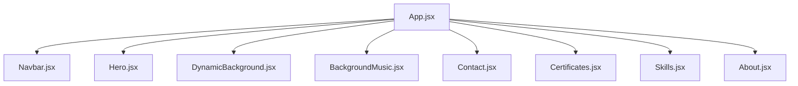

**Diagram sources**
- [App.jsx:14-49](file://src/App.jsx#L14-L49)
- [Navbar.jsx:6-10](file://src/components/Navbar.jsx#L6-L10)
- [Hero.jsx:16-19](file://src/components/Hero.jsx#L16-L19)
- [DynamicBackground.jsx:32-37](file://src/components/DynamicBackground.jsx#L32-L37)
- [BackgroundMusic.jsx:4-14](file://src/components/BackgroundMusic.jsx#L4-L14)
- [Contact.jsx:20-31](file://src/components/Contact.jsx#L20-L31)
- [Certificates.jsx:139-148](file://src/components/Certificates.jsx#L139-L148)
- [Skills.jsx:36-39](file://src/components/Skills.jsx#L36-L39)
- [About.jsx:18-24](file://src/components/About.jsx#L18-L24)

**Section sources**
- [App.jsx:14-49](file://src/App.jsx#L14-L49)
- [main.jsx:6-9](file://src/main.jsx#L6-L9)

## Core Components
- App.jsx: Global theme state persisted to localStorage; applies theme attribute to document root.
- Navbar.jsx: Tracks scroll position, active section, and mobile menu toggle; updates UI accordingly.
- Hero.jsx: Typing effect state machine for rotating taglines with delete/retype cycles.
- DynamicBackground.jsx: Section-aware animated background using IntersectionObserver and canvas; responds to mouse and click events.
- BackgroundMusic.jsx: Manages play/pause, mute, volume, and audio nodes lifecycle.
- Contact.jsx: Form state, submission flow, toast notifications, and clipboard copy feedback.
- Certificates.jsx: Filtering, search, modal viewer, intersection observer for reveal animations, and animated counters.
- Skills.jsx: Tabbed category filter for skills display.
- About.jsx: Static presentation layer; no internal state.

**Section sources**
- [App.jsx:14-26](file://src/App.jsx#L14-L26)
- [Navbar.jsx:6-38](file://src/components/Navbar.jsx#L6-L38)
- [Hero.jsx:16-42](file://src/components/Hero.jsx#L16-L42)
- [DynamicBackground.jsx:32-59](file://src/components/DynamicBackground.jsx#L32-L59)
- [BackgroundMusic.jsx:4-14](file://src/components/BackgroundMusic.jsx#L4-L14)
- [Contact.jsx:20-93](file://src/components/Contact.jsx#L20-L93)
- [Certificates.jsx:139-219](file://src/components/Certificates.jsx#L139-L219)
- [Skills.jsx:36-43](file://src/components/Skills.jsx#L36-L43)
- [About.jsx:18-24](file://src/components/About.jsx#L18-L24)

## Architecture Overview
Theme state originates in App.jsx and is passed down to Navbar and DynamicBackground. Other components manage their own local state for UI behavior and interactions.

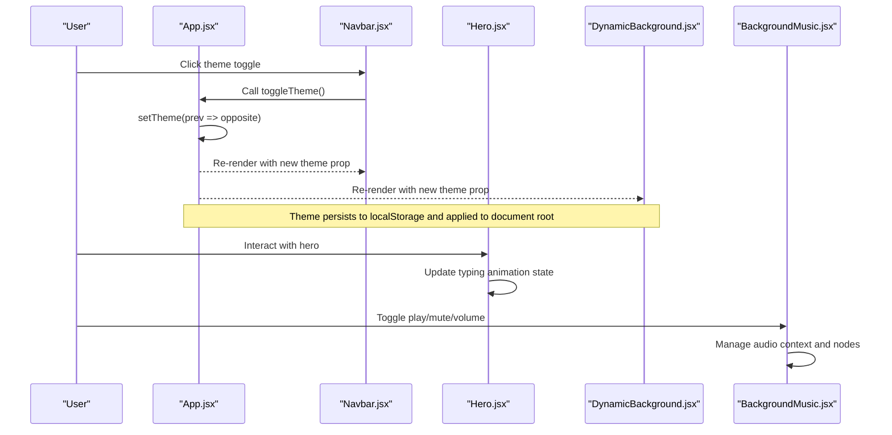

**Diagram sources**
- [App.jsx:14-26](file://src/App.jsx#L14-L26)
- [Navbar.jsx:90-124](file://src/components/Navbar.jsx#L90-L124)
- [Hero.jsx:16-42](file://src/components/Hero.jsx#L16-L42)
- [DynamicBackground.jsx:32-59](file://src/components/DynamicBackground.jsx#L32-L59)
- [BackgroundMusic.jsx:175-203](file://src/components/BackgroundMusic.jsx#L175-L203)

## Detailed Component Analysis

### App.jsx: Global Theme State
- Uses useState to initialize theme from localStorage or default to dark.
- Uses useEffect to apply theme to document.documentElement and persist changes to localStorage.
- Provides toggleTheme function to flip between light and dark themes.
- Passes theme and toggleTheme to Navbar and DynamicBackground.

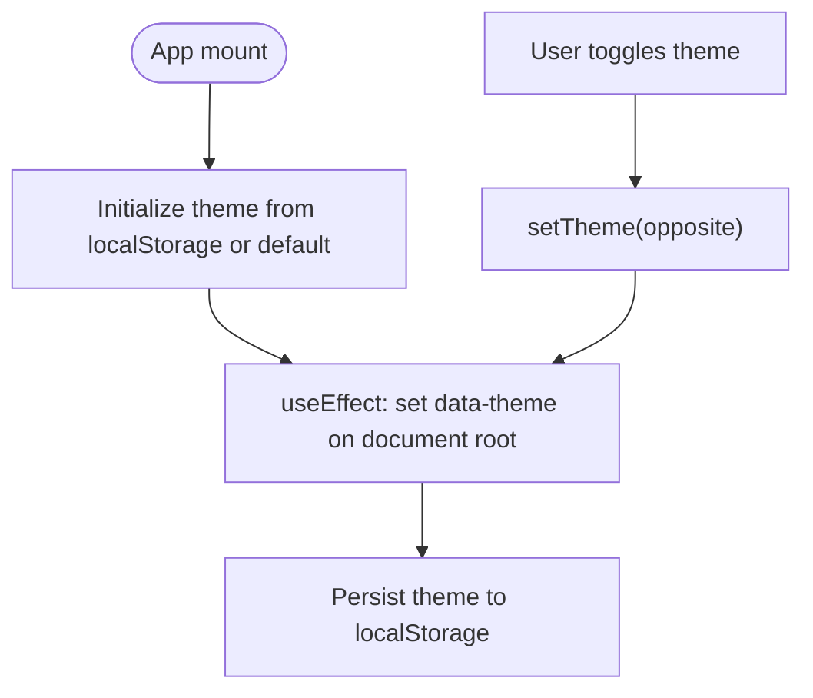

**Diagram sources**
- [App.jsx:14-26](file://src/App.jsx#L14-L26)

**Section sources**
- [App.jsx:14-26](file://src/App.jsx#L14-L26)

### Navbar.jsx: Navigation State Handling
- Tracks scrolled state to change header style when user scrolls.
- Determines active section based on scroll position and highlights the corresponding nav link.
- Manages mobile menu open/close state.
- Calls toggleTheme from props to update global theme.

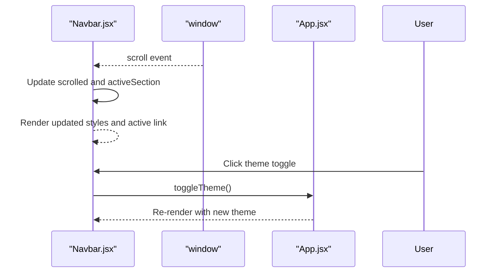

**Diagram sources**
- [Navbar.jsx:6-38](file://src/components/Navbar.jsx#L6-L38)
- [Navbar.jsx:90-124](file://src/components/Navbar.jsx#L90-L124)
- [App.jsx:14-26](file://src/App.jsx#L14-L26)

**Section sources**
- [Navbar.jsx:6-38](file://src/components/Navbar.jsx#L6-L38)
- [Navbar.jsx:90-124](file://src/components/Navbar.jsx#L90-L124)

### Hero.jsx: Animation States
- Implements a typing effect with state variables for current tagline index, displayed text, and deleting flag.
- Uses useEffect with timers to type and delete text, cycling through taglines.
- Cleans up timers on unmount to prevent memory leaks.

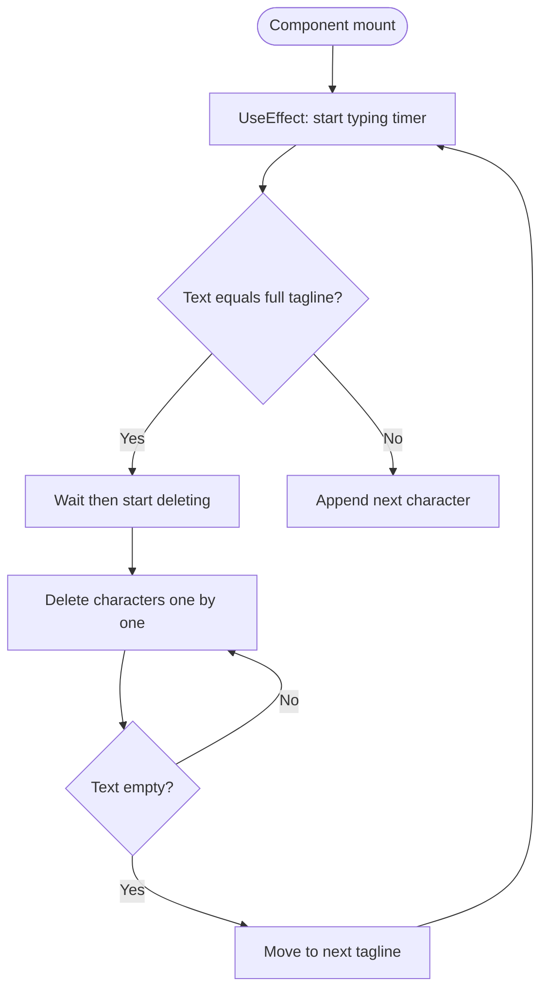

**Diagram sources**
- [Hero.jsx:16-42](file://src/components/Hero.jsx#L16-L42)

**Section sources**
- [Hero.jsx:16-42](file://src/components/Hero.jsx#L16-L42)

### DynamicBackground.jsx: Section-Aware Canvas Animations
- Uses IntersectionObserver to detect the current visible section and switch color palettes smoothly.
- Maintains refs for palette transitions and sets up canvas rendering loop with requestAnimationFrame.
- Listens to window resize, mouse movement, and click events; cleans up listeners on unmount.
- Renders animated orbs, particles, fireflies, shooting stars, and aurora bands.

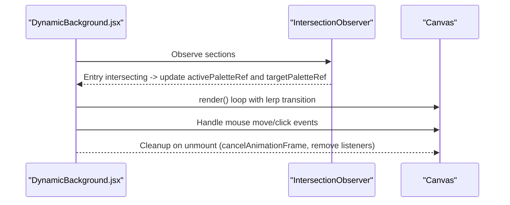

**Diagram sources**
- [DynamicBackground.jsx:32-59](file://src/components/DynamicBackground.jsx#L32-L59)
- [DynamicBackground.jsx:62-313](file://src/components/DynamicBackground.jsx#L62-L313)

**Section sources**
- [DynamicBackground.jsx:32-59](file://src/components/DynamicBackground.jsx#L32-L59)
- [DynamicBackground.jsx:62-313](file://src/components/DynamicBackground.jsx#L62-L313)

### BackgroundMusic.jsx: Audio Playback State
- Manages play/pause, mute, volume, and first-interaction hint.
- Initializes Web AudioContext, creates master gain, delay nodes, oscillators, and schedules chord progressions and chimes.
- Updates volume and mute state in real-time via gain adjustments.
- Ensures cleanup of intervals and audio nodes on unmount.

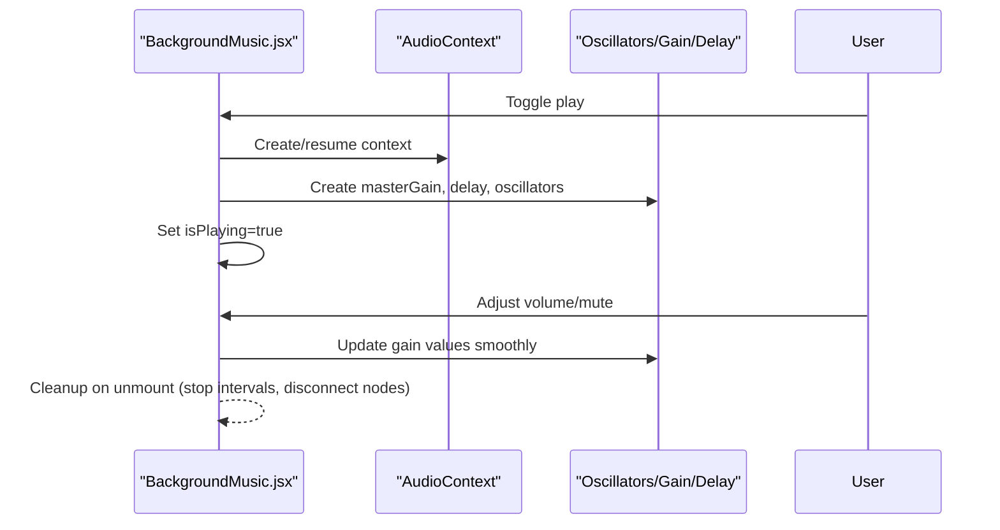

**Diagram sources**
- [BackgroundMusic.jsx:4-14](file://src/components/BackgroundMusic.jsx#L4-L14)
- [BackgroundMusic.jsx:45-173](file://src/components/BackgroundMusic.jsx#L45-L173)
- [BackgroundMusic.jsx:175-209](file://src/components/BackgroundMusic.jsx#L175-L209)

**Section sources**
- [BackgroundMusic.jsx:4-14](file://src/components/BackgroundMusic.jsx#L4-L14)
- [BackgroundMusic.jsx:45-173](file://src/components/BackgroundMusic.jsx#L45-L173)
- [BackgroundMusic.jsx:175-209](file://src/components/BackgroundMusic.jsx#L175-L209)

### Contact.jsx: Form and Interaction States
- Holds form data, loading status, toast messages, copied field indicator, and config modal visibility.
- Validates inputs before submission; shows error toast if required fields are missing.
- Submits via EmailJS integration; on success, clears form, shows success toast, triggers confetti.
- Handles clipboard copy with temporary visual feedback.

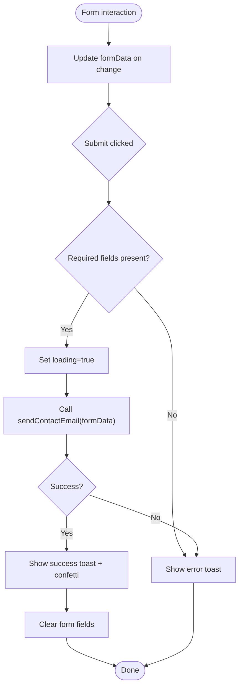

**Diagram sources**
- [Contact.jsx:20-93](file://src/components/Contact.jsx#L20-L93)

**Section sources**
- [Contact.jsx:20-93](file://src/components/Contact.jsx#L20-L93)

### Certificates.jsx: Filtering, Search, Modal, and Observers
- Manages active category, selected certificate for viewer, search query, visible cards set, and stats visibility.
- Computes categories and filtered certificates using useMemo for performance.
- Uses IntersectionObserver to reveal cards and trigger animated counters when stats come into view.
- Implements 3D tilt effects on hover and fullscreen PDF/image viewer modal.

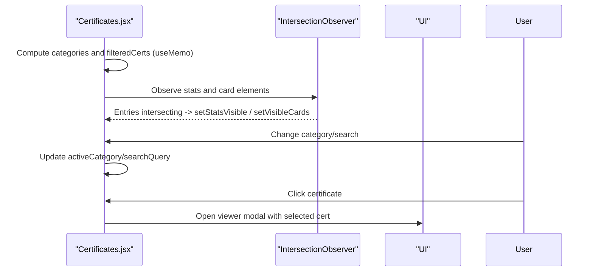

**Diagram sources**
- [Certificates.jsx:139-219](file://src/components/Certificates.jsx#L139-L219)
- [Certificates.jsx:221-237](file://src/components/Certificates.jsx#L221-L237)
- [Certificates.jsx:503-593](file://src/components/Certificates.jsx#L503-L593)

**Section sources**
- [Certificates.jsx:139-219](file://src/components/Certificates.jsx#L139-L219)
- [Certificates.jsx:221-237](file://src/components/Certificates.jsx#L221-L237)
- [Certificates.jsx:503-593](file://src/components/Certificates.jsx#L503-L593)

### Skills.jsx: Tabbed Category Filter
- Maintains activeTab state to filter skills categories.
- Renders skill cards with animated progress bars based on skill levels.

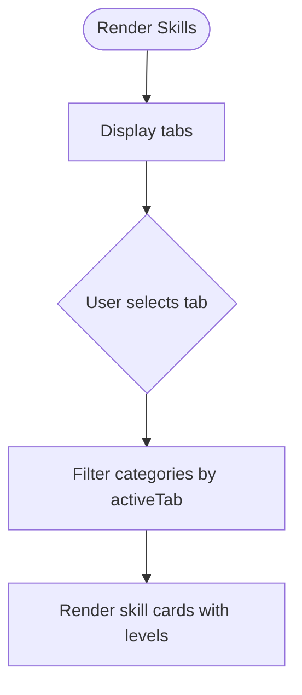

**Diagram sources**
- [Skills.jsx:36-43](file://src/components/Skills.jsx#L36-L43)
- [Skills.jsx:63-78](file://src/components/Skills.jsx#L63-L78)
- [Skills.jsx:100-125](file://src/components/Skills.jsx#L100-L125)

**Section sources**
- [Skills.jsx:36-43](file://src/components/Skills.jsx#L36-L43)
- [Skills.jsx:63-78](file://src/components/Skills.jsx#L63-L78)
- [Skills.jsx:100-125](file://src/components/Skills.jsx#L100-L125)

### About.jsx: Static Presentation
- No internal state; displays education timeline and profile snapshot from data.
- Demonstrates a pure component pattern for static content.

**Section sources**
- [About.jsx:18-24](file://src/components/About.jsx#L18-L24)

## Dependency Analysis
- App.jsx depends on child components and provides global theme state.
- Navbar.jsx depends on App.jsx for theme control and on portfolioData for personal info.
- Hero.jsx depends on portfolioData for taglines and BrandIcons for social links.
- DynamicBackground.jsx depends on DOM sections and canvas APIs; independent of theme prop except for palette selection.
- BackgroundMusic.jsx is self-contained with Web Audio API; does not depend on other components.
- Contact.jsx depends on emailjs configuration and external libraries for sending emails and triggering confetti.
- Certificates.jsx depends on portfolioData for certifications and uses refs for DOM manipulation.
- Skills.jsx depends on portfolioData for skills categories.

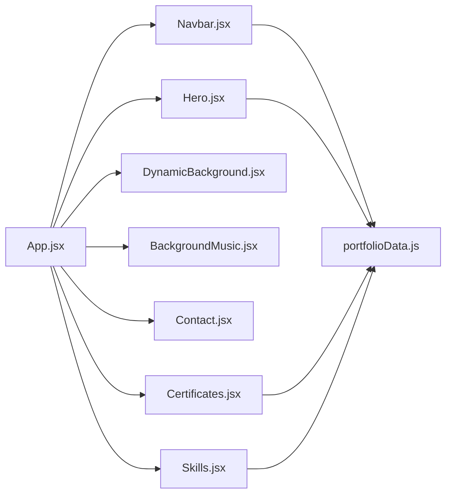

**Diagram sources**
- [App.jsx:14-49](file://src/App.jsx#L14-L49)
- [Navbar.jsx:3-4](file://src/components/Navbar.jsx#L3-L4)
- [Hero.jsx:12-14](file://src/components/Hero.jsx#L12-L14)
- [Certificates.jsx:19-20](file://src/components/Certificates.jsx#L19-L20)
- [Skills.jsx:25-26](file://src/components/Skills.jsx#L25-L26)

**Section sources**
- [App.jsx:14-49](file://src/App.jsx#L14-L49)
- [Navbar.jsx:3-4](file://src/components/Navbar.jsx#L3-L4)
- [Hero.jsx:12-14](file://src/components/Hero.jsx#L12-L14)
- [Certificates.jsx:19-20](file://src/components/Certificates.jsx#L19-L20)
- [Skills.jsx:25-26](file://src/components/Skills.jsx#L25-L26)

## Performance Considerations
- Use memoization:
  - Certificates.jsx uses useMemo to compute categories and filtered results, reducing recomputation on every render.
  - Avoid heavy computations inside render; precompute derived data.
- Minimize re-renders:
  - Keep state localized to where it’s needed (e.g., Hero typing state stays within Hero).
  - Lift only necessary state up (e.g., theme in App) to avoid prop drilling overhead.
- Efficient side effects:
  - Properly clean up event listeners and timers in useEffect (Navbar scroll listener, Hero timers, DynamicBackground canvas loop).
  - Use refs for mutable values that don’t need to trigger re-renders (e.g., palette refs in DynamicBackground).
- Optimize animations:
  - Use requestAnimationFrame for canvas rendering and avoid layout thrashing.
  - Leverage CSS transitions and transforms for UI animations where possible.
- Debounce/throttle expensive operations:
  - Scroll handlers can be throttled if performance becomes an issue.
- Memory management:
  - Stop intervals and cancel animations on unmount to prevent leaks (BackgroundMusic interval, DynamicBackground raf).

[No sources needed since this section provides general guidance]

## Troubleshooting Guide
- Theme not applying:
  - Ensure useEffect runs after DOM mounts and sets data-theme correctly.
  - Verify localStorage key matches and value is valid.
- Navbar active section incorrect:
  - Check scroll position calculations and element IDs match section ids.
  - Ensure event listeners are attached and removed properly.
- Typing effect glitches:
  - Confirm timers are cleared on unmount and dependencies include displayText, isDeleting, and taglineIndex.
- Background animations stutter:
  - Ensure canvas dimensions are updated on resize and particle counts are reasonable for device capabilities.
  - Remove unnecessary listeners on unmount.
- Audio issues:
  - Browser autoplay policies require user interaction; ensure play starts after user gesture.
  - Clean up oscillators and intervals to prevent memory leaks.
- Form submission errors:
  - Validate required fields before sending; handle network errors gracefully with toast messages.
  - Ensure EmailJS configuration keys are correct.

**Section sources**
- [App.jsx:19-22](file://src/App.jsx#L19-L22)
- [Navbar.jsx:11-38](file://src/components/Navbar.jsx#L11-L38)
- [Hero.jsx:21-42](file://src/components/Hero.jsx#L21-L42)
- [DynamicBackground.jsx:62-313](file://src/components/DynamicBackground.jsx#L62-L313)
- [BackgroundMusic.jsx:175-209](file://src/components/BackgroundMusic.jsx#L175-L209)
- [Contact.jsx:43-93](file://src/components/Contact.jsx#L43-L93)

## Conclusion
The application demonstrates robust state management using React hooks:
- useState for local UI state across components (theme, navigation, animations, forms, filters).
- useEffect for side effects like DOM updates, event listeners, timers, and observers.
- Careful separation of concerns keeps global state minimal and localized state focused.
- Performance optimizations like useMemo, proper cleanup, and efficient rendering ensure smooth interactions.
- The relationship between local and global state is clear: theme is global, while other states remain component-scoped, enabling scalability and maintainability.

[No sources needed since this section summarizes without analyzing specific files]