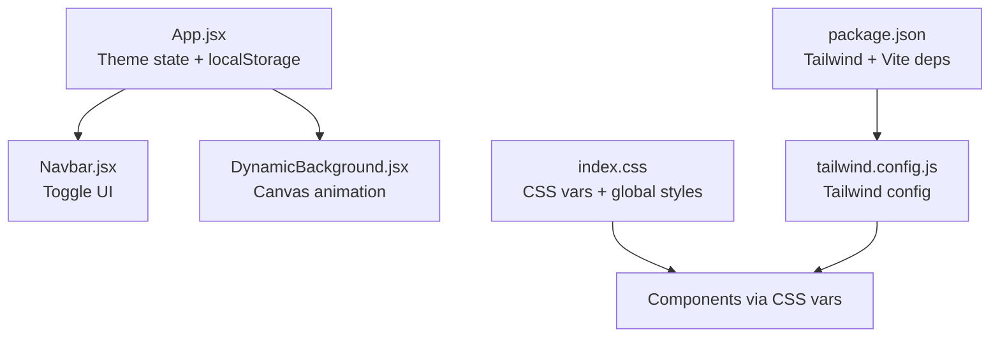
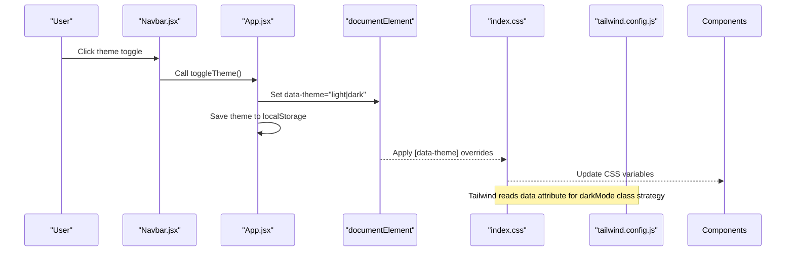
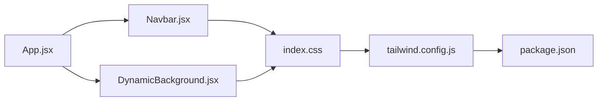

# Theme System & Styling Architecture

<cite>
**Referenced Files in This Document**
- [App.jsx](file://src/App.jsx)
- [Navbar.jsx](file://src/components/Navbar.jsx)
- [DynamicBackground.jsx](file://src/components/DynamicBackground.jsx)
- [index.css](file://src/index.css)
- [tailwind.config.js](file://tailwind.config.js)
- [package.json](file://package.json)
</cite>

## Update Summary
**Changes Made**
- Updated color scheme documentation to reflect the new 'Ultra Deep Cosmic Dark' theme
- Enhanced neon color definitions with cyan (#00f0ff), pink (#ff0080), and emerald (#00ff88)
- Added documentation for improved glow effects and glass morphism enhancements
- Updated section-specific color palettes and gradient definitions
- Enhanced accessibility considerations for the new vibrant color scheme

## Table of Contents
1. [Introduction](#introduction)
2. [Project Structure](#project-structure)
3. [Core Components](#core-components)
4. [Architecture Overview](#architecture-overview)
5. [Detailed Component Analysis](#detailed-component-analysis)
6. [Dependency Analysis](#dependency-analysis)
7. [Performance Considerations](#performance-considerations)
8. [Troubleshooting Guide](#troubleshooting-guide)
9. [Conclusion](#conclusion)
10. [Appendices](#appendices)

## Introduction
This document explains the theme system and styling architecture for the portfolio application, featuring the newly implemented 'Ultra Deep Cosmic Dark' theme with enhanced neon colors and improved visual effects. It covers:
- Dark/light mode implementation using CSS custom properties and localStorage persistence
- Tailwind CSS configuration with custom colors, fonts, and dark mode strategy
- Global styles in index.css and component-specific styles in App.css
- Examples of theme switching, custom color definitions, and responsive design patterns
- Accessibility considerations and performance optimizations for theme changes
- Guidelines for adding new theme variants

## Project Structure
The theme system spans React components and CSS/Tailwind configuration:
- App.jsx manages theme state and persists it to localStorage
- Navbar.jsx exposes a theme toggle button that calls the parent's toggle function
- DynamicBackground.jsx renders an animated canvas background whose palette adapts per section
- index.css defines CSS custom properties for both dark and light themes, plus global styles and utilities
- tailwind.config.js configures Tailwind's content scanning, dark mode strategy, brand colors, and fonts
- package.json lists dependencies and devDependencies including Tailwind and Vite tooling

**Diagram sources**
- [App.jsx:16-28](file://src/App.jsx#L16-L28)
- [Navbar.jsx:90-117](file://src/components/Navbar.jsx#L90-L117)
- [DynamicBackground.jsx:33-60](file://src/components/DynamicBackground.jsx#L33-L60)
- [index.css:12-91](file://src/index.css#L12-L91)
- [tailwind.config.js:1-29](file://tailwind.config.js#L1-L29)
- [package.json:12-28](file://package.json#L12-L28)

**Section sources**
- [App.jsx:16-28](file://src/App.jsx#L16-L28)
- [tailwind.config.js:1-29](file://tailwind.config.js#L1-L29)
- [package.json:12-28](file://package.json#L12-L28)

## Core Components
- Theme state management: The root component initializes theme from localStorage and applies it to the document element. It also provides a toggle function used by child components.
- Theme toggle UI: The navbar includes accessible buttons with icons that switch between dark and light modes.
- Dynamic background: A canvas-based background updates its color palette based on the active section and supports smooth transitions.

Key behaviors:
- Persistence: Theme is stored under a dedicated key in localStorage and restored on load.
- Attribute-driven theming: The document element receives a data attribute to drive CSS variable overrides.
- Section-aware visuals: Background animations adapt to the current section using predefined palettes.

**Section sources**
- [App.jsx:16-28](file://src/App.jsx#L16-L28)
- [Navbar.jsx:90-117](file://src/components/Navbar.jsx#L90-L117)
- [DynamicBackground.jsx:33-60](file://src/components/DynamicBackground.jsx#L33-L60)

## Architecture Overview
The theme system uses a hybrid approach:
- CSS custom properties define all colors, backgrounds, borders, and shadows
- A data attribute on the root element switches between theme sets
- Tailwind integrates with this attribute to enable dark-mode classes when needed
- Components consume CSS variables directly in className utilities and inline styles

**Diagram sources**
- [App.jsx:21-24](file://src/App.jsx#L21-L24)
- [Navbar.jsx:92-98](file://src/components/Navbar.jsx#L92-L98)
- [index.css:77-91](file://src/index.css#L77-L91)
- [tailwind.config.js:7](file://tailwind.config.js#L7)

## Detailed Component Analysis

### Theme State and Persistence (App.jsx)
- Initializes theme from localStorage or defaults to dark
- On change, sets data-theme on the document element and persists the value
- Provides a toggle function that flips between dark and light

Implementation highlights:
- Uses React state and effect to synchronize UI and storage
- Applies theme via attribute selector in CSS rather than class toggling on body

Accessibility notes:
- Ensure any interactive controls expose appropriate aria attributes and titles for screen readers

**Section sources**
- [App.jsx:16-28](file://src/App.jsx#L16-L28)

### Theme Toggle Button (Navbar.jsx)
- Renders desktop and mobile theme toggle buttons
- Uses lucide-react icons to visually indicate current theme
- Calls the parent-provided toggle function
- Includes accessibility attributes like aria-label and title

Responsive behavior:
- Desktop shows a prominent icon button alongside navigation
- Mobile includes a compact button within the header

**Section sources**
- [Navbar.jsx:90-117](file://src/components/Navbar.jsx#L90-L117)

### Dynamic Background (DynamicBackground.jsx)
- Observes sections to determine the active palette and smoothly interpolates colors
- Renders animated orbs and a canvas with particles, shooting stars, fireflies, and aurora bands
- Responds to mouse interactions and window resize events
- Cleans up event listeners and animation frames on unmount

Design integration:
- Uses CSS classes for orbs and overlays defined in index.css
- Palette keys map to section IDs for consistent visual identity across the page

**Updated** Enhanced with Ultra Deep Cosmic Dark theme featuring vibrant neon colors and improved aurora effects

**Section sources**
- [DynamicBackground.jsx:33-60](file://src/components/DynamicBackground.jsx#L33-L60)
- [DynamicBackground.jsx:155-303](file://src/components/DynamicBackground.jsx#L155-L303)
- [DynamicBackground.jsx:316-341](file://src/components/DynamicBackground.jsx#L316-L341)

### Global Styles and Theme Variables (index.css)
- Defines :root CSS variables for Ultra Deep Cosmic Dark theme with enhanced neon colors
- Overrides variables under [data-theme="light"] for light mode
- Provides gradients, shadows, radii, fonts, and reusable utility classes
- Includes section-specific background tints and animated effects
- Adds responsive rules for smaller screens

Theming mechanics:
- All components reference CSS variables for colors, backgrounds, and borders
- Smooth transitions are applied to background and text color changes for a polished experience

**Updated** Enhanced with Ultra Deep Cosmic Dark theme featuring:
- Deep space background colors (#020617 primary, #0c1230 secondary)
- Vibrant neon accent colors (cyan #00f0ff, pink #ff0080, emerald #00ff88)
- Improved glass morphism effects with enhanced backdrop filters
- Enhanced glow effects with multi-layered box shadows
- Section-specific color palettes for each portfolio section

**Section sources**
- [index.css:12-91](file://src/index.css#L12-L91)
- [index.css:95-108](file://src/index.css#L95-L108)
- [index.css:170-233](file://src/index.css#L170-L233)
- [index.css:401-463](file://src/index.css#L401-L463)
- [index.css:662-669](file://src/index.css#L662-L669)

### Tailwind Configuration (tailwind.config.js)
- Configures content paths to scan JSX files for utility classes
- Enables dark mode via attribute selector matching data-theme
- Extends default theme with brand colors and font families
- No plugins are configured

Usage implications:
- You can use Tailwind's dark: variant if you add a class that matches the attribute strategy
- Brand colors and fonts are available as tokens throughout the app

**Updated** Enhanced brand color palette with neon accents:
- Cyan: #00f0ff
- Pink: #ff0080  
- Emerald: #00ff88
- Additional vibrant colors for comprehensive design system

**Section sources**
- [tailwind.config.js:1-29](file://tailwind.config.js#L1-L29)

### Component-Specific Styles (App.css)
- Contains legacy or example styles not central to the theme system
- Demonstrates nested selectors and responsive adjustments
- Uses CSS variables for accent and border colors where applicable

Note:
- Most theme-related styling is centralized in index.css; App.css appears to be template scaffolding

**Section sources**
- [App.css:1-185](file://src/App.css#L1-L185)

## Dependency Analysis
- App.jsx depends on Navbar.jsx and DynamicBackground.jsx for UI and visuals
- Navbar.jsx consumes props from App.jsx for theme and toggle
- DynamicBackground.jsx relies on section IDs present in the DOM and CSS classes from index.css
- index.css drives theme appearance through CSS variables and attribute selectors
- tailwind.config.js influences how Tailwind processes classes and dark mode
- package.json declares Tailwind and Vite dependencies required for build-time processing

**Diagram sources**
- [App.jsx:1-15](file://src/App.jsx#L1-L15)
- [Navbar.jsx:1-6](file://src/components/Navbar.jsx#L1-L6)
- [DynamicBackground.jsx:1-14](file://src/components/DynamicBackground.jsx#L1-L14)
- [index.css:1-5](file://src/index.css#L1-L5)
- [tailwind.config.js:1-6](file://tailwind.config.js#L1-L6)
- [package.json:12-28](file://package.json#L12-L28)

**Section sources**
- [package.json:12-28](file://package.json#L12-L28)

## Performance Considerations
- Minimize re-renders: Theme state lives in App.jsx; pass only necessary props to children
- Debounce expensive operations: If adding more scroll-based logic, consider throttling scroll handlers
- Canvas optimization:
  - Limit particle count based on viewport size
  - Use requestAnimationFrame efficiently and clean up on unmount
  - Avoid heavy computations inside render loops
- CSS transitions:
  - Prefer transitioning CSS variables for theme changes to avoid layout thrash
  - Keep transition durations reasonable (e.g., ~0.3–0.5s)
- Tailwind purge:
  - Ensure content paths include all relevant files to keep CSS bundle small
- Storage access:
  - Read/write localStorage once on mount and on theme change to reduce overhead

## Troubleshooting Guide
Common issues and resolutions:
- Theme not persisting:
  - Verify localStorage key usage and ensure it is set on every theme change
  - Check for browser privacy settings blocking localStorage
- Light theme not applying:
  - Confirm data-theme attribute is set on documentElement
  - Ensure [data-theme="light"] overrides exist in index.css
- Icons not updating:
  - Ensure Navbar receives the correct theme prop and toggles accordingly
- Tailwind dark mode not working:
  - Verify darkMode strategy matches the attribute selector used
  - Confirm content paths include all source files
- Excessive reflows during theme switch:
  - Avoid forcing layout reads/writes in tight loops
  - Prefer CSS transitions over JS-driven style changes for colors
- Neon colors appearing too bright:
  - Adjust opacity values in CSS variables for better contrast
  - Consider reducing glow intensity for accessibility compliance

**Section sources**
- [App.jsx:21-24](file://src/App.jsx#L21-L24)
- [index.css:77-91](file://src/index.css#L77-L91)
- [tailwind.config.js:7](file://tailwind.config.js#L7)

## Conclusion
The theme system combines React state, CSS custom properties, and Tailwind configuration to deliver a robust dark/light mode with persistent user preference, now enhanced with the Ultra Deep Cosmic Dark theme. The architecture separates concerns cleanly:
- App.jsx owns theme state and persistence
- Navbar.jsx provides accessible UI for toggling
- index.css centralizes theme variables and global styles with enhanced neon aesthetics
- tailwind.config.js enables attribute-based dark mode and defines design tokens
- DynamicBackground.jsx enhances visual appeal with section-aware animations and vibrant color palettes

This setup scales well for additional themes and maintains performance through efficient rendering and CSS-driven transitions, while providing a stunning visual experience with the new cosmic dark theme.

## Appendices

### Example: Theme Switching Implementation
- Initialize theme from localStorage and apply to document element
- Provide a toggle function that flips between dark and light
- Render a button that calls the toggle function and updates icons based on current theme

References:
- [App.jsx:16-28](file://src/App.jsx#L16-L28)
- [Navbar.jsx:90-117](file://src/components/Navbar.jsx#L90-L117)

### Example: Custom Color Definitions
- Define brand colors in Tailwind config for reuse across components
- Map CSS variables to semantic roles (backgrounds, text, borders, accents)
- Use CSS variables in components via Tailwind arbitrary values or utility classes

**Updated** Enhanced color palette with Ultra Deep Cosmic Dark theme:
- Primary background: #020617 (deep space blue)
- Neon accents: cyan #00f0ff, pink #ff0080, emerald #00ff88
- Glass morphism: rgba(15, 23, 55, 0.82) with enhanced blur effects

References:
- [tailwind.config.js:10-24](file://tailwind.config.js#L10-L24)
- [index.css:12-75](file://src/index.css#L12-L75)

### Example: Responsive Design Patterns
- Use media queries in index.css for typography and spacing adjustments
- Leverage Tailwind's responsive prefixes for layout changes
- Optimize canvas and orb effects for smaller viewports

References:
- [index.css:775-786](file://src/index.css#L775-L786)
- [tailwind.config.js:3-6](file://tailwind.config.js#L3-L6)

### Accessibility Considerations
- Provide descriptive aria-labels and titles for theme toggle buttons
- Ensure sufficient color contrast in both themes, especially with neon colors
- Maintain keyboard focus visibility and order
- Announce theme changes to assistive technologies if needed
- Test neon colors for WCAG compliance in both dark and light modes

**Updated** Enhanced accessibility guidelines for Ultra Deep Cosmic Dark theme:
- Neon colors require careful contrast testing against deep backgrounds
- Glow effects should not compromise readability or cause visual discomfort
- Consider reduced motion preferences for animated elements

References:
- [Navbar.jsx:92-117](file://src/components/Navbar.jsx#L92-L117)

### Guidelines for Adding New Theme Variants
- Add new CSS variables under :root or create a new attribute selector block for the theme
- Update index.css with overrides for backgrounds, text, borders, and shadows
- Optionally extend tailwind.config.js with new color tokens if needed
- Update components to reference new variables or tokens consistently
- Test contrast, animations, and responsiveness across devices
- Validate neon color combinations for accessibility compliance

**Updated** Enhanced guidelines for Ultra Deep Cosmic Dark theme variations:
- Maintain deep space color hierarchy (primary: #020617, secondary: #0c1230)
- Use neon accents strategically to avoid overwhelming users
- Implement proper glow intensity levels for different UI states
- Ensure glass morphism effects work well with vibrant backgrounds

References:
- [index.css:77-91](file://src/index.css#L77-L91)
- [tailwind.config.js:10-24](file://tailwind.config.js#L10-L24)