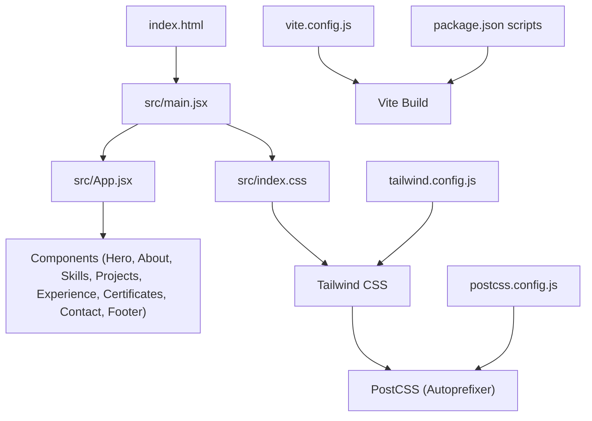
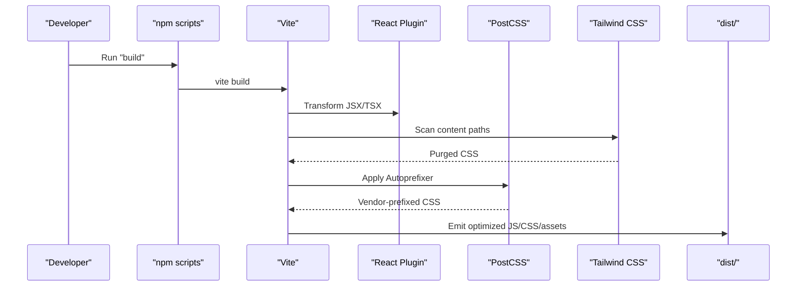
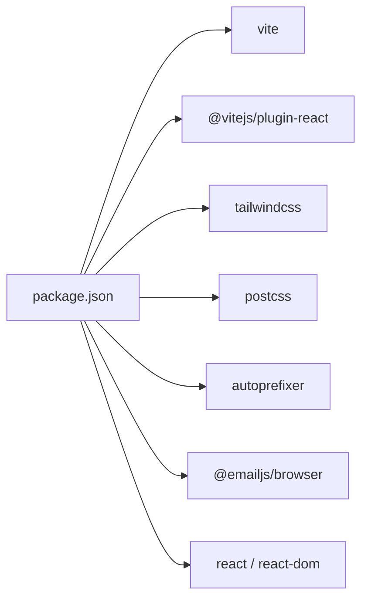

# Build & Deployment

<cite>
**Referenced Files in This Document**
- [package.json](file://package.json)
- [vite.config.js](file://vite.config.js)
- [postcss.config.js](file://postcss.config.js)
- [tailwind.config.js](file://tailwind.config.js)
- [index.html](file://index.html)
- [src/main.jsx](file://src/main.jsx)
- [src/App.jsx](file://src/App.jsx)
- [src/index.css](file://src/index.css)
- [src/config/emailjs.js](file://src/config/emailjs.js)
</cite>

## Table of Contents
1. [Introduction](#introduction)
2. [Project Structure](#project-structure)
3. [Core Components](#core-components)
4. [Architecture Overview](#architecture-overview)
5. [Detailed Component Analysis](#detailed-component-analysis)
6. [Dependency Analysis](#dependency-analysis)
7. [Performance Considerations](#performance-considerations)
8. [Troubleshooting Guide](#troubleshooting-guide)
9. [Conclusion](#conclusion)
10. [Appendices](#appendices)

## Introduction
This document explains how to build and deploy the portfolio website with Vite, including PostCSS processing, asset management, optimization strategies, environment configuration, and step-by-step deployment instructions for GitHub Pages, Netlify, and Vercel. It also covers caching, bundle optimization, and monitoring deployment performance.

## Project Structure
The project is a React + Vite application with Tailwind CSS and PostCSS. The build pipeline compiles JSX via Vite’s React plugin, processes CSS through Tailwind and Autoprefixer, and outputs an optimized static site under dist/.

**Diagram sources**
- [index.html:1-30](file://index.html#L1-L30)
- [src/main.jsx:1-11](file://src/main.jsx#L1-L11)
- [src/App.jsx:1-51](file://src/App.jsx#L1-L51)
- [src/index.css:1-787](file://src/index.css#L1-L787)
- [vite.config.js:1-13](file://vite.config.js#L1-L13)
- [postcss.config.js:1-7](file://postcss.config.js#L1-L7)
- [tailwind.config.js:1-29](file://tailwind.config.js#L1-L29)
- [package.json:1-30](file://package.json#L1-L30)

**Section sources**
- [package.json:6-11](file://package.json#L6-L11)
- [vite.config.js:1-13](file://vite.config.js#L1-L13)
- [postcss.config.js:1-7](file://postcss.config.js#L1-L7)
- [tailwind.config.js:1-29](file://tailwind.config.js#L1-L29)
- [index.html:1-30](file://index.html#L1-L30)
- [src/main.jsx:1-11](file://src/main.jsx#L1-L11)
- [src/App.jsx:1-51](file://src/App.jsx#L1-L51)
- [src/index.css:1-787](file://src/index.css#L1-L787)

## Core Components
- Build tooling: Vite with React plugin; development server with file watching exclusions for large assets like certificates.
- CSS pipeline: Tailwind CSS configured to scan source files, with PostCSS adding vendor prefixes via Autoprefixer.
- Entry points: index.html mounts the React app from src/main.jsx, which renders App and global styles.
- Environment usage: EmailJS credentials are loaded from a local config module; no runtime env variables are required by default.

Key responsibilities:
- vite.config.js: Enables React plugin and excludes heavy directories from dev watcher.
- postcss.config.js: Chains Tailwind and Autoprefixer.
- tailwind.config.js: Defines content paths, dark mode strategy, theme extensions, and fonts.
- index.html: Provides meta tags, preconnect hints for fonts, and script entry.
- src/main.jsx: Bootstraps React root and imports global CSS.
- src/App.jsx: Composes page sections and manages theme state.

**Section sources**
- [vite.config.js:1-13](file://vite.config.js#L1-L13)
- [postcss.config.js:1-7](file://postcss.config.js#L1-L7)
- [tailwind.config.js:1-29](file://tailwind.config.js#L1-L29)
- [index.html:1-30](file://index.html#L1-L30)
- [src/main.jsx:1-11](file://src/main.jsx#L1-L11)
- [src/App.jsx:1-51](file://src/App.jsx#L1-L51)

## Architecture Overview
The build architecture transforms source code into a production-ready static bundle:

**Diagram sources**
- [package.json:6-11](file://package.json#L6-L11)
- [vite.config.js:1-13](file://vite.config.js#L1-L13)
- [postcss.config.js:1-7](file://postcss.config.js#L1-L7)
- [tailwind.config.js:1-29](file://tailwind.config.js#L1-L29)

## Detailed Component Analysis

### Vite Build Configuration
- Plugins: React plugin enabled for JSX transformation.
- Dev server watch: Ignores large or irrelevant folders (ZIPs, PDFs, certificates, node_modules, .git).
- Output: Standard Vite production build produces a minified, hashed, and optimized bundle in dist/.

Optimization notes:
- Vite uses Rollup under the hood for production builds, enabling code splitting and tree-shaking automatically.
- No custom Rollup options are set; defaults apply.

**Section sources**
- [vite.config.js:1-13](file://vite.config.js#L1-L13)
- [package.json:6-11](file://package.json#L6-L11)

### PostCSS and Tailwind CSS Processing
- PostCSS chain: Tailwind CSS followed by Autoprefixer.
- Tailwind scanning: Configured to scan HTML and all JS/JSX/TS/TSX files under src/.
- Theme and fonts: Custom brand colors and font families extended in Tailwind config.
- Global styles: Tailwind directives imported in src/index.css.

Performance considerations:
- Tailwind purges unused classes during build based on content paths.
- Autoprefixer adds necessary vendor prefixes at build time.

**Section sources**
- [postcss.config.js:1-7](file://postcss.config.js#L1-L7)
- [tailwind.config.js:1-29](file://tailwind.config.js#L1-L29)
- [src/index.css:1-787](file://src/index.css#L1-L787)

### Asset Management Strategy
- Static assets: Place files under public/ to be served as-is. The project includes a certificates directory under public/certificates.
- Fonts: Google Fonts are linked in index.html with preconnect hints to reduce latency.
- Images and other media: Prefer importing via modules for bundling or place in public for direct URLs.

Caching strategy:
- Vite emits content-hashed filenames for long-term caching in production.
- Ensure your hosting provider serves static assets with appropriate cache headers (see Deployment section).

**Section sources**
- [index.html:1-30](file://index.html#L1-L30)

### Application Entry and Rendering
- Entry point: index.html loads src/main.jsx as a module.
- Root rendering: main.jsx creates a React root and renders App within StrictMode.
- App composition: App.jsx composes page sections and manages theme persistence via localStorage.

**Section sources**
- [index.html:20-30](file://index.html#L20-L30)
- [src/main.jsx:1-11](file://src/main.jsx#L1-L11)
- [src/App.jsx:1-51](file://src/App.jsx#L1-L51)

### Environment Variables and External Services
- EmailJS integration: Credentials are defined in a local config module. Replace placeholder values with real keys when deploying.
- No Vite env variables are used in this project; if needed, prefix them with VITE_ and reference via import.meta.env in code.

Security note:
- Do not commit secrets to version control. Use platform-specific secret management (e.g., Netlify/Vercel environment variables) and update the config accordingly.

**Section sources**
- [src/config/emailjs.js:1-82](file://src/config/emailjs.js#L1-L82)

## Dependency Analysis
High-level dependencies relevant to build and deployment:
- Runtime: React and ReactDOM.
- UI: Tailwind CSS, Lucide icons, canvas-confetti.
- Utilities: EmailJS browser SDK.
- Tooling: Vite, PostCSS, Autoprefixer, Oxlint.

**Diagram sources**
- [package.json:12-28](file://package.json#L12-L28)

**Section sources**
- [package.json:12-28](file://package.json#L12-L28)

## Performance Considerations
- Code splitting and tree-shaking: Enabled by default in Vite production builds.
- CSS optimization: Tailwind purges unused utilities; Autoprefixer ensures compatibility without bloating CSS.
- Asset size: Avoid shipping large binary assets (PDFs, ZIPs) in the bundle; keep them in public/ and link directly.
- Fonts: Preconnect to font CDNs to improve first paint.
- Bundle analysis: Optionally add a bundle analyzer plugin to inspect sizes and identify heavy dependencies.
- Minification: Vite minifies JS and CSS by default in production.

[No sources needed since this section provides general guidance]

## Troubleshooting Guide
Common issues and resolutions:
- Build fails due to missing dependencies:
  - Ensure Node.js version matches project requirements and run install before build.
- Tailwind styles not applied:
  - Verify content paths in Tailwind config include all source files where classes are used.
- Large certificate assets slow down dev:
  - Watcher ignores certificates folder; ensure you do not import them directly in dev.
- EmailJS not sending emails:
  - Confirm that real service/template/public key values are set in the email config module.
- Routing or base path issues on subdirectory hosting:
  - Configure base path in Vite config if deploying to a subpath (e.g., GitHub Pages user/org sites).

**Section sources**
- [tailwind.config.js:1-29](file://tailwind.config.js#L1-L29)
- [vite.config.js:1-13](file://vite.config.js#L1-L13)
- [src/config/emailjs.js:1-82](file://src/config/emailjs.js#L1-L82)

## Conclusion
This portfolio uses a modern, efficient stack: Vite for fast builds, Tailwind + PostCSS for scalable styling, and a simple React entrypoint. Production builds output a compact, cached-friendly static site ready for deployment to any static host. Follow the deployment steps below to publish quickly and reliably.

[No sources needed since this section summarizes without analyzing specific files]

## Appendices

### Build Scripts
- Development: Start dev server with hot module replacement.
- Build: Generate production assets under dist/.
- Preview: Serve the production build locally to verify output.
- Lint: Run code quality checks.

**Section sources**
- [package.json:6-11](file://package.json#L6-L11)

### Step-by-Step Deployment

#### GitHub Pages
- Prerequisites:
  - If publishing to a user or organization site (e.g., username.github.io), set the base path in Vite config to match the repository name.
- Steps:
  - Install dependencies and build the project.
  - Deploy the contents of the dist/ folder to the gh-pages branch or configure a GitHub Actions workflow to automate publishing.
  - Enable GitHub Pages in repository settings to serve from dist/.

Notes:
- Ensure correct base path for subdirectory deployments.
- Set cache headers via repository settings or a _config.yml if needed.

**Section sources**
- [package.json:6-11](file://package.json#L6-L11)
- [vite.config.js:1-13](file://vite.config.js#L1-L13)

#### Netlify
- Automated builds:
  - Connect your repository to Netlify.
  - Set Build command to the build script and Publish directory to dist/.
  - Add environment variables under Site settings > Environment variables if using external services.
- Manual upload:
  - Build locally and drag-and-drop the dist/ folder into Netlify’s deploy area.

Caching:
- Netlify sets strong caching for hashed assets by default.

**Section sources**
- [package.json:6-11](file://package.json#L6-L11)

#### Vercel
- Automated builds:
  - Import the project from your Git provider.
  - Framework preset should detect Vite automatically; Build Command can be set to the build script and Output Directory to dist/.
- Environment variables:
  - Add any required variables under Project settings > Environment Variables.

Caching:
- Vercel serves static assets with optimal caching headers.

**Section sources**
- [package.json:6-11](file://package.json#L6-L11)

### Environment Variable Setup
- Current setup:
  - EmailJS credentials are stored in a local config module. Update these values before deploying to production.
- Optional Vite env variables:
  - Create a .env file (or .env.production) and define variables prefixed with VITE_.
  - Access them in code via import.meta.env.VITE_*.
- Best practices:
  - Never commit secrets to version control.
  - Use platform secret managers (Netlify/Vercel/GitHub Secrets) and inject variables at build or runtime as supported.

**Section sources**
- [src/config/emailjs.js:1-82](file://src/config/emailjs.js#L1-L82)

### Caching Strategies
- Client-side caching:
  - Rely on Vite’s content-hashed filenames for long-term caching of JS/CSS/assets.
- CDN caching:
  - Configure CDN or hosting provider to cache immutable assets indefinitely and non-fingerprinted assets with short TTLs.
- Service workers:
  - Not included by default; consider adding one if offline support or advanced caching is required.

[No sources needed since this section provides general guidance]

### Monitoring Deployment Performance
- Web Vitals:
  - Integrate a lightweight library to measure Core Web Vitals in production.
- Analytics:
  - Add analytics to track traffic and performance metrics.
- Error tracking:
  - Integrate error reporting to capture runtime issues in production.

[No sources needed since this section provides general guidance]