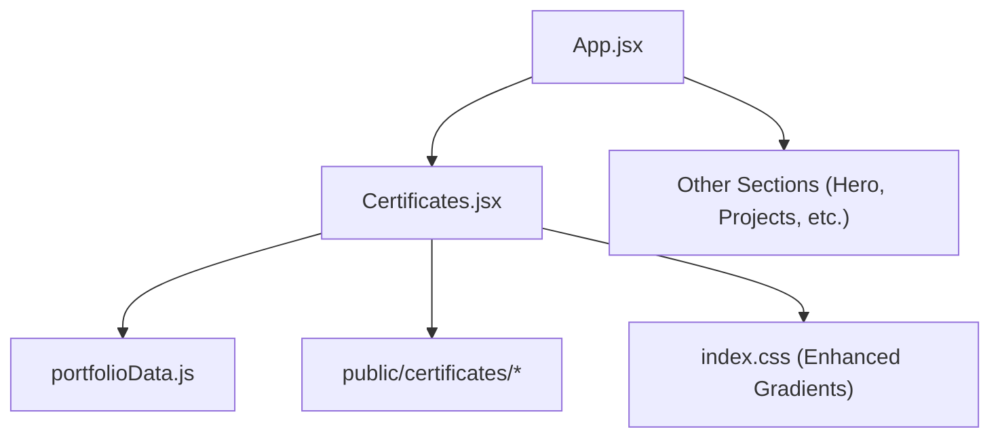
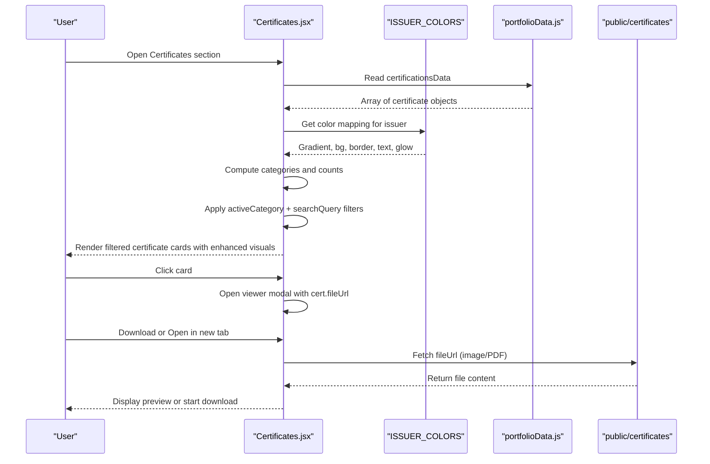
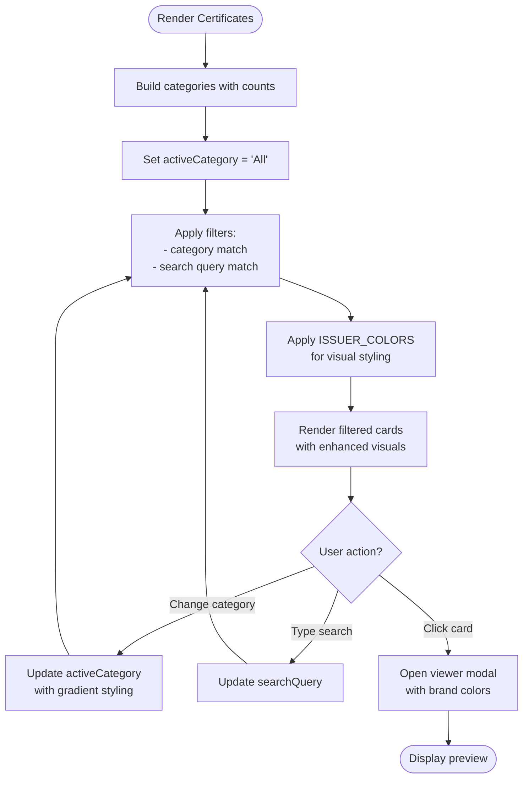
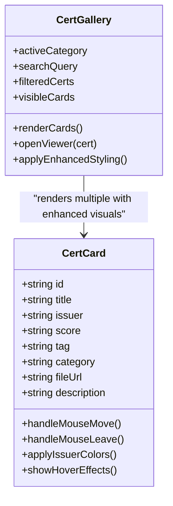
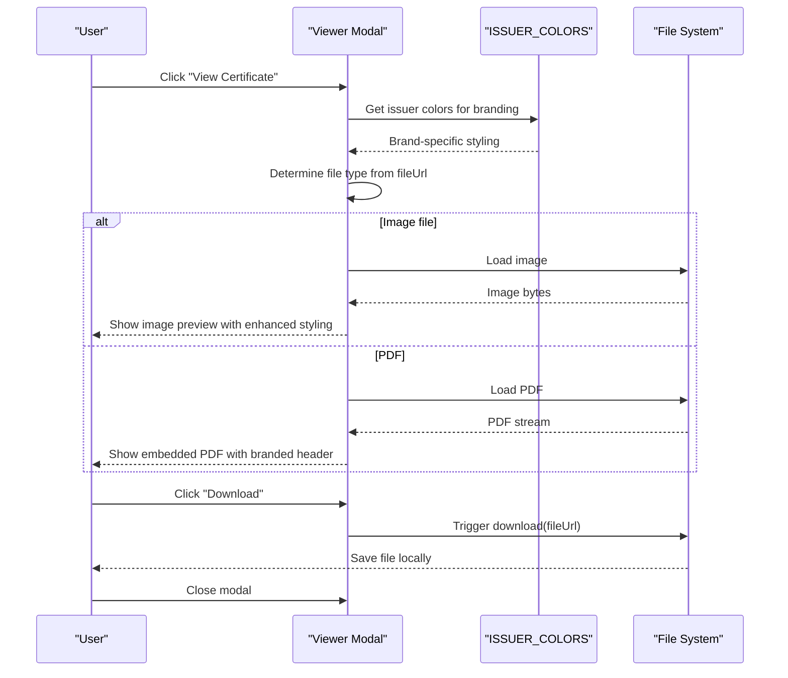
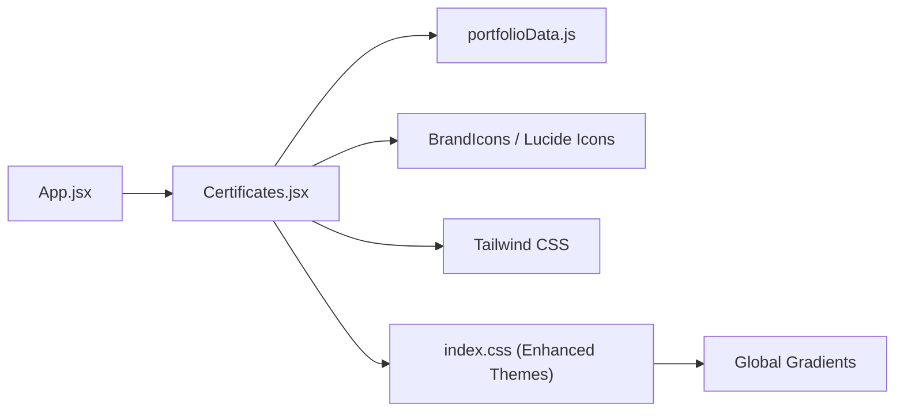

# Certificates Management

<cite>
**Referenced Files in This Document**
- [Certificates.jsx](file://src/components/Certificates.jsx)
- [portfolioData.js](file://src/data/portfolioData.js)
- [App.jsx](file://src/App.jsx)
- [index.css](file://src/index.css)
</cite>

## Update Summary
**Changes Made**
- Updated Enhanced Visual Design section to document comprehensive issuer color mapping system
- Added detailed coverage of gradient colors, background opacities, and vibrant text colors for all certification providers
- Enhanced Category Filter Bar section with improved responsive design details
- Updated Gallery Layout section to reflect new visual enhancements
- Added comprehensive documentation of the ISSUER_COLORS configuration system

## Table of Contents
1. [Introduction](#introduction)
2. [Project Structure](#project-structure)
3. [Core Components](#core-components)
4. [Architecture Overview](#architecture-overview)
5. [Detailed Component Analysis](#detailed-component-analysis)
6. [Dependency Analysis](#dependency-analysis)
7. [Performance Considerations](#performance-considerations)
8. [Troubleshooting Guide](#troubleshooting-guide)
9. [Conclusion](#conclusion)
10. [Appendices](#appendices)

## Introduction
This document explains the Certificates management system implemented in the portfolio application. It covers how certificates are organized and categorized, how category-based filtering and search work, and how the gallery displays certificate cards with interactive viewing and download capabilities. The system features an advanced visual design with enhanced issuer color mappings, improved gradient colors, enhanced background opacities, and more vibrant text colors across all certification providers. It also documents bundle downloads, file handling for images and PDFs, performance optimizations for large collections, and user experience considerations for verification workflows.

## Project Structure
The certificates feature is composed of:
- A data layer that defines all certificates and personal information
- A UI component that renders the gallery, filters, viewer modal, and download actions with enhanced visual styling
- An app shell that includes the Certificates section within the main page flow
- Global CSS variables and gradients that support the enhanced visual theme

**Diagram sources**
- [App.jsx:1-51](file://src/App.jsx#L1-L51)
- [Certificates.jsx:1-597](file://src/components/Certificates.jsx#L1-L597)
- [portfolioData.js:275-1123](file://src/data/portfolioData.js#L275-L1123)
- [index.css:48-74](file://src/index.css#L48-L74)

**Section sources**
- [App.jsx:1-51](file://src/App.jsx#L1-L51)
- [Certificates.jsx:1-597](file://src/components/Certificates.jsx#L1-L597)
- [portfolioData.js:275-1123](file://src/data/portfolioData.js#L275-L1123)

## Core Components
- Certificate data model: Each certificate entry includes a unique id, title, issuer, score, tag, category, fileUrl, and description. Categories group certificates by provider or program (e.g., HackerRank, Google, LinkedIn & Microsoft).
- **Enhanced Visual System**: Advanced issuer color mapping with sophisticated gradient colors, optimized background opacities, and vibrant text colors for all certification providers including HackerRank, HCL GUVI, AICTE Parakh, LinkedIn & Microsoft, Google, Infosys Springboard, TCS iON, Simplilearn, NPTEL & Academics, IEEE & Badges, and IIT Bombay.
- Gallery UI: Renders a responsive grid of certificate cards with hover effects, category filter buttons, and a search input, featuring enhanced visual styling with glow effects and gradient top stripes.
- Viewer modal: Opens a full-screen preview for each certificate, supporting both image and PDF formats, with download and open-in-new-tab options.
- Bundle download: Provides a single link to download all certificates as a zip archive.

Key responsibilities:
- Compute categories and counts dynamically from the dataset
- Apply enhanced visual styling based on issuer color mappings
- Filter certificates by selected category and text search
- Manage visibility animations via intersection observers
- Handle 3D tilt interactions on cards with enhanced visual feedback
- Render appropriate viewers based on file type

**Section sources**
- [Certificates.jsx:139-597](file://src/components/Certificates.jsx#L139-L597)
- [Certificates.jsx:22-115](file://src/components/Certificates.jsx#L22-L115)
- [portfolioData.js:275-1123](file://src/data/portfolioData.js#L275-L1123)

## Architecture Overview
The Certificates module follows a clear separation between data and presentation with enhanced visual architecture:
- Data source: The certifications array in portfolioData.js provides structured metadata and file paths.
- **Enhanced Visual Layer**: The ISSUER_COLORS configuration maps each certification provider to specific gradient colors, background opacities, border colors, text colors, and glow effects.
- Presentation: The Certificates component reads this data, computes derived state (categories, filtered list), and renders the UI with dynamic visual styling.
- File serving: Actual certificate files are served from public/certificates; the component references them via relative URLs.

**Diagram sources**
- [Certificates.jsx:139-597](file://src/components/Certificates.jsx#L139-L597)
- [Certificates.jsx:22-115](file://src/components/Certificates.jsx#L22-L115)
- [portfolioData.js:275-1123](file://src/data/portfolioData.js#L275-L1123)

## Detailed Component Analysis

### Enhanced Visual Design System
The Certificates component features a comprehensive visual enhancement system through the ISSUER_COLORS configuration object that provides sophisticated styling for each certification provider:

**Color Mapping Features:**
- **Gradient Colors**: Each issuer has a unique multi-stop linear gradient (135deg angles) creating vibrant, modern visual identity
- **Background Opacities**: Optimized rgba values (0.15 opacity) providing subtle background highlighting without overwhelming the content
- **Border Colors**: Semi-transparent borders (0.4 opacity) creating defined card boundaries with brand consistency
- **Text Colors**: Vibrant, high-contrast colors ensuring excellent readability and visual appeal
- **Glow Effects**: Sophisticated box-shadow configurations creating depth and focus indicators

**Supported Issuers:**
- HackerRank: Emerald-to-cyan gradients with green tones
- HCL GUVI: Cyan-to-blue gradients with teal accents  
- AICTE Parakh: Amber-to-orange gradients with warm tones
- LinkedIn & Microsoft: Blue gradient palette reflecting corporate branding
- Google: Multi-color gradient representing Google's brand identity
- Infosys Springboard: Professional blue gradient scheme
- TCS iON: Purple-violet gradient with modern tech aesthetic
- Simplilearn: Pink-magenta gradient with vibrant energy
- NPTEL & Academics: Green gradient emphasizing educational excellence
- IEEE & Badges: Orange gradient representing technical authority
- IIT Bombay: Golden amber gradient signifying academic prestige

**Visual Applications:**
- Top gradient stripes on certificate cards
- Hover glow overlays with matching brand colors
- Tag badges with colored backgrounds and borders
- Issuer initials with branded color schemes
- Active filter button states with gradient backgrounds
- Card hover effects with brand-specific glows

**Section sources**
- [Certificates.jsx:22-115](file://src/components/Certificates.jsx#L22-L115)
- [Certificates.jsx:374-387](file://src/components/Certificates.jsx#L374-L387)
- [Certificates.jsx:391-427](file://src/components/Certificates.jsx#L391-L427)

### Data Model and Organization
- Each certificate object contains:
  - id: Unique identifier used for rendering keys and tracking visibility
  - title: Human-readable name
  - issuer: Provider name
  - score: Badge or result label
  - tag: Short label shown on the card
  - category: Grouping key used for filtering
  - fileUrl: Relative path to the asset under public/certificates
  - description: Brief summary for the card
- Categories are derived at runtime from the dataset, ensuring the filter bar always reflects available groups and their counts.

Examples of categories present in the dataset include HackerRank, HCL GUVI, AICTE Parakh, LinkedIn & Microsoft, Google, Infosys Springboard, TCS iON, NPTEL & Academics, Simplilearn, IEEE & Badges, and IIT Bombay.

**Section sources**
- [portfolioData.js:275-1123](file://src/data/portfolioData.js#L275-L1123)

### Category-Based Filtering and Search
- Categories: Computed using a map over the dataset to count occurrences per category; an "All" option shows the entire set.
- Filtering logic: Combines category selection with a free-text search across title, issuer, and description fields.
- **Enhanced Visual Integration**: Filter buttons dynamically apply issuer-specific gradient backgrounds and glow effects when active, providing immediate visual feedback for category selection.

**Updated** The category filter bar now features enhanced visual integration with issuer-specific gradient colors and glow effects, providing immediate visual feedback when users select different categories.

**Diagram sources**
- [Certificates.jsx:149-171](file://src/components/Certificates.jsx#L149-L171)
- [Certificates.jsx:311-346](file://src/components/Certificates.jsx#L311-L346)
- [Certificates.jsx:348-450](file://src/components/Certificates.jsx#L348-L450)

**Section sources**
- [Certificates.jsx:149-171](file://src/components/Certificates.jsx#L149-L171)
- [Certificates.jsx:311-346](file://src/components/Certificates.jsx#L311-L346)

### Enhanced Gallery Layout and Card Interactions
- Grid layout adapts to screen size (single column on small screens, multi-column on larger screens).
- **Enhanced Card Styling**: Cards now feature sophisticated visual elements including:
  - Top gradient stripes with issuer-specific colors
  - Hover glow overlays with brand-matched shadows and borders
  - Animated shimmer effects on hover
  - Dynamic 3D tilt interactions with enhanced visual feedback
  - IntersectionObserver-driven fade/slide-in animations with staggered delays
- Cards display:
  - Tag and score badges with colored backgrounds and borders
  - Title and issuer with enhanced typography
  - Description snippet with improved readability
  - "View Certificate" call-to-action with animated chevron
- Interactions:
  - 3D tilt effect on mouse move for visual depth with smooth transitions
  - Enhanced hover states with brand-specific glow effects
  - Smooth animation transitions for better user experience

**Diagram sources**
- [Certificates.jsx:221-237](file://src/components/Certificates.jsx#L221-L237)
- [Certificates.jsx:201-219](file://src/components/Certificates.jsx#L201-L219)
- [Certificates.jsx:348-450](file://src/components/Certificates.jsx#L348-L450)

**Section sources**
- [Certificates.jsx:201-237](file://src/components/Certificates.jsx#L201-L237)
- [Certificates.jsx:348-450](file://src/components/Certificates.jsx#L348-L450)

### Certificate Viewing and Download
- Viewer modal:
  - Displays image files directly using an img element with enhanced styling
  - Embeds PDFs using an iframe with proper container styling
  - Provides download button and open-in-new-tab button with brand-consistent styling
  - Closes on backdrop click or close button with smooth transitions
  - Features header with issuer-specific color coding and branding
- Bundle download:
  - A prominent button links to a zip archive containing all certificates with enhanced visual styling

**Diagram sources**
- [Certificates.jsx:503-593](file://src/components/Certificates.jsx#L503-L593)
- [Certificates.jsx:461-471](file://src/components/Certificates.jsx#L461-L471)

**Section sources**
- [Certificates.jsx:503-593](file://src/components/Certificates.jsx#L503-L593)
- [Certificates.jsx:461-471](file://src/components/Certificates.jsx#L461-L471)

### Adding New Certificates
To add a new certificate:
- Add a new entry to the certifications array in the data file with required fields: id, title, issuer, score, tag, category, fileUrl, description.
- Place the actual certificate file under public/certificates and reference it via fileUrl.
- Ensure the category value matches existing categories or introduce a new one; the filter bar will auto-update with counts.
- **Visual Enhancement**: If adding a new issuer category, consider adding corresponding color mapping in the ISSUER_COLORS object to maintain visual consistency.

Guidelines:
- Use descriptive titles and concise descriptions for better searchability
- Choose a consistent category naming convention to avoid duplicates
- Keep fileUrl paths accurate and accessible
- Consider brand alignment when selecting color schemes for new issuers

**Section sources**
- [portfolioData.js:275-1123](file://src/data/portfolioData.js#L275-L1123)
- [Certificates.jsx:22-115](file://src/components/Certificates.jsx#L22-L115)

### Organizing by Categories
- Categories are computed from the dataset; ensure each certificate has a meaningful category field.
- The enhanced filter bar automatically lists all categories with counts using responsive flex-wrap layout and applies issuer-specific gradient styling when active.
- For large datasets, consider grouping related providers into broader categories to simplify navigation.

**Updated** The filter bar now provides enhanced visual feedback with issuer-specific gradient backgrounds and glow effects when categories are selected, improving user interaction and visual hierarchy.

**Section sources**
- [Certificates.jsx:149-159](file://src/components/Certificates.jsx#L149-L159)
- [Certificates.jsx:311-346](file://src/components/Certificates.jsx#L311-L346)

### Customizing the Gallery Layout
- Grid responsiveness is controlled via Tailwind classes; adjust breakpoints to change columns per screen size.
- **Enhanced Color System**: Card styling uses the ISSUER_COLORS configuration for category-based visual theming; modify the color mapping to rebrand or emphasize certain issuers.
- Animations and transitions can be tuned by adjusting thresholds and delays in the observer and transform styles.
- **Advanced Customization Options**:
  - Modify gradient angles and color stops in ISSUER_COLORS for different visual effects
  - Adjust background opacities for stronger/weaker visual presence
  - Customize glow intensities for different interaction states
  - Extend color mappings for new certification providers

**Section sources**
- [Certificates.jsx:348-450](file://src/components/Certificates.jsx#L348-L450)
- [Certificates.jsx:221-237](file://src/components/Certificates.jsx#L221-L237)
- [Certificates.jsx:22-115](file://src/components/Certificates.jsx#L22-L115)

## Dependency Analysis
- Certificates.jsx depends on:
  - portfolioData.js for certificationsData and personalInfo
  - Brand icons and Lucide icons for UI elements
  - Tailwind CSS utilities for styling
  - **Enhanced CSS Variables**: index.css provides global gradient definitions and visual themes
- App.jsx includes Certificates as part of the main page flow.

**Diagram sources**
- [App.jsx:1-51](file://src/App.jsx#L1-L51)
- [Certificates.jsx:1-21](file://src/components/Certificates.jsx#L1-L21)
- [portfolioData.js:1-25](file://src/data/portfolioData.js#L1-L25)
- [index.css:48-74](file://src/index.css#L48-L74)

**Section sources**
- [App.jsx:1-51](file://src/App.jsx#L1-L51)
- [Certificates.jsx:1-21](file://src/components/Certificates.jsx#L1-L21)
- [portfolioData.js:1-25](file://src/data/portfolioData.js#L1-L25)

## Performance Considerations
- Memoization: Uses useMemo to compute categories and filtered results efficiently, avoiding unnecessary recalculations on render.
- Lazy visibility: IntersectionObserver triggers card animations only when cards enter the viewport, reducing initial layout cost.
- Conditional rendering: Viewer modal renders only when a certificate is selected, minimizing overhead.
- File types: Images are rendered directly; PDFs are embedded via iframe. For very large PDFs, consider lazy loading or thumbnail previews to improve perceived performance.
- Bundle downloads: Provide a pre-built zip to reduce server load during individual downloads.
- **Enhanced Visual Performance**: 
  - CSS transforms and opacity changes are hardware-accelerated for smooth animations
  - Gradient backgrounds use efficient CSS properties that don't trigger layout recalculation
  - Glow effects utilize optimized box-shadow configurations
  - Staggered animation delays prevent simultaneous heavy rendering operations
- Mobile optimization: Enhanced visual elements maintain performance on mobile devices through efficient CSS implementations

Recommendations:
- Implement virtualized lists if the number of certificates grows significantly beyond current scale.
- Preload frequently accessed assets or use CDN caching for faster delivery.
- Debounce search input to reduce filter computations during typing.
- Consider lazy loading complex visual effects for below-the-fold content.

[No sources needed since this section provides general guidance]

## Troubleshooting Guide
Common issues and resolutions:
- Empty results after search/filter:
  - Verify search query spelling and category selection
  - Ensure certificate entries have correct category values and searchable fields populated
- Viewer not displaying content:
  - Confirm fileUrl points to a valid file under public/certificates
  - Check browser support for embedded PDFs; fallback to download or open-in-new-tab
- Bundle download not working:
  - Ensure the zip file exists at the expected path referenced by the download link
- Performance lag with many certificates:
  - Reduce initial render by implementing pagination or virtualization
  - Optimize images and compress PDFs where possible
- **Visual Issues**:
  - Missing issuer colors: Verify category names match exactly with ISSUER_COLORS keys
  - Inconsistent styling: Check that all certificate entries have valid category assignments
  - Performance issues with gradients: Ensure gradient definitions are properly formatted
  - Mobile display problems: Test responsive behavior across different screen sizes
- **Mobile layout issues**: If category buttons appear cramped on mobile devices, verify that the flex-wrap container is properly configured with adequate gap spacing.

**Section sources**
- [Certificates.jsx:452-459](file://src/components/Certificates.jsx#L452-L459)
- [Certificates.jsx:503-593](file://src/components/Certificates.jsx#L503-L593)
- [Certificates.jsx:461-471](file://src/components/Certificates.jsx#L461-L471)
- [Certificates.jsx:22-115](file://src/components/Certificates.jsx#L22-L115)

## Conclusion
The Certificates management system provides a robust, user-friendly interface for browsing, filtering, and downloading a diverse collection of credentials. With the recent extensive visual enhancements featuring comprehensive issuer color mappings, improved gradient colors, enhanced background opacities, and more vibrant text colors across all certification providers, the system now offers superior visual appeal and brand consistency. The enhanced ISSUER_COLORS configuration system enables sophisticated visual theming while maintaining performance and accessibility. It leverages efficient data processing, responsive design, interactive features, and advanced visual styling to enhance the verification workflow. With clear data organization and extensible UI patterns, it supports easy addition of new certificates and customization of layout and branding.

[No sources needed since this section summarizes without analyzing specific files]

## Appendices

### Example Workflows

#### Adding a New Certificate
- Steps:
  - Add a new entry to the certifications array with all required fields
  - Place the certificate file under public/certificates
  - Reference the file via fileUrl in the new entry
  - Optionally assign or create a category to organize the certificate
  - **Enhanced**: Consider adding corresponding color mapping in ISSUER_COLORS for visual consistency
- Result:
  - The new certificate appears in the gallery with enhanced visual styling and participates in filtering/search

**Section sources**
- [portfolioData.js:275-1123](file://src/data/portfolioData.js#L275-L1123)
- [Certificates.jsx:22-115](file://src/components/Certificates.jsx#L22-L115)

#### Verifying a Certificate
- Steps:
  - Locate the certificate in the gallery
  - Click "View Certificate" to open the modal with enhanced branding
  - Review the embedded content or download/open in a new tab
  - Validate issuer, title, and score against expectations
  - **Enhanced**: Observe issuer-specific color coding and visual branding throughout the interface

**Section sources**
- [Certificates.jsx:503-593](file://src/components/Certificates.jsx#L503-L593)

#### Downloading All Certificates
- Steps:
  - Click the "Download All" button with enhanced visual styling
  - Save the zip archive to your device
  - Extract and verify contents as needed

**Section sources**
- [Certificates.jsx:461-471](file://src/components/Certificates.jsx#L461-L471)

### Enhanced Visual Design Implementation

The Certificates component features a sophisticated visual enhancement system built around the ISSUER_COLORS configuration:

**Color Mapping Architecture:**
- **Gradient Definitions**: Multi-stop linear gradients (135deg) creating vibrant, modern visual identity for each issuer
- **Background Opacities**: Optimized rgba values (0.15 opacity) providing subtle yet effective background highlighting
- **Border Styling**: Semi-transparent borders (0.4 opacity) creating defined card boundaries with brand consistency
- **Text Colors**: Vibrant, high-contrast colors ensuring excellent readability and visual appeal
- **Glow Effects**: Sophisticated box-shadow configurations creating depth and focus indicators

**Visual Applications Throughout Component:**
- Top gradient stripes on certificate cards with issuer-specific colors
- Hover glow overlays with matching brand colors and shadows
- Tag badges with colored backgrounds and borders
- Issuer initials with branded color schemes
- Active filter button states with gradient backgrounds
- Card hover effects with brand-specific glows
- Modal headers with issuer branding

**Responsive Design Integration:**
- Enhanced visual elements maintain performance across all screen sizes
- Gradient backgrounds use efficient CSS properties that don't trigger layout recalculation
- Glow effects utilize optimized box-shadow configurations for smooth animations
- Staggered animation delays prevent simultaneous heavy rendering operations

**Section sources**
- [Certificates.jsx:22-115](file://src/components/Certificates.jsx#L22-L115)
- [Certificates.jsx:374-387](file://src/components/Certificates.jsx#L374-L387)
- [Certificates.jsx:391-427](file://src/components/Certificates.jsx#L391-L427)
- [index.css:48-74](file://src/index.css#L48-L74)