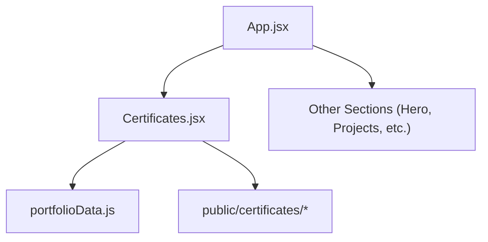
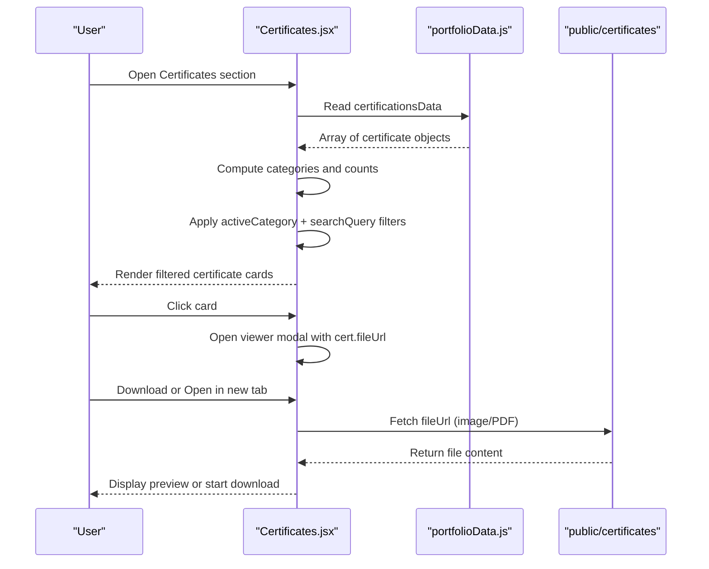
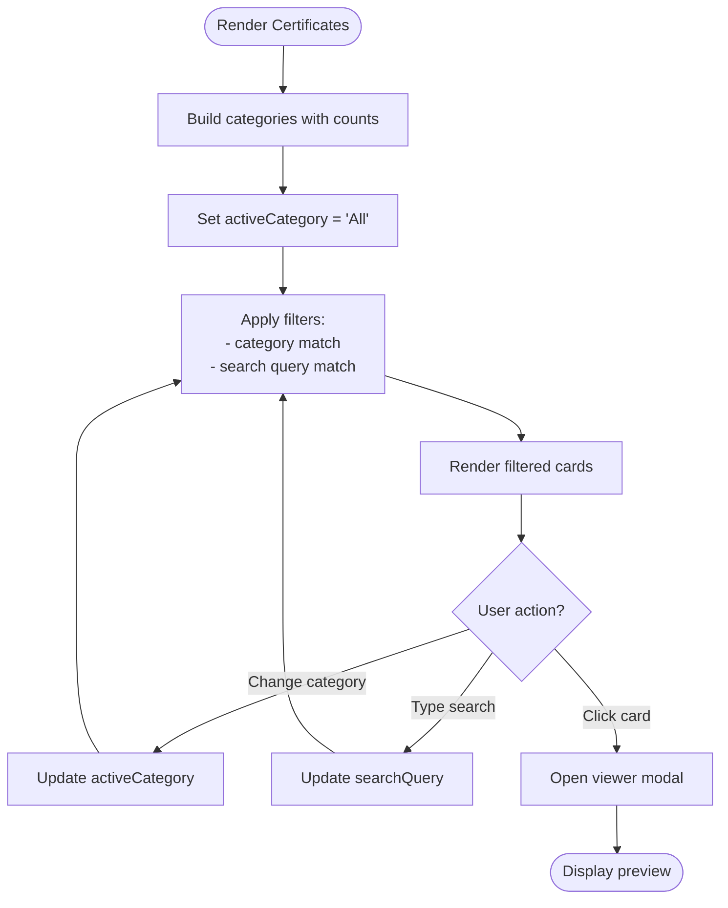
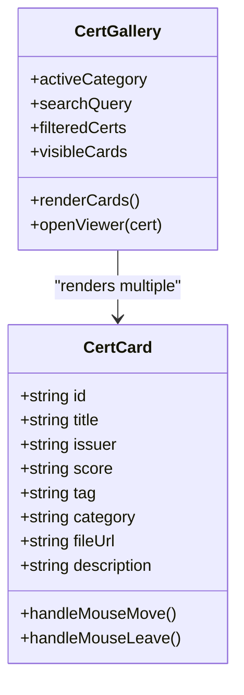
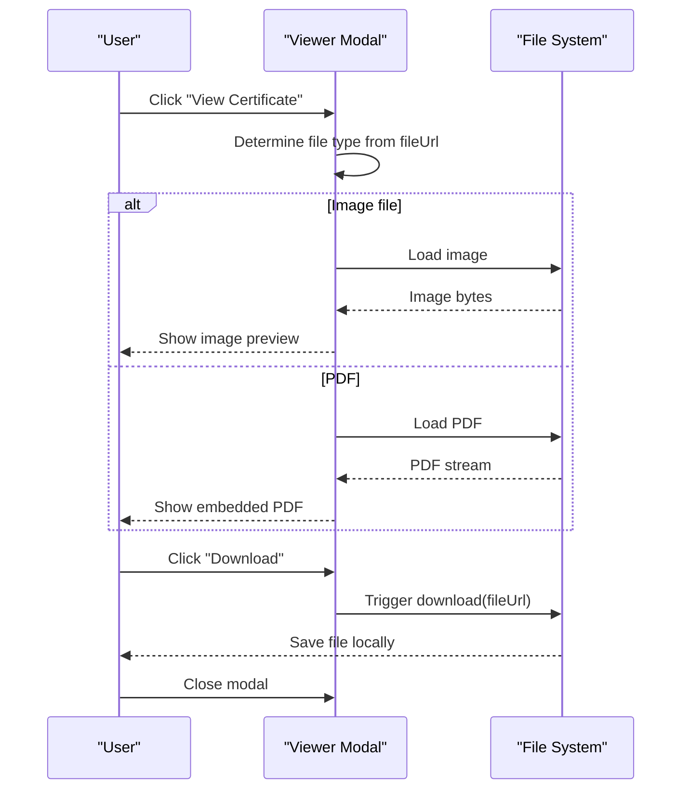
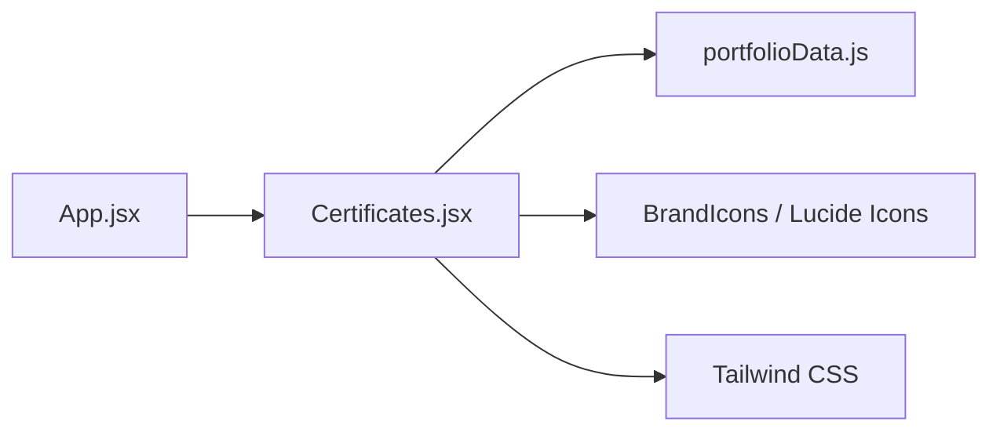

# Certificates Management

<cite>
**Referenced Files in This Document**
- [Certificates.jsx](file://src/components/Certificates.jsx)
- [portfolioData.js](file://src/data/portfolioData.js)
- [App.jsx](file://src/App.jsx)
</cite>

## Table of Contents
1. [Introduction](#introduction)
2. [Project Structure](#project-structure)
3. [Core Components](#core-components)
4. [Architecture Overview](#architecture-overview)
5. [Detailed Component Analysis](#detailed-component-analysis)
6. [Dependency Analysis](#dependency-analysis)
7. [Performance Considerations](#performance-considerations)
8. [Troubleshooting Guide](#troubleshooting-guide)
9. [Conclusion](#conclusion)
10. [Appendices](#appendices)

## Introduction
This document explains the Certificates management system implemented in the portfolio application. It covers how certificates are organized and categorized, how category-based filtering and search work, and how the gallery displays certificate cards with interactive viewing and download capabilities. It also documents bundle downloads, file handling for images and PDFs, performance optimizations for large collections, and user experience considerations for verification workflows.

## Project Structure
The certificates feature is composed of:
- A data layer that defines all certificates and personal information
- A UI component that renders the gallery, filters, viewer modal, and download actions
- An app shell that includes the Certificates section within the main page flow

**Diagram sources**
- [App.jsx:1-51](file://src/App.jsx#L1-L51)
- [Certificates.jsx:1-597](file://src/components/Certificates.jsx#L1-L597)
- [portfolioData.js:275-1123](file://src/data/portfolioData.js#L275-L1123)

**Section sources**
- [App.jsx:1-51](file://src/App.jsx#L1-L51)
- [Certificates.jsx:1-597](file://src/components/Certificates.jsx#L1-L597)
- [portfolioData.js:275-1123](file://src/data/portfolioData.js#L275-L1123)

## Core Components
- Certificate data model: Each certificate entry includes a unique id, title, issuer, score, tag, category, fileUrl, and description. Categories group certificates by provider or program (e.g., HackerRank, Google, LinkedIn & Microsoft).
- Gallery UI: Renders a responsive grid of certificate cards with hover effects, category filter buttons, and a search input.
- Viewer modal: Opens a full-screen preview for each certificate, supporting both image and PDF formats, with download and open-in-new-tab options.
- Bundle download: Provides a single link to download all certificates as a zip archive.

Key responsibilities:
- Compute categories and counts dynamically from the dataset
- Filter certificates by selected category and text search
- Manage visibility animations via intersection observers
- Handle 3D tilt interactions on cards
- Render appropriate viewers based on file type

**Section sources**
- [Certificates.jsx:139-597](file://src/components/Certificates.jsx#L139-L597)
- [portfolioData.js:275-1123](file://src/data/portfolioData.js#L275-L1123)

## Architecture Overview
The Certificates module follows a clear separation between data and presentation:
- Data source: The certifications array in portfolioData.js provides structured metadata and file paths.
- Presentation: The Certificates component reads this data, computes derived state (categories, filtered list), and renders the UI.
- File serving: Actual certificate files are served from public/certificates; the component references them via relative URLs.

**Diagram sources**
- [Certificates.jsx:139-597](file://src/components/Certificates.jsx#L139-L597)
- [portfolioData.js:275-1123](file://src/data/portfolioData.js#L275-L1123)

## Detailed Component Analysis

### Data Model and Organization
- Each certificate object contains:
  - id: Unique identifier used for rendering keys and tracking visibility
  - title: Human-readable name
  - issuer: Provider name
  - score: Badge or result label
  - tag: Short label shown on the card
  - category: Grouping key used for filtering
  - fileUrl: Relative path to the asset under public/certificates
  - description: Brief summary for the card
- Categories are derived at runtime from the dataset, ensuring the filter bar always reflects available groups and their counts.

Examples of categories present in the dataset include HackerRank, HCL GUVI, AICTE Parakh, LinkedIn & Microsoft, Google, Infosys Springboard, TCS iON, NPTEL & Academics, Simplilearn, IEEE & Badges, and IIT Bombay.

**Section sources**
- [portfolioData.js:275-1123](file://src/data/portfolioData.js#L275-L1123)

### Category-Based Filtering and Search
- Categories: Computed using a map over the dataset to count occurrences per category; an “All” option shows the entire set.
- Filtering logic: Combines category selection with a free-text search across title, issuer, and description fields.
- UI: Horizontal scrollable filter bar with badges showing counts; search input with placeholder guidance.

**Diagram sources**
- [Certificates.jsx:149-171](file://src/components/Certificates.jsx#L149-L171)
- [Certificates.jsx:311-346](file://src/components/Certificates.jsx#L311-L346)
- [Certificates.jsx:348-450](file://src/components/Certificates.jsx#L348-L450)

**Section sources**
- [Certificates.jsx:149-171](file://src/components/Certificates.jsx#L149-L171)
- [Certificates.jsx:311-346](file://src/components/Certificates.jsx#L311-L346)

### Gallery Layout and Card Interactions
- Grid layout adapts to screen size (single column on small screens, multi-column on larger screens).
- Cards display:
  - Tag and score badges
  - Title and issuer
  - Description snippet
  - “View Certificate” call-to-action
- Interactions:
  - 3D tilt effect on mouse move for visual depth
  - IntersectionObserver-driven fade/slide-in animation when cards enter viewport
  - Hover glow and gradient top stripe reflecting category colors

**Diagram sources**
- [Certificates.jsx:221-237](file://src/components/Certificates.jsx#L221-L237)
- [Certificates.jsx:201-219](file://src/components/Certificates.jsx#L201-L219)
- [Certificates.jsx:348-450](file://src/components/Certificates.jsx#L348-L450)

**Section sources**
- [Certificates.jsx:201-237](file://src/components/Certificates.jsx#L201-L237)
- [Certificates.jsx:348-450](file://src/components/Certificates.jsx#L348-L450)

### Certificate Viewing and Download
- Viewer modal:
  - Displays image files directly using an img element
  - Embeds PDFs using an iframe
  - Provides download button and open-in-new-tab button
  - Closes on backdrop click or close button
- Bundle download:
  - A prominent button links to a zip archive containing all certificates

**Diagram sources**
- [Certificates.jsx:503-593](file://src/components/Certificates.jsx#L503-L593)
- [Certificates.jsx:461-471](file://src/components/Certificates.jsx#L461-L471)

**Section sources**
- [Certificates.jsx:503-593](file://src/components/Certificates.jsx#L503-L593)
- [Certificates.jsx:461-471](file://src/components/Certificates.jsx#L461-L471)

### Adding New Certificates
To add a new certificate:
- Add a new entry to the certifications array in the data file with required fields: id, title, issuer, score, tag, category, fileUrl, description.
- Place the actual certificate file under public/certificates and reference it via fileUrl.
- Ensure the category value matches existing categories or introduce a new one; the filter bar will auto-update with counts.

Guidelines:
- Use descriptive titles and concise descriptions for better searchability
- Choose a consistent category naming convention to avoid duplicates
- Keep fileUrl paths accurate and accessible

**Section sources**
- [portfolioData.js:275-1123](file://src/data/portfolioData.js#L275-L1123)

### Organizing by Categories
- Categories are computed from the dataset; ensure each certificate has a meaningful category field.
- The filter bar automatically lists all categories with counts; users can select a specific category to narrow results.
- For large datasets, consider grouping related providers into broader categories to simplify navigation.

**Section sources**
- [Certificates.jsx:149-159](file://src/components/Certificates.jsx#L149-L159)
- [Certificates.jsx:311-346](file://src/components/Certificates.jsx#L311-L346)

### Customizing the Gallery Layout
- Grid responsiveness is controlled via Tailwind classes; adjust breakpoints to change columns per screen size.
- Card styling uses CSS variables and gradients tied to category colors; modify the color mapping to rebrand or emphasize certain issuers.
- Animations and transitions can be tuned by adjusting thresholds and delays in the observer and transform styles.

**Section sources**
- [Certificates.jsx:348-450](file://src/components/Certificates.jsx#L348-L450)
- [Certificates.jsx:221-237](file://src/components/Certificates.jsx#L221-L237)

## Dependency Analysis
- Certificates.jsx depends on:
  - portfolioData.js for certificationsData and personalInfo
  - Brand icons and Lucide icons for UI elements
  - Tailwind CSS utilities for styling
- App.jsx includes Certificates as part of the main page flow.

**Diagram sources**
- [App.jsx:1-51](file://src/App.jsx#L1-L51)
- [Certificates.jsx:1-21](file://src/components/Certificates.jsx#L1-L21)
- [portfolioData.js:1-25](file://src/data/portfolioData.js#L1-L25)

**Section sources**
- [App.jsx:1-51](file://src/App.jsx#L1-L51)
- [Certificates.jsx:1-21](file://src/components/Certificates.jsx#L1-L21)
- [portfolioData.js:1-25](file://src/data/portfolioData.js#L1-L25)

## Performance Considerations
- Memoization: Uses useMemo to compute categories and filtered results efficiently, avoiding unnecessary recalculations on render.
- Lazy visibility: IntersectionObserver triggers card animations only when cards enter the viewport, reducing initial layout cost.
- Conditional rendering: Viewer modal renders only when a certificate is selected, minimizing overhead.
- File types: Images are rendered directly; PDFs are embedded via iframe. For very large PDFs, consider lazy loading or thumbnail previews to improve perceived performance.
- Bundle downloads: Provide a pre-built zip to reduce server load during individual downloads.

Recommendations:
- Implement virtualized lists if the number of certificates grows significantly beyond current scale.
- Preload frequently accessed assets or use CDN caching for faster delivery.
- Debounce search input to reduce filter computations during typing.

[No sources needed since this section provides general guidance]

## Troubleshooting Guide
Common issues and resolutions:
- Empty results after search/filter:
  - Verify search query spelling and category selection
  - Ensure certificate entries have correct category values and searchable fields populated
- Viewer not displaying content:
  - Confirm fileUrl points to a valid file under public/certificates
  - Check browser support for embedded PDFs; fallback to download or open-in-new-tab
- Bundle download not working:
  - Ensure the zip file exists at the expected path referenced by the download link
- Performance lag with many certificates:
  - Reduce initial render by implementing pagination or virtualization
  - Optimize images and compress PDFs where possible

**Section sources**
- [Certificates.jsx:452-459](file://src/components/Certificates.jsx#L452-L459)
- [Certificates.jsx:503-593](file://src/components/Certificates.jsx#L503-L593)
- [Certificates.jsx:461-471](file://src/components/Certificates.jsx#L461-L471)

## Conclusion
The Certificates management system provides a robust, user-friendly interface for browsing, filtering, and downloading a diverse collection of credentials. It leverages efficient data processing, responsive design, and interactive features to enhance the verification workflow. With clear data organization and extensible UI patterns, it supports easy addition of new certificates and customization of layout and branding.

[No sources needed since this section summarizes without analyzing specific files]

## Appendices

### Example Workflows

#### Adding a New Certificate
- Steps:
  - Add a new entry to the certifications array with all required fields
  - Place the certificate file under public/certificates
  - Reference the file via fileUrl in the new entry
  - Optionally assign or create a category to organize the certificate
- Result:
  - The new certificate appears in the gallery and participates in filtering/search

**Section sources**
- [portfolioData.js:275-1123](file://src/data/portfolioData.js#L275-L1123)

#### Verifying a Certificate
- Steps:
  - Locate the certificate in the gallery
  - Click “View Certificate” to open the modal
  - Review the embedded content or download/open in a new tab
  - Validate issuer, title, and score against expectations

**Section sources**
- [Certificates.jsx:503-593](file://src/components/Certificates.jsx#L503-L593)

#### Downloading All Certificates
- Steps:
  - Click the “Download All” button
  - Save the zip archive to your device
  - Extract and verify contents as needed

**Section sources**
- [Certificates.jsx:461-471](file://src/components/Certificates.jsx#L461-L471)