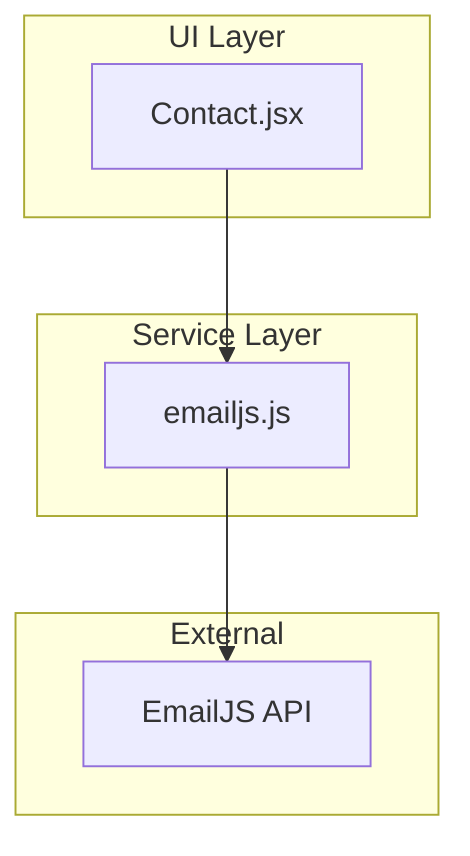
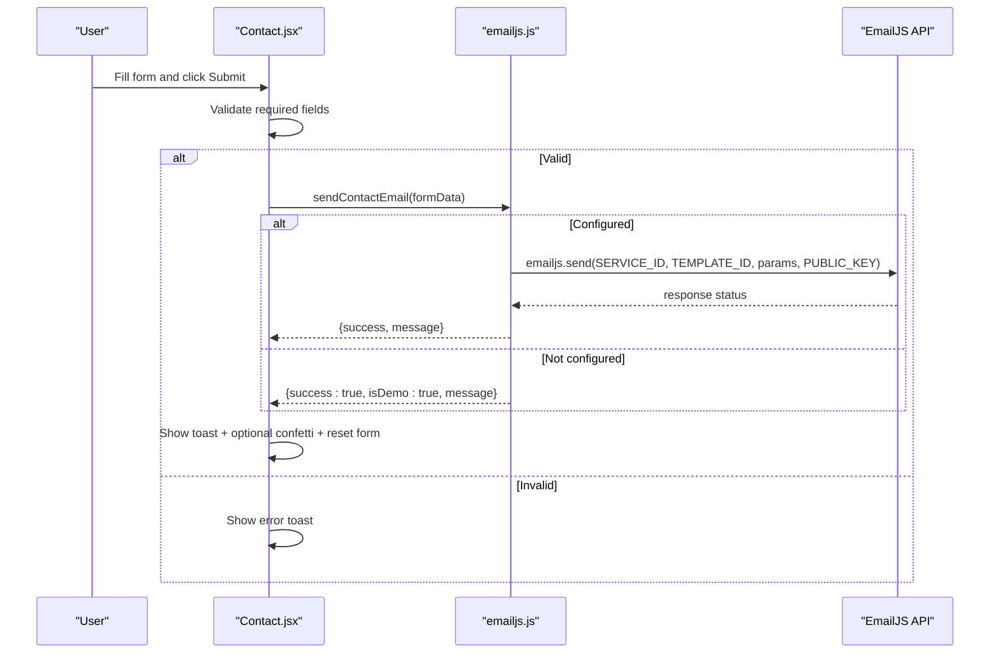
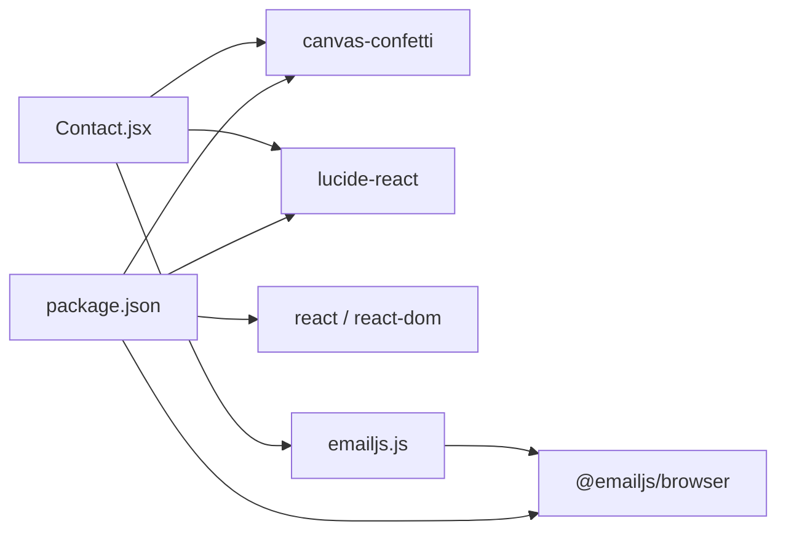
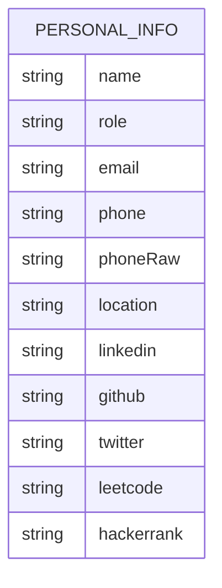

# Contact Form

<cite>
**Referenced Files in This Document**
- [Contact.jsx](file://src/components/Contact.jsx)
- [emailjs.js](file://src/config/emailjs.js)
- [portfolioData.js](file://src/data/portfolioData.js)
- [package.json](file://package.json)
</cite>

## Table of Contents
1. [Introduction](#introduction)
2. [Project Structure](#project-structure)
3. [Core Components](#core-components)
4. [Architecture Overview](#architecture-overview)
5. [Detailed Component Analysis](#detailed-component-analysis)
6. [Dependency Analysis](#dependency-analysis)
7. [Performance Considerations](#performance-considerations)
8. [Troubleshooting Guide](#troubleshooting-guide)
9. [Conclusion](#conclusion)
10. [Appendices](#appendices)

## Introduction
This document explains the Contact form feature, focusing on EmailJS integration, form validation, submission handling, configuration, customization, security, spam prevention, user feedback, troubleshooting, and performance optimization. The implementation is a React component that collects user input and sends it via EmailJS or simulates sending when credentials are not configured.

## Project Structure
The Contact form spans two primary files:
- A React UI component for the contact section and form
- A configuration module for EmailJS settings and email dispatch logic

**Diagram sources**
- [Contact.jsx:18-93](file://src/components/Contact.jsx#L18-L93)
- [emailjs.js:25-81](file://src/config/emailjs.js#L25-L81)

**Section sources**
- [Contact.jsx:1-373](file://src/components/Contact.jsx#L1-L373)
- [emailjs.js:1-82](file://src/config/emailjs.js#L1-L82)

## Core Components
- Contact form UI with fields: Name, Email, Subject, Message
- Client-side validation for required fields before submission
- Submission flow to EmailJS service or simulated send
- Toast notifications for success/error feedback
- Optional confetti animation on successful submission
- Inline guide modal to show where to configure EmailJS keys

Key responsibilities:
- Manage local state for form data, loading, and toast messages
- Validate inputs and prevent submission if required fields are missing
- Call the email dispatch function and handle results
- Provide user feedback through UI elements

**Section sources**
- [Contact.jsx:21-93](file://src/components/Contact.jsx#L21-L93)
- [Contact.jsx:239-324](file://src/components/Contact.jsx#L239-L324)
- [Contact.jsx:333-369](file://src/components/Contact.jsx#L333-L369)

## Architecture Overview
The Contact form follows a simple client-side architecture:
- User interacts with the form in the browser
- On submit, the component validates inputs and calls the email dispatch function
- The dispatch function either uses EmailJS (if configured) or simulates sending
- The component updates UI based on the result (success or error)

**Diagram sources**
- [Contact.jsx:43-93](file://src/components/Contact.jsx#L43-L93)
- [emailjs.js:25-81](file://src/config/emailjs.js#L25-L81)

## Detailed Component Analysis

### Form Fields and State Management
- Fields: name, email, subject, message
- Controlled inputs bound to local state
- Change handler updates state by field name
- Copy-to-clipboard utilities for direct contact details

Validation rules:
- Required: name, email, message
- Optional: subject
- Validation occurs on submit; invalid submissions display an error toast

State:
- formData: object holding current input values
- loading: boolean to disable submit button during processing
- toast: object with type and text for user feedback
- copiedField: tracks which item was copied to clipboard
- showConfigModal: toggles EmailJS setup guide modal

**Section sources**
- [Contact.jsx:21-35](file://src/components/Contact.jsx#L21-L35)
- [Contact.jsx:239-324](file://src/components/Contact.jsx#L239-L324)

### Submission Handling and EmailJS Integration
- On submit, prevents default behavior and validates required fields
- Sets loading state and clears previous toast
- Calls sendContactEmail with form data
- Handles success: shows success toast, triggers confetti, resets form
- Handles failure: shows error toast
- Ensures loading state is cleared in finally block

EmailJS integration:
- Reads SERVICE_ID, TEMPLATE_ID, PUBLIC_KEY from EMAILJS_CONFIG
- If configured, constructs template parameters and calls emailjs.send
- Returns structured result with success flag and message
- If not configured, simulates sending with a delay and returns demo success

Template parameters include:
- from_name, from_email, subject, message, to_name, reply_to

**Section sources**
- [Contact.jsx:43-93](file://src/components/Contact.jsx#L43-L93)
- [emailjs.js:12-18](file://src/config/emailjs.js#L12-L18)
- [emailjs.js:25-81](file://src/config/emailjs.js#L25-L81)

### User Feedback Mechanisms
- Toast notifications for success and error states
- Loading spinner on submit button while sending
- Confetti animation on successful submission
- Modal with instructions to configure EmailJS keys

Accessibility considerations:
- Disabled submit button during submission
- Clear labels and placeholders for inputs
- Informative toast messages

**Section sources**
- [Contact.jsx:305-324](file://src/components/Contact.jsx#L305-L324)
- [Contact.jsx:333-369](file://src/components/Contact.jsx#L333-L369)

### Configuration Process for Email Service Setup
To enable real email delivery:
- Replace placeholder values in EMAILJS_CONFIG with your actual EmailJS credentials
- Ensure SERVICE_ID, TEMPLATE_ID, and PUBLIC_KEY are set
- Optionally update RECIPIENT_EMAIL if needed

Steps:
1. Create an EmailJS account and set up an Email Service
2. Create an Email Template with matching variables
3. Retrieve Public Key from Account settings
4. Update EMAILJS_CONFIG accordingly

When placeholders remain, the form simulates sending for demonstration purposes.

**Section sources**
- [emailjs.js:12-18](file://src/config/emailjs.js#L12-L18)
- [emailjs.js:28-36](file://src/config/emailjs.js#L28-L36)
- [emailjs.js:70-80](file://src/config/emailjs.js#L70-L80)

### Customizing Form Fields
To add or modify fields:
- Extend formData state with new properties
- Add corresponding input elements with matching name attributes
- Update handleChange to support new fields
- Adjust validation logic to include new required fields
- Update template parameters in sendContactEmail to include new fields

Example guidance:
- Add a phone number field by adding phone to state and input
- Include phone in templateParams if you want it in emails
- Update validation to mark phone as required or optional

**Section sources**
- [Contact.jsx:21-35](file://src/components/Contact.jsx#L21-L35)
- [Contact.jsx:239-324](file://src/components/Contact.jsx#L239-L324)
- [emailjs.js:39-46](file://src/config/emailjs.js#L39-L46)

### Implementing Validation Rules
Current validation:
- Checks presence of name, email, message on submit
- Uses HTML required attributes for basic validation

Enhancements:
- Add email format validation using regex or libraries
- Enforce minimum/maximum lengths for message
- Sanitize inputs to prevent XSS (e.g., trim whitespace, escape HTML)
- Debounce input changes for performance-sensitive scenarios

Note: Keep validation consistent between UI hints and server-side checks if you later introduce a backend.

**Section sources**
- [Contact.jsx:43-52](file://src/components/Contact.jsx#L43-L52)
- [Contact.jsx:247-302](file://src/components/Contact.jsx#L247-L302)

### Error Handling Strategies
- Prevents submission when required fields are missing
- Displays error toast with clear messaging
- Catches errors from EmailJS and returns structured failure responses
- Ensures loading state is always cleared after submission attempt

Robustness tips:
- Log detailed errors for debugging without exposing sensitive info to users
- Provide fallback actions (e.g., suggest emailing directly)
- Handle network failures gracefully

**Section sources**
- [Contact.jsx:43-93](file://src/components/Contact.jsx#L43-L93)
- [emailjs.js:63-69](file://src/config/emailjs.js#L63-L69)

### Security Considerations
- EmailJS public key exposure is expected; ensure you do not expose private keys
- Avoid logging sensitive data (emails, names) in production console logs
- Sanitize user inputs to mitigate XSS risks
- Use HTTPS in production to protect data in transit
- Consider rate limiting at the EmailJS dashboard to prevent abuse

Spam prevention measures:
- Enable reCAPTCHA or hCaptcha in EmailJS templates
- Use EmailJS IP allowlist if applicable
- Add honeypot fields to detect bots
- Limit submission frequency per user session

**Section sources**
- [emailjs.js:12-18](file://src/config/emailjs.js#L12-L18)
- [emailjs.js:63-69](file://src/config/emailjs.js#L63-L69)

### Performance Optimization Techniques
- Debounce input handlers to reduce state updates
- Minimize re-renders by memoizing expensive computations
- Avoid unnecessary network calls; batch operations if possible
- Use conditional rendering to avoid heavy UI updates during loading
- Keep toast lifecycle short to improve perceived performance

[No sources needed since this section provides general guidance]

## Dependency Analysis
Dependencies relevant to the Contact form:
- @emailjs/browser: used to send emails via EmailJS
- canvas-confetti: used for celebratory animations on success
- lucide-react: icons used in the UI
- React and React DOM: core framework

**Diagram sources**
- [package.json:12-17](file://package.json#L12-L17)
- [Contact.jsx:1-18](file://src/components/Contact.jsx#L1-L18)
- [emailjs.js:1-1](file://src/config/emailjs.js#L1-L1)

**Section sources**
- [package.json:12-17](file://package.json#L12-L17)
- [Contact.jsx:1-18](file://src/components/Contact.jsx#L1-L18)
- [emailjs.js:1-1](file://src/config/emailjs.js#L1-L1)

## Performance Considerations
- Keep form state minimal and only update necessary fields
- Avoid heavy computations inside onChange; move to onBlur or onSubmit
- Use CSS transitions instead of JS animations where possible
- Defer non-critical tasks (like confetti) to not block main thread
- Monitor bundle size impact of dependencies

[No sources needed since this section provides general guidance]

## Troubleshooting Guide
Common EmailJS integration issues:
- Placeholder keys still present: form will simulate sending; replace keys in EMAILJS_CONFIG
- Incorrect template variables: ensure templateParams match EmailJS template placeholders
- Network errors: check internet connectivity and EmailJS service status
- CORS or domain restrictions: verify allowed domains in EmailJS settings
- Rate limits: EmailJS may throttle excessive requests; implement retry/backoff if needed

Diagnostic steps:
- Open browser console to inspect error messages from EmailJS
- Verify SERVICE_ID, TEMPLATE_ID, PUBLIC_KEY are correct
- Test with minimal form data to isolate issues
- Confirm EmailJS dashboard shows incoming messages

**Section sources**
- [emailjs.js:28-36](file://src/config/emailjs.js#L28-L36)
- [emailjs.js:63-69](file://src/config/emailjs.js#L63-L69)

## Conclusion
The Contact form provides a clean, accessible interface for users to reach out, with robust validation, clear feedback, and flexible EmailJS integration. It supports both live email delivery and a demo mode for development. By following the configuration and customization guidance, you can tailor the form to your needs while maintaining security and performance best practices.

[No sources needed since this section summarizes without analyzing specific files]

## Appendices

### Data Model for Personal Info Used in Contact Section

**Diagram sources**
- [portfolioData.js:1-25](file://src/data/portfolioData.js#L1-L25)

**Section sources**
- [portfolioData.js:1-25](file://src/data/portfolioData.js#L1-L25)