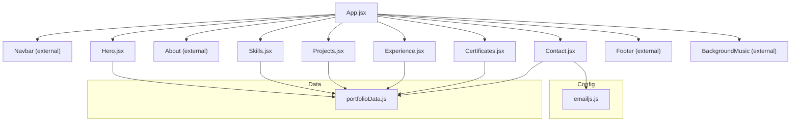
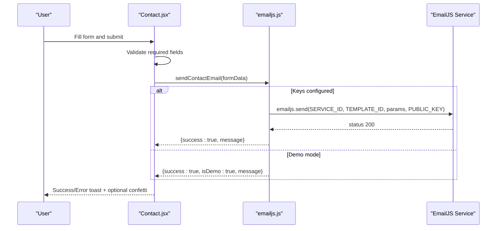
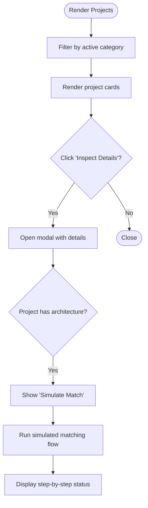
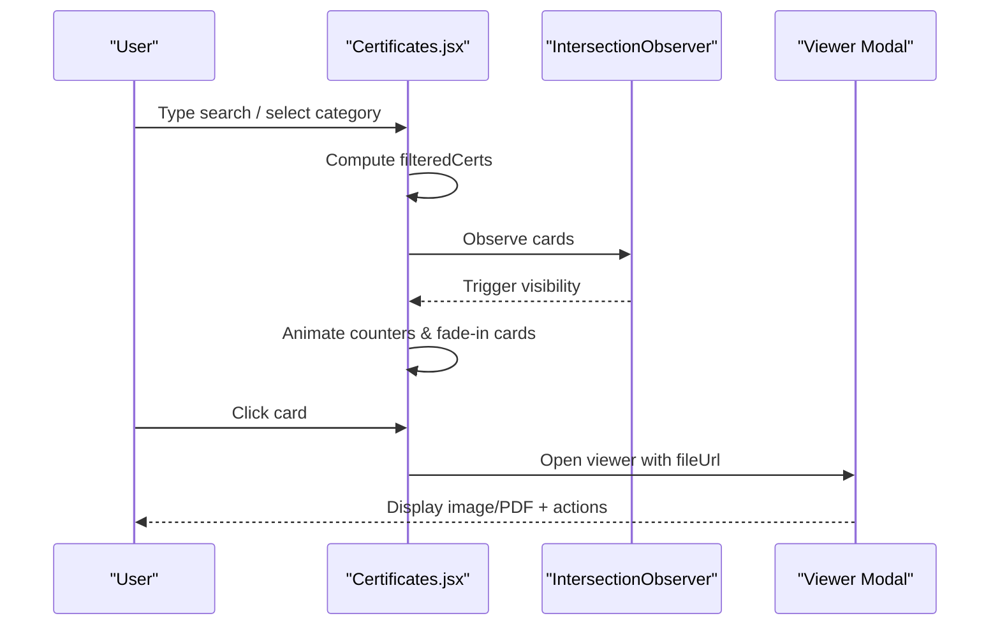
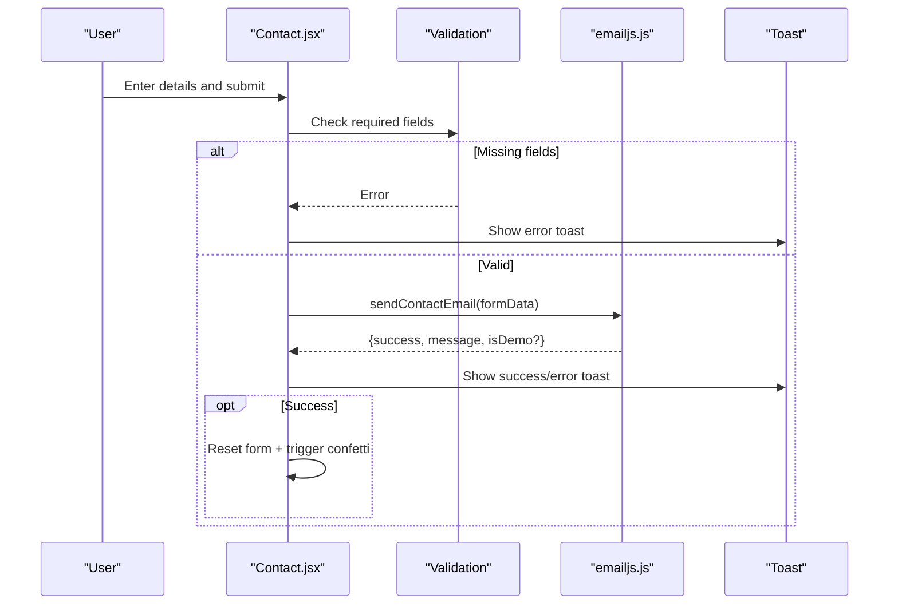

# Core Features

<cite>
**Referenced Files in This Document**
- [App.jsx](file://src/App.jsx)
- [Hero.jsx](file://src/components/Hero.jsx)
- [Projects.jsx](file://src/components/Projects.jsx)
- [Certificates.jsx](file://src/components/Certificates.jsx)
- [Skills.jsx](file://src/components/Skills.jsx)
- [Experience.jsx](file://src/components/Experience.jsx)
- [Contact.jsx](file://src/components/Contact.jsx)
- [portfolioData.js](file://src/data/portfolioData.js)
- [emailjs.js](file://src/config/emailjs.js)
- [package.json](file://package.json)
</cite>

## Table of Contents
1. Introduction
2. Project Structure
3. Core Components
4. Architecture Overview
5. Detailed Component Analysis
6. Dependency Analysis
7. Performance Considerations
8. Troubleshooting Guide
9. Conclusion

## Introduction
This document explains the core features of the portfolio website: Hero with typing animation, Projects showcase with filtering and interactive details, Certificates management with search/filter and PDF/image viewer, Skills visualization with category tabs and animated meters, Experience timeline, and Contact form with EmailJS integration. It covers implementation details, user interactions, configuration options, customization possibilities, responsive design patterns, and accessibility considerations across all features.

## Project Structure
The application is a React + Vite project using Tailwind CSS for styling and lucide-react icons. The main app composes top-level sections as components that read content from a centralized data file. A dedicated EmailJS configuration module handles contact form submissions.



**Diagram sources**
- [App.jsx:1-51](file://src/App.jsx#L1-L51)
- [portfolioData.js:1-100](file://src/data/portfolioData.js#L1-L100)
- [emailjs.js:1-82](file://src/config/emailjs.js#L1-L82)

**Section sources**
- [App.jsx:1-51](file://src/App.jsx#L1-L51)
- [package.json:1-30](file://package.json#L1-L30)

## Core Components
- Hero: Typing tagline animation, social links, quick stats, and CTAs.
- Projects: Category filter bar, cards grid, detail modal with architecture steps and simulated workflow.
- Certificates: Searchable/filterable grid, animated counters, 3D tilt cards, full-screen PDF/image viewer, download-all action.
- Skills: Tabbed categories, skill bars with animated progress levels.
- Experience: Timeline-style cards listing roles, durations, locations, and responsibilities.
- Contact: Form with validation, EmailJS send or demo simulation, toast notifications, copy-to-clipboard for contact info.

**Section sources**
- [Hero.jsx:1-245](file://src/components/Hero.jsx#L1-L245)
- [Projects.jsx:1-260](file://src/components/Projects.jsx#L1-L260)
- [Certificates.jsx:1-597](file://src/components/Certificates.jsx#L1-L597)
- [Skills.jsx:1-152](file://src/components/Skills.jsx#L1-L152)
- [Experience.jsx:1-84](file://src/components/Experience.jsx#L1-L84)
- [Contact.jsx:1-373](file://src/components/Contact.jsx#L1-L373)

## Architecture Overview
The app renders a single-page layout where each section is a self-contained component. Data flows from a central data file into components via props. The Contact component integrates with EmailJS to send messages directly from the browser without a backend.



**Diagram sources**
- [Contact.jsx:43-93](file://src/components/Contact.jsx#L43-L93)
- [emailjs.js:25-81](file://src/config/emailjs.js#L25-L81)

## Detailed Component Analysis

### Hero Section with Typing Animation
- Implementation highlights:
  - Uses state to cycle through taglines and type/delete characters with different speeds.
  - Displays personal info, short bio, CTAs, and social profile links.
  - Right-side glass card shows avatar, role, and quick stats.
- User interactions:
  - Clicking CTAs navigates to Projects, Certificates, or Contact sections.
  - Social links open external profiles in new tabs.
- Configuration:
  - Personalization via personalInfo in the data file.
- Customization:
  - Adjust typing speed, pause duration, and taglines in the data source.
  - Modify badges, stats, and highlight pills to reflect current focus areas.
- Responsive design:
  - Grid switches from single column on mobile to multi-column on larger screens.
  - Text sizes and spacing adapt via Tailwind utilities.
- Accessibility:
  - Links include rel="noopener noreferrer" for security.
  - Icons are decorative; meaningful text is provided via titles and visible labels.

**Section sources**
- [Hero.jsx:16-42](file://src/components/Hero.jsx#L16-L42)
- [Hero.jsx:44-165](file://src/components/Hero.jsx#L44-L165)
- [Hero.jsx:169-245](file://src/components/Hero.jsx#L169-L245)
- [portfolioData.js:1-25](file://src/data/portfolioData.js#L1-L25)

### Projects Showcase with Filtering and Details Modal
- Implementation highlights:
  - Filter bar by category: All, Java / Systems, Full-Stack / Web, AI & ML.
  - Cards display title, subtitle, description, tools, and featured badge.
  - Detail modal includes key highlights and an optional architecture workflow simulator.
- User interactions:
  - Selecting a category filters projects instantly.
  - “Inspect Details” opens a modal; close button resets state.
  - For specific projects, a “Simulate Match” button demonstrates a background worker thread concept.
- Configuration:
  - Projects array defines metadata, tools, highlights, and optional architecture steps.
- Customization:
  - Add new categories and update filter logic accordingly.
  - Extend architecture arrays to show more steps or add interactive simulations.
- Responsive design:
  - Grid adapts from 1 to 3 columns based on screen size.
  - Modal uses max-width and scrollable content for smaller devices.
- Accessibility:
  - Buttons have descriptive labels.
  - External links use rel="noopener noreferrer".



**Diagram sources**
- [Projects.jsx:18-28](file://src/components/Projects.jsx#L18-L28)
- [Projects.jsx:57-73](file://src/components/Projects.jsx#L57-L73)
- [Projects.jsx:149-254](file://src/components/Projects.jsx#L149-L254)

**Section sources**
- [Projects.jsx:18-73](file://src/components/Projects.jsx#L18-L73)
- [Projects.jsx:75-147](file://src/components/Projects.jsx#L75-L147)
- [Projects.jsx:149-254](file://src/components/Projects.jsx#L149-L254)
- [portfolioData.js:101-257](file://src/data/portfolioData.js#L101-L257)

### Certificates Management System
- Implementation highlights:
  - Categories computed dynamically with counts; search input filters by title, issuer, or description.
  - Animated counters for total certificates, providers, elite/distinction count, and categories.
  - IntersectionObserver triggers fade-in animations for cards and starts counters when visible.
  - 3D tilt effect on hover for cards; color-coded per issuer.
  - Full-screen viewer supports images and PDFs; download and open-in-new-tab actions available.
  - Download-all action provides a zip bundle link.
- User interactions:
  - Type to search; click category chips to filter.
  - Hover cards for tilt and glow effects; click to open viewer.
  - Use viewer toolbar to download or open certificate.
- Configuration:
  - certificationsData defines id, title, issuer, score, tag, category, fileUrl, and description.
  - Issuer colors map controls visual theme per provider.
- Customization:
  - Add new issuers to the color map.
  - Update file paths to point to actual certificate assets.
  - Adjust thresholds for elite/distinction detection if needed.
- Responsive design:
  - Grid scales from 1 to 3 columns; horizontal scrolling for category chips on small screens.
  - Viewer adapts to viewport height and width.
- Accessibility:
  - Inputs have placeholders and clear labels.
  - Images and iframes include alt/title attributes.
  - Keyboard-friendly navigation within modal.



**Diagram sources**
- [Certificates.jsx:139-171](file://src/components/Certificates.jsx#L139-L171)
- [Certificates.jsx:189-219](file://src/components/Certificates.jsx#L189-L219)
- [Certificates.jsx:221-237](file://src/components/Certificates.jsx#L221-L237)
- [Certificates.jsx:299-346](file://src/components/Certificates.jsx#L299-L346)
- [Certificates.jsx:348-450](file://src/components/Certificates.jsx#L348-L450)
- [Certificates.jsx:503-593](file://src/components/Certificates.jsx#L503-L593)

**Section sources**
- [Certificates.jsx:139-171](file://src/components/Certificates.jsx#L139-L171)
- [Certificates.jsx:173-219](file://src/components/Certificates.jsx#L173-L219)
- [Certificates.jsx:221-237](file://src/components/Certificates.jsx#L221-L237)
- [Certificates.jsx:241-346](file://src/components/Certificates.jsx#L241-L346)
- [Certificates.jsx:348-450](file://src/components/Certificates.jsx#L348-L450)
- [Certificates.jsx:461-593](file://src/components/Certificates.jsx#L461-L593)
- [portfolioData.js:275-800](file://src/data/portfolioData.js#L275-L800)

### Skills Visualization
- Implementation highlights:
  - Tabs filter skills by category: All, Programming & Core CS, Machine Learning & Data Analytics, Web & Developer Tools, Design & Soft Competencies.
  - Each skill displays name, tag, level percentage, and an animated progress bar.
- User interactions:
  - Switch tabs to view relevant skills.
  - Hover reveals subtle color transitions on progress bars.
- Configuration:
  - skillsCategoryData defines categories and skill entries with names, levels, tags, and icon keys.
- Customization:
  - Add new categories or skills; adjust levels to reflect proficiency.
  - Map additional icons via the iconMap helper.
- Responsive design:
  - Two-column grid on medium+ screens; single column on mobile.
- Accessibility:
  - Labels and semantic structure support screen readers.
  - Progress bars convey quantitative information visually and numerically.

**Section sources**
- [Skills.jsx:28-43](file://src/components/Skills.jsx#L28-L43)
- [Skills.jsx:45-79](file://src/components/Skills.jsx#L45-L79)
- [Skills.jsx:81-130](file://src/components/Skills.jsx#L81-L130)
- [Skills.jsx:132-146](file://src/components/Skills.jsx#L132-L146)
- [portfolioData.js:57-99](file://src/data/portfolioData.js#L57-L99)

### Experience Timeline
- Implementation highlights:
  - Renders experience cards with role, organization, location, duration, period, and responsibilities.
  - Visual badges indicate internship type; calendar and map icons provide context.
- User interactions:
  - Scroll to review past experiences; expandable list of responsibilities.
- Configuration:
  - experienceData contains structured records for each role.
- Customization:
  - Add new experiences; customize badges and icons as needed.
- Responsive design:
  - Cards stack vertically; internal layout adjusts spacing for readability.
- Accessibility:
  - Clear headings and lists improve navigation for assistive technologies.

**Section sources**
- [Experience.jsx:10-77](file://src/components/Experience.jsx#L10-L77)
- [portfolioData.js:259-273](file://src/data/portfolioData.js#L259-L273)

### Contact Form with EmailJS Integration
- Implementation highlights:
  - Form collects name, email, subject, and message; validates required fields.
  - Sends via EmailJS if keys are configured; otherwise simulates success for demo.
  - Toast notifications inform users of success or errors; optional confetti celebration on success.
  - Copy-to-clipboard buttons for email and phone; direct links to social profiles.
- User interactions:
  - Submit form to send message; click info badge to view EmailJS setup guide.
  - Copy contact details quickly.
- Configuration:
  - EMAILJS_CONFIG holds service ID, template ID, public key, and recipient email.
  - Replace placeholder values to enable real email delivery.
- Customization:
  - Adjust validation rules, toast messages, and confetti parameters.
  - Extend contact info blocks or add additional channels.
- Responsive design:
  - Two-column layout on large screens; stacked on smaller screens.
  - Modal for setup guide adapts to viewport.
- Accessibility:
  - Input labels and required attributes ensure proper semantics.
  - Buttons have descriptive text and icons; links include rel="noopener noreferrer".



**Diagram sources**
- [Contact.jsx:20-93](file://src/components/Contact.jsx#L20-L93)
- [emailjs.js:25-81](file://src/config/emailjs.js#L25-L81)

**Section sources**
- [Contact.jsx:20-93](file://src/components/Contact.jsx#L20-L93)
- [Contact.jsx:95-228](file://src/components/Contact.jsx#L95-L228)
- [Contact.jsx:230-327](file://src/components/Contact.jsx#L230-L327)
- [Contact.jsx:333-369](file://src/components/Contact.jsx#L333-L369)
- [emailjs.js:1-82](file://src/config/emailjs.js#L1-L82)

## Dependency Analysis
- Components depend on centralized data for content rendering.
- Contact depends on EmailJS client library for sending messages.
- UI libraries: lucide-react for icons; canvas-confetti for celebrations; Tailwind CSS for styling.
- Build toolchain: Vite for development/build; PostCSS/Autoprefixer for CSS processing.

```mermaid
graph LR
Pkg["package.json"] --> Libs["@emailjs/browser", "canvas-confetti", "lucide-react", "react", "react-dom"]
App["App.jsx"] --> Comp["Components"]
Comp --> Data["portfolioData.js"]
Contact["Contact.jsx"] --> EJ["emailjs.js"]
```

**Diagram sources**
- [package.json:12-17](file://package.json#L12-L17)
- [App.jsx:1-51](file://src/App.jsx#L1-L51)
- [Contact.jsx:1-373](file://src/components/Contact.jsx#L1-L373)
- [emailjs.js:1-82](file://src/config/emailjs.js#L1-L82)

**Section sources**
- [package.json:1-30](file://package.json#L1-L30)
- [App.jsx:1-51](file://src/App.jsx#L1-L51)

## Performance Considerations
- Certificates:
  - IntersectionObserver used to animate only when cards enter viewport, reducing unnecessary re-renders.
  - useMemo computes categories and filtered results efficiently.
  - Avoid heavy computations inside render loops; keep transformations in memoized callbacks.
- Projects:
  - Filtering is lightweight; consider virtualization if project count grows significantly.
- Skills:
  - Animated progress bars are simple DOM updates; avoid excessive reflows by batching state changes.
- Contact:
  - Debounce or throttle any future search inputs if added.
  - Keep EmailJS calls minimal; handle errors gracefully to prevent blocking UI.

[No sources needed since this section provides general guidance]

## Troubleshooting Guide
- EmailJS not sending emails:
  - Ensure SERVICE_ID, TEMPLATE_ID, and PUBLIC_KEY are set to real values in emailjs.js.
  - Verify EmailJS service and template are correctly configured in the dashboard.
  - If keys remain placeholders, the form will simulate success; check console warnings.
- Certificate viewer not loading PDFs:
  - Confirm fileUrl paths exist under public/certificates and are accessible at build time.
  - Some browsers restrict inline PDFs; use download or open-in-new-tab actions.
- Filtering/search not working:
  - Verify data fields match expected casing and spelling; search is case-insensitive.
  - Ensure categories in data align with filter definitions.
- Animations not triggering:
  - Check IntersectionObserver references and thresholds; ensure elements have refs attached.
  - Inspect CSS classes and custom styles for conflicts.

**Section sources**
- [emailjs.js:12-18](file://src/config/emailjs.js#L12-L18)
- [emailjs.js:25-81](file://src/config/emailjs.js#L25-L81)
- [Certificates.jsx:503-593](file://src/components/Certificates.jsx#L503-L593)
- [Certificates.jsx:161-171](file://src/components/Certificates.jsx#L161-L171)

## Conclusion
The portfolio showcases a modern, interactive single-page application with well-structured components and centralized data. Key features include dynamic hero animations, robust project filtering and details, comprehensive certificate management with rich visuals, clear skills visualization, concise experience timeline, and a functional contact form powered by EmailJS. The codebase emphasizes responsiveness and accessibility while providing ample opportunities for customization and extension.

[No sources needed since this section summarizes without analyzing specific files]