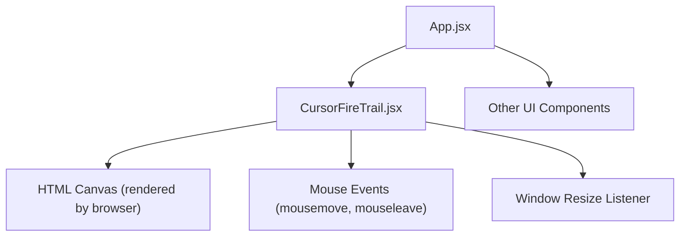
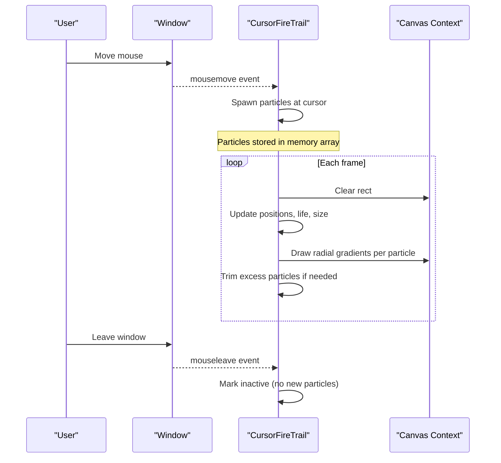
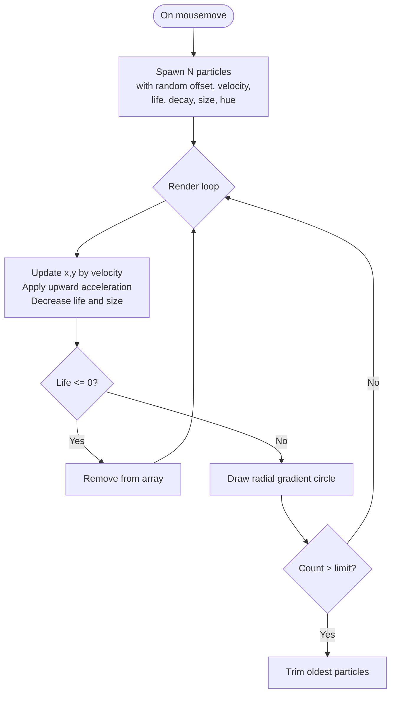
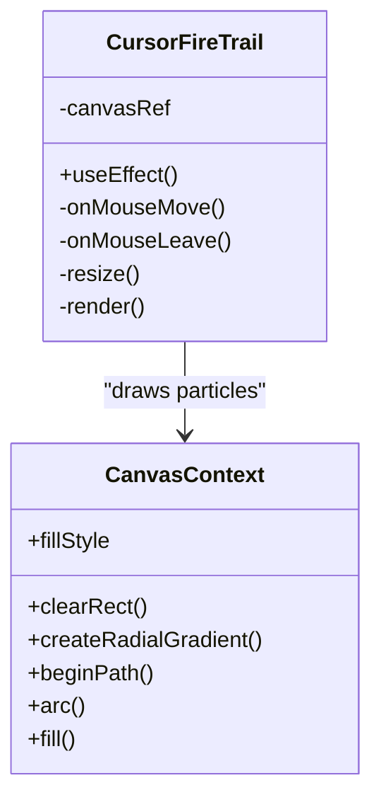
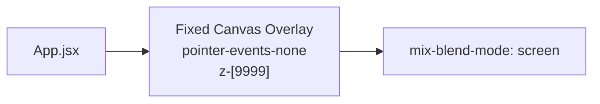
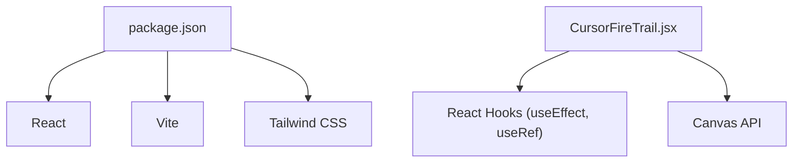

# Cursor Fire Trail Component

<cite>
**Referenced Files in This Document**
- [CursorFireTrail.jsx](file://src/components/CursorFireTrail.jsx)
- [App.jsx](file://src/App.jsx)
- [tailwind.config.js](file://tailwind.config.js)
- [package.json](file://package.json)
</cite>

## Table of Contents
1. [Introduction](#introduction)
2. [Project Structure](#project-structure)
3. [Core Components](#core-components)
4. [Architecture Overview](#architecture-overview)
5. [Detailed Component Analysis](#detailed-component-analysis)
6. [Dependency Analysis](#dependency-analysis)
7. [Performance Considerations](#performance-considerations)
8. [Troubleshooting Guide](#troubleshooting-guide)
9. [Conclusion](#conclusion)

## Introduction
This document explains the Cursor Fire Trail component used in the portfolio application. It provides a high-level overview, architecture, and detailed analysis of how the component renders an interactive fire-like particle trail that follows the mouse cursor using HTML Canvas. The goal is to make the implementation understandable for both technical and non-technical readers while highlighting performance characteristics and integration points.

## Project Structure
The Cursor Fire Trail is implemented as a standalone React component and integrated into the root application layout. It uses a fixed-position canvas overlay with screen blend mode to create a luminous effect over the rest of the UI.

**Diagram sources**
- [App.jsx:40-67](file://src/App.jsx#L40-L67)
- [CursorFireTrail.jsx:6-89](file://src/components/CursorFireTrail.jsx#L6-L89)

**Section sources**
- [App.jsx:40-67](file://src/App.jsx#L40-L67)
- [CursorFireTrail.jsx:1-99](file://src/components/CursorFireTrail.jsx#L1-L99)

## Core Components
- CursorFireTrail: A self-contained React component that manages a full-screen canvas overlay and animates fire-like particles based on mouse movement.
- Integration point: The component is rendered once at the app level so it persists across all pages/sections.

Key responsibilities:
- Initialize and manage a canvas element sized to the viewport.
- Listen to mouse events to spawn and update particles.
- Render frames via requestAnimationFrame with efficient cleanup on unmount.

**Section sources**
- [CursorFireTrail.jsx:1-99](file://src/components/CursorFireTrail.jsx#L1-L99)
- [App.jsx:40-67](file://src/App.jsx#L40-L67)

## Architecture Overview
The component follows a standard reactive animation pattern:
- Event-driven input: mousemove spawns particles; mouseleave toggles activity state.
- Animation loop: requestAnimationFrame clears the canvas and updates/draws particles each frame.
- Lifecycle management: useEffect sets up listeners and returns a cleanup function to cancel animation and remove listeners.

**Diagram sources**
- [CursorFireTrail.jsx:19-89](file://src/components/CursorFireTrail.jsx#L19-L89)

## Detailed Component Analysis

### Particle System Design
- Particle properties include position, velocity, life, decay rate, size, and hue. These define motion, lifespan, and color variation within an orange-red range.
- On each mousemove, multiple particles are spawned near the cursor with randomized offsets and velocities to simulate a natural fire trail.

**Diagram sources**
- [CursorFireTrail.jsx:22-79](file://src/components/CursorFireTrail.jsx#L22-L79)

### Rendering Pipeline
- Canvas sizing: On mount and resize, the canvas is set to the viewport dimensions to ensure full coverage.
- Frame rendering: Each frame clears the canvas, iterates through particles in reverse order to safely remove expired ones, applies physics, and draws glowing circles using radial gradients.
- Blend mode: The canvas uses a screen blend mode to enhance brightness and create a luminous overlay effect.

**Diagram sources**
- [CursorFireTrail.jsx:6-89](file://src/components/CursorFireTrail.jsx#L6-L89)

### Styling and Positioning
- The canvas is positioned fixed over the entire viewport and placed above other content with a very high z-index.
- Pointer events are disabled on the canvas so it does not interfere with user interactions beneath it.
- Tailwind classes provide responsive and utility-based styling without custom CSS.

**Diagram sources**
- [CursorFireTrail.jsx:91-97](file://src/components/CursorFireTrail.jsx#L91-L97)
- [tailwind.config.js:1-29](file://tailwind.config.js#L1-L29)

**Section sources**
- [CursorFireTrail.jsx:1-99](file://src/components/CursorFireTrail.jsx#L1-L99)
- [tailwind.config.js:1-29](file://tailwind.config.js#L1-L29)

## Dependency Analysis
- Runtime dependencies: The component relies only on React hooks and the browser’s Canvas API. No additional libraries are required for this feature.
- Build tooling: Vite and React are used by the project; Tailwind CSS provides utility classes.

**Diagram sources**
- [package.json:1-30](file://package.json#L1-L30)
- [CursorFireTrail.jsx:1-99](file://src/components/CursorFireTrail.jsx#L1-L99)

**Section sources**
- [package.json:1-30](file://package.json#L1-L30)
- [CursorFireTrail.jsx:1-99](file://src/components/CursorFireTrail.jsx#L1-L99)

## Performance Considerations
- Particle count cap: The render loop trims the particle array when it exceeds a threshold to prevent memory growth and maintain smooth framerates.
- Efficient updates: Iterating backwards allows safe removal of expired particles during the same pass.
- Lightweight drawing: Radial gradients are used per particle; consider reducing gradient complexity or particle count on low-end devices if needed.
- Event throttling: Mousemove can fire frequently; if performance degrades on some devices, consider debouncing or limiting spawns per frame.
- Cleanup: Properly canceling animation frames and removing event listeners prevents leaks when the component unmounts.

[No sources needed since this section provides general guidance]

## Troubleshooting Guide
Common issues and resolutions:
- Canvas not visible: Ensure the canvas has correct dimensions and is not hidden behind other elements. Verify the fixed positioning and high z-index.
- No particles appear: Confirm that mousemove events are firing and that the canvas is not intercepting pointer events. Check that the component is mounted and the effect ran.
- Janky animations: Reduce particle spawn rate, lower max particle count, or simplify gradient stops. Consider disabling the effect on low-power devices.
- Memory growth: Verify that the particle trimming logic runs and that expired particles are removed. Monitor the array length in development tools.

**Section sources**
- [CursorFireTrail.jsx:19-89](file://src/components/CursorFireTrail.jsx#L19-L89)

## Conclusion
The Cursor Fire Trail component delivers a visually engaging, performant particle effect that enhances user interaction without obstructing content. Its design leverages React lifecycle methods and the Canvas API to create a smooth, responsive experience. With built-in safeguards like particle capping and proper cleanup, it integrates cleanly into the portfolio application and can be tuned further for specific device capabilities.

[No sources needed since this section summarizes without analyzing specific files]