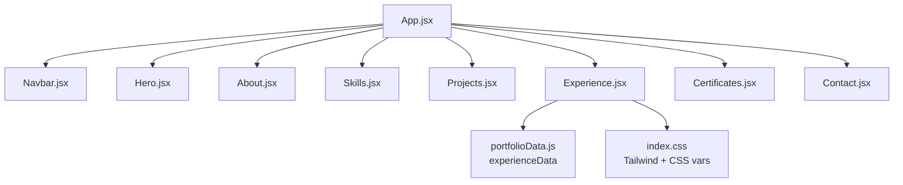
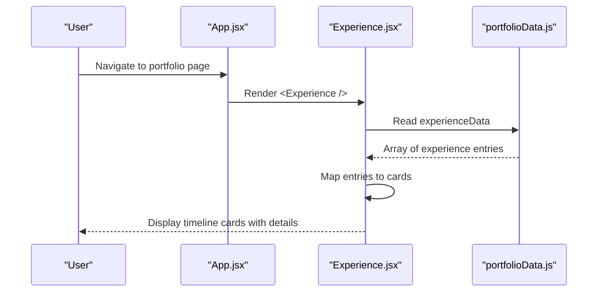
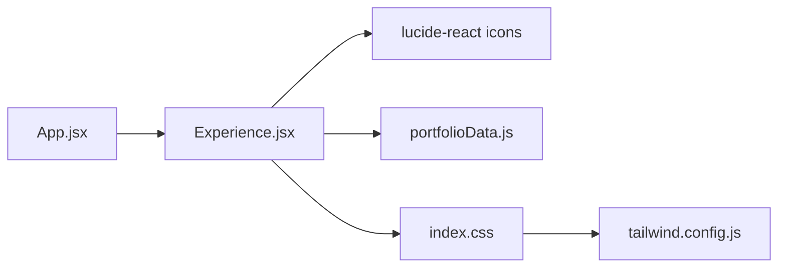

# Experience Timeline

<cite>
**Referenced Files in This Document**
- [Experience.jsx](file://src/components/Experience.jsx)
- [portfolioData.js](file://src/data/portfolioData.js)
- [App.jsx](file://src/App.jsx)
- [index.css](file://src/index.css)
- [tailwind.config.js](file://tailwind.config.js)
</cite>

## Table of Contents
1. Introduction
2. Project Structure
3. Core Components
4. Architecture Overview
5. Detailed Component Analysis
6. Dependency Analysis
7. Performance Considerations
8. Troubleshooting Guide
9. Conclusion
10. Appendices

## Introduction
This document explains the Experience timeline component that presents professional history in a clean, modern layout. It covers how experience entries are structured and rendered, the visual timeline design, interactive behaviors, responsive behavior across screen sizes, accessibility considerations, and practical guidance for adding work experience and customizing appearance.

## Project Structure
The Experience timeline is implemented as a React section integrated into the main application. The data driving the timeline lives in a centralized data file, while styling is provided by Tailwind CSS utilities and global CSS variables.

**Diagram sources**
- [App.jsx:28-47](file://src/App.jsx#L28-L47)
- [Experience.jsx:1-12](file://src/components/Experience.jsx#L1-L12)
- [portfolioData.js:259-273](file://src/data/portfolioData.js#L259-L273)
- [index.css:12-74](file://src/index.css#L12-L74)

**Section sources**
- [App.jsx:28-47](file://src/App.jsx#L28-L47)
- [Experience.jsx:1-12](file://src/components/Experience.jsx#L1-L12)
- [portfolioData.js:259-273](file://src/data/portfolioData.js#L259-L273)
- [index.css:12-74](file://src/index.css#L12-L74)

## Core Components
- Experience section: Renders the “Work & Experience” section with a header and a list of experience cards. Each card shows role, organization, type badge, duration/period, location, and responsibilities.
- Data source: A single array of experience objects provides all content for rendering.
- Styling: Uses Tailwind utility classes and global CSS variables for colors, glassmorphism, badges, and section-specific accents.

Key responsibilities:
- Render a consistent header for the section.
- Map over experience entries to produce cards with metadata and responsibilities.
- Apply hover effects and accessible icons for clarity.

**Section sources**
- [Experience.jsx:10-80](file://src/components/Experience.jsx#L10-L80)
- [portfolioData.js:259-273](file://src/data/portfolioData.js#L259-L273)
- [index.css:392-418](file://src/index.css#L392-L418)
- [index.css:580-606](file://src/index.css#L580-L606)

## Architecture Overview
The Experience component reads from a static data export and renders UI using declarative JSX. There is no client-side state or API calls; updates are made by editing the data file.

**Diagram sources**
- [App.jsx:28-47](file://src/App.jsx#L28-L47)
- [Experience.jsx:10-80](file://src/components/Experience.jsx#L10-L80)
- [portfolioData.js:259-273](file://src/data/portfolioData.js#L259-L273)

## Detailed Component Analysis

### Data Model for Experience Entries
Each entry in the timeline is an object with the following fields:
- organisation: string (company or organization name)
- role: string (job title or internship role)
- type: string (e.g., Internship)
- duration: string (e.g., “2 Months”)
- period: string (e.g., “2024”)
- location: string (e.g., “Remote / Virtual”)
- responsibilities: array of strings (key responsibilities and achievements)

Rendering behavior:
- Type is shown as a colored badge.
- Duration and period are displayed together with a calendar icon.
- Role and organization are prominent, with location shown alongside a pin icon.
- Responsibilities are listed with check-circle icons for emphasis.

Complexity:
- Rendering time is O(n) where n is the number of experience entries.
- Memory usage is proportional to the size of the data array.

**Section sources**
- [portfolioData.js:259-273](file://src/data/portfolioData.js#L259-L273)
- [Experience.jsx:40-75](file://src/components/Experience.jsx#L40-L75)

### Visual Timeline Design
- Section background: A radial gradient tinted for the Experience section creates a subtle “fire/orange” atmosphere.
- Cards: Glassmorphic cards with backdrop blur, borders, and hover lift/glow effects.
- Badges: Color-coded pills for types (e.g., Internship).
- Icons: Lucide icons provide visual cues for calendar, map pin, and checklist items.
- Title bar: Animated gradient underline emphasizes the section heading.

Responsive behavior:
- Container width and padding adapt via Tailwind utilities.
- Typography scales down on smaller screens through media queries.
- Background orbs blur slightly on mobile for performance and readability.

Accessibility:
- Semantic headings structure the section.
- Icons are decorative but paired with text labels for context.
- Contrast uses theme-aware CSS variables to maintain legibility in both light and dark themes.

**Section sources**
- [index.css:202-208](file://src/index.css#L202-L208)
- [index.css:392-418](file://src/index.css#L392-L418)
- [index.css:461-507](file://src/index.css#L461-L507)
- [index.css:580-606](file://src/index.css#L580-L606)
- [index.css:775-786](file://src/index.css#L775-L786)
- [Experience.jsx:15-28](file://src/components/Experience.jsx#L15-L28)

### Interactive Elements
- Hover states: Cards lift and glow on hover, improving discoverability.
- Badge hover: Subtle glow and color shift on type badges.
- Smooth scrolling: Global scroll-behavior set to smooth for anchor navigation.

These interactions are purely presentational and do not alter state.

**Section sources**
- [index.css:392-418](file://src/index.css#L392-L418)
- [index.css:580-606](file://src/index.css#L580-L606)
- [index.css:95-99](file://src/index.css#L95-L99)

### Responsive Behavior Across Screen Sizes
- Mobile-first approach via Tailwind utilities ensures flexible layouts.
- Media queries adjust section padding, title font sizes, and orb blur for performance.
- Card content wraps gracefully due to flexbox and responsive spacing utilities.

Practical tips:
- Keep responsibility lists concise to avoid excessive vertical scrolling on small screens.
- Use meaningful type values so badges remain readable at small widths.

**Section sources**
- [index.css:775-786](file://src/index.css#L775-L786)
- [Experience.jsx:39-76](file://src/components/Experience.jsx#L39-L76)

### Adding Work Experience
To add a new experience entry:
1. Open the data file and locate the experience array.
2. Add a new object with required fields: organisation, role, type, duration, period, location, responsibilities.
3. Ensure responsibilities is an array of strings describing key duties and achievements.
4. Save the file; the component will automatically render the new entry.

Guidelines:
- Keep descriptions action-oriented and outcome-focused.
- Use consistent formatting for dates and durations.
- Avoid overly long lines to improve readability on narrow screens.

**Section sources**
- [portfolioData.js:259-273](file://src/data/portfolioData.js#L259-L273)
- [Experience.jsx:40-75](file://src/components/Experience.jsx#L40-L75)

### Customizing Timeline Appearance
You can customize the look without changing component logic:
- Colors and themes: Adjust CSS variables in the root styles for backgrounds, text, borders, and accent colors. Theme toggling is supported via data attributes.
- Section accent: Modify the section-specific gradient and title bar colors for the Experience section.
- Card style: Tweak glassmorphism, shadows, and hover transitions in the shared card styles.
- Badges: Extend or modify badge variants to match your brand palette.
- Fonts: Configure fonts via Tailwind config and CSS variables.

Examples of customization points:
- Update accent colors used by badges and icons.
- Change the Experience section’s radial gradient tint.
- Adjust border glow intensity and shadow depth for cards.

**Section sources**
- [index.css:12-74](file://src/index.css#L12-L74)
- [index.css:76-90](file://src/index.css#L76-L90)
- [index.css:202-208](file://src/index.css#L202-L208)
- [index.css:392-418](file://src/index.css#L392-L418)
- [index.css:580-606](file://src/index.css#L580-L606)
- [tailwind.config.js:8-24](file://tailwind.config.js#L8-L24)

### Managing Career Progression Display
- Chronological order: The array order determines display order. Place the most recent or relevant experiences first if you want them to appear at the top.
- Grouping: If needed in the future, consider adding a grouping field to segment roles (e.g., Full-time, Internship, Freelance) and filter or sort accordingly.
- Consistency: Maintain uniform field formats for duration and period to keep the timeline visually consistent.

[No sources needed since this section provides general guidance]

## Dependency Analysis
- Component-level dependencies:
  - Experience.jsx imports icons from a UI library and reads data from portfolioData.js.
  - App.jsx includes Experience.jsx among other sections.
- Styling dependencies:
  - index.css defines CSS variables, animations, and global utilities consumed by the component.
  - Tailwind configuration extends fonts and brand colors used throughout the app.

**Diagram sources**
- [Experience.jsx:1-12](file://src/components/Experience.jsx#L1-L12)
- [App.jsx:28-47](file://src/App.jsx#L28-L47)
- [index.css:12-74](file://src/index.css#L12-L74)
- [tailwind.config.js:8-24](file://tailwind.config.js#L8-L24)

**Section sources**
- [Experience.jsx:1-12](file://src/components/Experience.jsx#L1-L12)
- [App.jsx:28-47](file://src/App.jsx#L28-L47)
- [index.css:12-74](file://src/index.css#L12-L74)
- [tailwind.config.js:8-24](file://tailwind.config.js#L8-L24)

## Performance Considerations
- Static data rendering: Since data is static, there is no runtime overhead beyond initial render.
- CSS animations: Animations like gradients and glows are GPU-friendly and should not impact performance significantly.
- Mobile optimization: Reduced blur on background orbs on smaller screens improves rendering speed.

Recommendations:
- Keep responsibility arrays reasonably sized to avoid heavy DOM nodes on low-end devices.
- Prefer concise text for better performance and readability on mobile.

[No sources needed since this section provides general guidance]

## Troubleshooting Guide
Common issues and resolutions:
- Missing or malformed data:
  - Ensure each experience object contains all required fields.
  - Verify responsibilities is an array of strings.
- Styling not applied:
  - Confirm that index.css is imported and Tailwind is configured correctly.
  - Check that CSS variables are defined and theme attribute is set appropriately.
- Icons not visible:
  - Verify the icon library is installed and imported.
- Layout issues on small screens:
  - Review responsive utilities and ensure content does not overflow containers.

Where to look:
- Data structure and values: [portfolioData.js:259-273](file://src/data/portfolioData.js#L259-L273)
- Component rendering logic: [Experience.jsx:40-75](file://src/components/Experience.jsx#L40-L75)
- Global styles and variables: [index.css:12-74](file://src/index.css#L12-L74), [index.css:392-418](file://src/index.css#L392-L418)
- Tailwind setup: [tailwind.config.js:8-24](file://tailwind.config.js#L8-L24)

**Section sources**
- [portfolioData.js:259-273](file://src/data/portfolioData.js#L259-L273)
- [Experience.jsx:40-75](file://src/components/Experience.jsx#L40-L75)
- [index.css:12-74](file://src/index.css#L12-L74)
- [index.css:392-418](file://src/index.css#L392-L418)
- [tailwind.config.js:8-24](file://tailwind.config.js#L8-L24)

## Conclusion
The Experience timeline component provides a clear, visually engaging way to showcase professional history. It relies on a simple data model, leverages Tailwind and CSS variables for styling, and offers responsive behavior suitable for various screen sizes. By updating the data file and adjusting CSS variables, you can easily add new experiences and tailor the appearance to your brand. Accessibility is considered through semantic structure, contrast, and contextual icons.

[No sources needed since this section summarizes without analyzing specific files]

## Appendices

### Example: Adding a New Experience Entry
Steps:
- Locate the experience array in the data file.
- Insert a new object with fields: organisation, role, type, duration, period, location, responsibilities.
- Save and verify the new card appears in the timeline.

Reference paths:
- Data file: [portfolioData.js:259-273](file://src/data/portfolioData.js#L259-L273)
- Rendering loop: [Experience.jsx:40-75](file://src/components/Experience.jsx#L40-L75)

**Section sources**
- [portfolioData.js:259-273](file://src/data/portfolioData.js#L259-L273)
- [Experience.jsx:40-75](file://src/components/Experience.jsx#L40-L75)

### Example: Customizing Timeline Appearance
Actions:
- Change accent colors via CSS variables.
- Adjust section background gradient for Experience.
- Modify card hover effects and badge styles.

Reference paths:
- CSS variables and theme: [index.css:12-74](file://src/index.css#L12-L74), [index.css:76-90](file://src/index.css#L76-L90)
- Section background: [index.css:202-208](file://src/index.css#L202-L208)
- Card and badge styles: [index.css:392-418](file://src/index.css#L392-L418), [index.css:580-606](file://src/index.css#L580-L606)
- Tailwind fonts/colors: [tailwind.config.js:8-24](file://tailwind.config.js#L8-L24)

**Section sources**
- [index.css:12-74](file://src/index.css#L12-L74)
- [index.css:76-90](file://src/index.css#L76-L90)
- [index.css:202-208](file://src/index.css#L202-L208)
- [index.css:392-418](file://src/index.css#L392-L418)
- [index.css:580-606](file://src/index.css#L580-L606)
- [tailwind.config.js:8-24](file://tailwind.config.js#L8-L24)