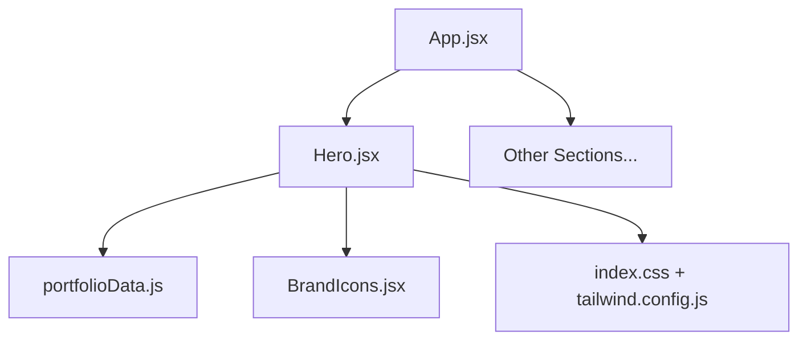
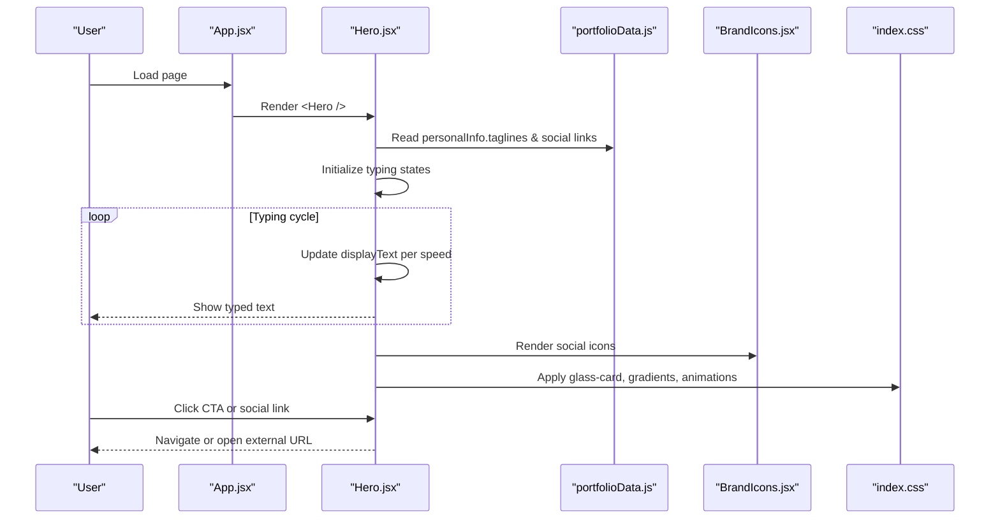
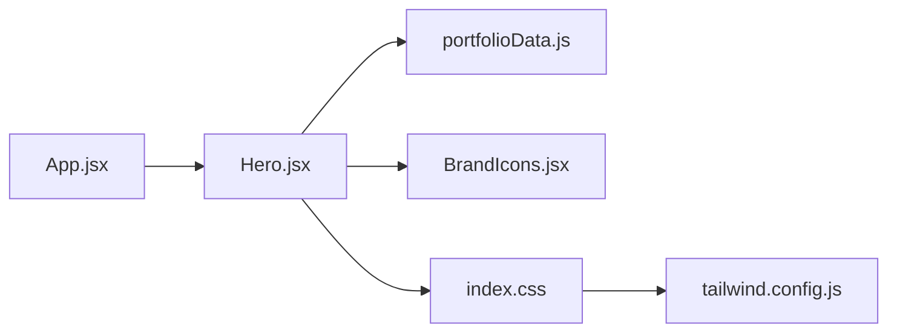

# Hero Section

<cite>
**Referenced Files in This Document**
- [Hero.jsx](file://src/components/Hero.jsx)
- [portfolioData.js](file://src/data/portfolioData.js)
- [BrandIcons.jsx](file://src/components/BrandIcons.jsx)
- [index.css](file://src/index.css)
- [tailwind.config.js](file://tailwind.config.js)
- [App.jsx](file://src/App.jsx)
</cite>

## Table of Contents
1. [Introduction](#introduction)
2. [Project Structure](#project-structure)
3. [Core Components](#core-components)
4. [Architecture Overview](#architecture-overview)
5. [Detailed Component Analysis](#detailed-component-analysis)
6. [Dependency Analysis](#dependency-analysis)
7. [Performance Considerations](#performance-considerations)
8. [Troubleshooting Guide](#troubleshooting-guide)
9. [Conclusion](#conclusion)
10. [Appendices](#appendices)

## Introduction
This document explains the Hero section component, focusing on:
- Dynamic typing animation for rotating taglines using React hooks
- Responsive layout built with Tailwind CSS grid utilities
- Interactive elements including social media links and call-to-action buttons
- State management for tagline rotation
- Glass-morphism design patterns and animated gradient borders
- Accessibility considerations and mobile responsiveness

## Project Structure
The Hero section is a self-contained React component that composes UI from:
- The Hero component itself
- Brand icons (custom SVGs)
- Centralized portfolio data for personal info and social links
- Global styles and Tailwind configuration for theming and responsive behavior
- App-level composition that mounts the Hero within the page

**Diagram sources**
- [App.jsx:1-51](file://src/App.jsx#L1-L51)
- [Hero.jsx:1-245](file://src/components/Hero.jsx#L1-L245)
- [portfolioData.js:1-25](file://src/data/portfolioData.js#L1-L25)
- [BrandIcons.jsx:1-99](file://src/components/BrandIcons.jsx#L1-L99)
- [index.css:1-787](file://src/index.css#L1-L787)
- [tailwind.config.js:1-29](file://tailwind.config.js#L1-L29)

**Section sources**
- [App.jsx:1-51](file://src/App.jsx#L1-L51)
- [Hero.jsx:1-245](file://src/components/Hero.jsx#L1-L245)
- [portfolioData.js:1-25](file://src/data/portfolioData.js#L1-L25)
- [BrandIcons.jsx:1-99](file://src/components/BrandIcons.jsx#L1-L99)
- [index.css:1-787](file://src/index.css#L1-L787)
- [tailwind.config.js:1-29](file://tailwind.config.js#L1-L29)

## Core Components
- Hero component: Implements the hero layout, typing effect, CTAs, social links, and profile card.
- BrandIcons: Provides inline SVG icons for LinkedIn, GitHub, Twitter/X, LeetCode, HackerRank.
- Portfolio data: Centralizes name, role, taglines, and social URLs used by the Hero.
- Global styles: Defines glass-morphism, gradients, animations, and responsive utilities via Tailwind and custom CSS.

Key responsibilities:
- Manage state for dynamic typing and tagline cycling
- Render responsive two-column layout on large screens and stacked on small screens
- Provide accessible links and interactive CTAs
- Apply glass-morphism cards and animated gradient borders

**Section sources**
- [Hero.jsx:16-245](file://src/components/Hero.jsx#L16-L245)
- [BrandIcons.jsx:1-99](file://src/components/BrandIcons.jsx#L1-L99)
- [portfolioData.js:1-25](file://src/data/portfolioData.js#L1-L25)
- [index.css:392-456](file://src/index.css#L392-L456)
- [index.css:521-575](file://src/index.css#L521-L575)
- [index.css:610-629](file://src/index.css#L610-L629)

## Architecture Overview
The Hero section integrates with the app shell and uses centralized data and global styles to render a cohesive experience.

**Diagram sources**
- [App.jsx:28-47](file://src/App.jsx#L28-L47)
- [Hero.jsx:16-42](file://src/components/Hero.jsx#L16-L42)
- [portfolioData.js:1-25](file://src/data/portfolioData.js#L1-L25)
- [BrandIcons.jsx:1-99](file://src/components/BrandIcons.jsx#L1-L99)
- [index.css:392-456](file://src/index.css#L392-L456)

## Detailed Component Analysis

### Dynamic Typing Animation with React Hooks
- Uses useState for current tagline index, displayed text, and deleting flag.
- useEffect drives a timer that:
  - Types characters forward at one speed
  - Pauses briefly when complete
  - Deletes characters at a faster speed
  - Rotates to the next tagline cyclically
- Cleanup clears timers to avoid leaks.

Customization tips:
- Adjust typing/deleting speeds by modifying the delay values in the effect.
- Change pause duration after full word is typed to control dwell time.
- Extend or reorder taglines in the central data file to update content globally.

Accessibility notes:
- The typing effect updates visible text; ensure screen readers can announce changes. Consider adding aria-live regions if needed.
- Avoid overly fast animations for users with motion sensitivity; consider respecting prefers-reduced-motion.

**Section sources**
- [Hero.jsx:16-42](file://src/components/Hero.jsx#L16-L42)
- [portfolioData.js:4-9](file://src/data/portfolioData.js#L4-L9)

### Responsive Layout with Tailwind CSS Grid
- Two-column layout on large screens using a 12-column grid; left column holds headline, bio, CTAs, and social bar; right column shows the profile card.
- On smaller screens, it stacks vertically for readability.
- Spacing and alignment are handled with Tailwind spacing and flex utilities.

Mobile responsiveness patterns:
- Use responsive breakpoints to switch from grid to single-column stacking.
- Scale typography and padding for smaller viewports.
- Ensure touch targets for social icons and CTAs remain appropriately sized.

**Section sources**
- [Hero.jsx:44-167](file://src/components/Hero.jsx#L44-L167)
- [index.css:775-786](file://src/index.css#L775-L786)

### Interactive Elements: Social Media Integration and CTAs
- Social links:
  - Open in new tabs with security attributes for external navigation.
  - Include descriptive titles for accessibility.
  - Use consistent icon sizing and hover effects.
- Call-to-action buttons:
  - Primary button uses an animated gradient background and hover lift/shadow.
  - Secondary buttons use glass-like styling with subtle glow and hover color shifts.
  - All links/buttons are keyboard-focusable and visually distinct.

Customization tips:
- Update social URLs in the central data file to reflect your profiles.
- Swap or add new brand icons by extending the BrandIcons module.
- Tweak button colors and shadows via Tailwind classes or CSS variables.

**Section sources**
- [Hero.jsx:85-165](file://src/components/Hero.jsx#L85-L165)
- [BrandIcons.jsx:1-99](file://src/components/BrandIcons.jsx#L1-L99)
- [index.css:521-575](file://src/index.css#L521-L575)

### State Management for Tagline Rotation
- State variables:
  - Current tagline index
  - Displayed text string
  - Deleting mode boolean
- Effect logic:
  - Reads current tagline from data
  - Applies different speeds for typing vs deleting
  - Triggers deletion after a pause when fully typed
  - Rotates to next tagline when fully deleted
- Memory safety:
  - Clears timers on unmount or dependency change to prevent memory leaks.

Complexity:
- Time complexity per tick is O(1).
- Space complexity is O(1) relative to tagline length due to substring operations.

**Section sources**
- [Hero.jsx:16-42](file://src/components/Hero.jsx#L16-L42)
- [portfolioData.js:4-9](file://src/data/portfolioData.js#L4-L9)

### Glass-Morphism Design Patterns
- Glass cards:
  - Semi-transparent backgrounds with backdrop blur and subtle borders.
  - Hover states increase border glow and shadow depth.
- Glass pills:
  - Pill-shaped badges with blur and light borders for status indicators.
- Consistent theme variables:
  - Colors, borders, and shadows are defined as CSS variables for easy theming.

Customization tips:
- Adjust blur intensity and opacity to balance readability and aesthetics.
- Modify accent colors via CSS variables to match branding.

**Section sources**
- [index.css:392-456](file://src/index.css#L392-L456)
- [index.css:12-74](file://src/index.css#L12-L74)

### Animated Gradient Borders
- Outer glowing frame around the profile card uses a gradient overlay with blur and pulsing animation.
- Avatar ring rotates continuously to create a dynamic halo effect.
- Buttons and highlights also leverage animated gradients for visual interest.

Customization tips:
- Change gradient colors and animation durations to align with brand guidelines.
- Reduce animation intensity for performance or accessibility needs.

**Section sources**
- [Hero.jsx:169-193](file://src/components/Hero.jsx#L169-L193)
- [index.css:291-294](file://src/index.css#L291-L294)
- [index.css:333-387](file://src/index.css#L333-L387)

### Accessibility Considerations
- External links:
  - Use target="_blank" with rel="noopener noreferrer" for security.
  - Provide descriptive titles for each social link.
- Focus and interaction:
  - Ensure all interactive elements have clear focus states and sufficient contrast.
  - Buttons and links should be navigable via keyboard.
- Motion preferences:
  - Respect user preferences for reduced motion where possible.
- Screen reader support:
  - Ensure meaningful text alternatives for icons and decorative elements.

**Section sources**
- [Hero.jsx:110-158](file://src/components/Hero.jsx#L110-L158)
- [index.css:521-575](file://src/index.css#L521-L575)

### Mobile Responsiveness Patterns
- Grid-to-stack transition:
  - Switch from multi-column grid to single-column on smaller screens.
- Typography scaling:
  - Adjust font sizes and line heights for readability on mobile.
- Touch-friendly targets:
  - Ensure adequate spacing and sizing for tap interactions.
- Background orbs:
  - Reduce blur intensity on smaller screens to improve performance.

**Section sources**
- [Hero.jsx:44-167](file://src/components/Hero.jsx#L44-L167)
- [index.css:775-786](file://src/index.css#L775-L786)

## Dependency Analysis
The Hero component depends on:
- Centralized data for names, roles, taglines, and social URLs
- Brand icons for social platforms
- Global styles for glass-morphism, gradients, and animations
- Tailwind configuration for fonts and brand colors

**Diagram sources**
- [Hero.jsx:1-14](file://src/components/Hero.jsx#L1-L14)
- [portfolioData.js:1-25](file://src/data/portfolioData.js#L1-L25)
- [BrandIcons.jsx:1-99](file://src/components/BrandIcons.jsx#L1-L99)
- [index.css:1-787](file://src/index.css#L1-L787)
- [tailwind.config.js:1-29](file://tailwind.config.js#L1-L29)
- [App.jsx:1-51](file://src/App.jsx#L1-L51)

**Section sources**
- [Hero.jsx:1-14](file://src/components/Hero.jsx#L1-L14)
- [portfolioData.js:1-25](file://src/data/portfolioData.js#L1-L25)
- [BrandIcons.jsx:1-99](file://src/components/BrandIcons.jsx#L1-L99)
- [index.css:1-787](file://src/index.css#L1-L787)
- [tailwind.config.js:1-29](file://tailwind.config.js#L1-L29)
- [App.jsx:1-51](file://src/App.jsx#L1-L51)

## Performance Considerations
- Typing effect:
  - Keep delays reasonable to avoid excessive re-renders.
  - Clear timers on unmount to prevent memory leaks.
- Animations:
  - Prefer GPU-accelerated transforms and opacity for smoothness.
  - Limit heavy blurs on low-end devices; reduce blur radius on mobile.
- Images and icons:
  - Use lightweight inline SVGs to minimize network requests.
- Theme switching:
  - Minimize DOM mutations during theme toggles; rely on CSS variables.

[No sources needed since this section provides general guidance]

## Troubleshooting Guide
Common issues and fixes:
- Typing effect not updating:
  - Verify dependencies in the effect include displayText, isDeleting, and taglineIndex.
  - Ensure timers are cleared properly to avoid stale closures.
- Social links not opening:
  - Confirm href values are correct and external URLs are valid.
  - Check browser settings blocking pop-ups or new tabs.
- Glass-morphism not visible:
  - Ensure backdrop-filter is supported in the target browser.
  - Verify CSS variables for background and border colors are set.
- Gradient animations stuttering:
  - Reduce animation complexity or disable on low-power devices.
  - Use prefers-reduced-motion to limit animations for sensitive users.

**Section sources**
- [Hero.jsx:16-42](file://src/components/Hero.jsx#L16-L42)
- [index.css:392-456](file://src/index.css#L392-L456)
- [index.css:291-294](file://src/index.css#L291-L294)

## Conclusion
The Hero section combines a dynamic typing effect, responsive grid layout, and polished glass-morphism design to deliver an engaging first impression. By centralizing data and leveraging Tailwind and CSS variables, it remains easy to customize and maintain. Follow the customization tips and accessibility guidelines to tailor the component to your needs while ensuring a robust, inclusive user experience.

[No sources needed since this section summarizes without analyzing specific files]

## Appendices

### Customization Examples (by reference)
- Customize typing effect:
  - Adjust timing and pause durations in the typing effect hook.
  - Reference: [Hero.jsx:16-42](file://src/components/Hero.jsx#L16-L42)
- Modify social links:
  - Update URLs in the central data file for LinkedIn, GitHub, Twitter/X, LeetCode, HackerRank.
  - Reference: [portfolioData.js:14-19](file://src/data/portfolioData.js#L14-L19)
- Adjust visual styling:
  - Edit CSS variables for colors, borders, and shadows to match your brand.
  - Reference: [index.css:12-74](file://src/index.css#L12-L74)
- Add new brand icons:
  - Extend the BrandIcons module with additional SVG components.
  - Reference: [BrandIcons.jsx:1-99](file://src/components/BrandIcons.jsx#L1-L99)

[No sources needed since this section references code paths rather than quoting content]