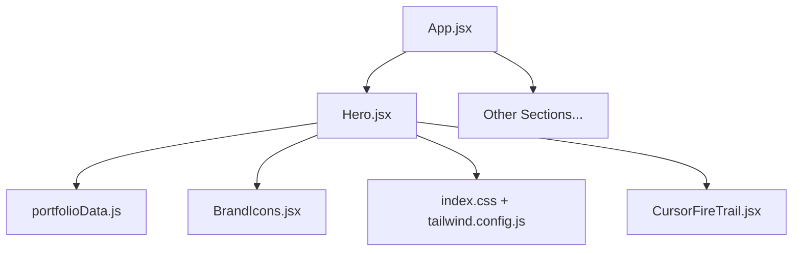
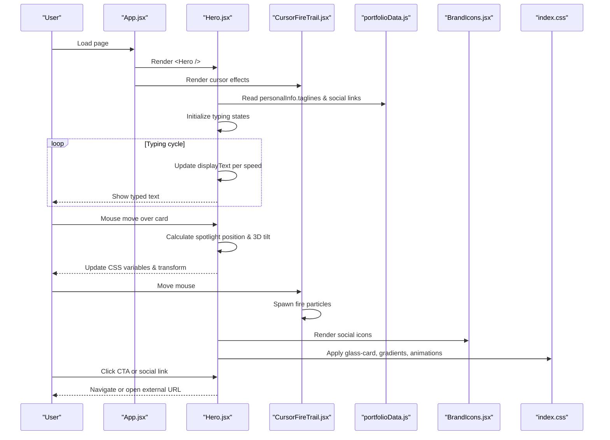
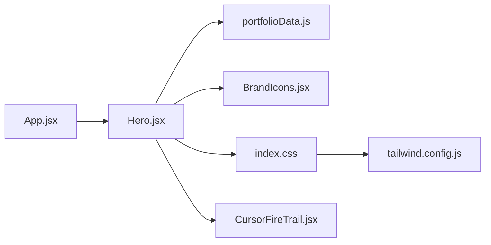

# Hero Section

<cite>
**Referenced Files in This Document**
- [Hero.jsx](file://src/components/Hero.jsx)
- [portfolioData.js](file://src/data/portfolioData.js)
- [BrandIcons.jsx](file://src/components/BrandIcons.jsx)
- [index.css](file://src/index.css)
- [tailwind.config.js](file://tailwind.config.js)
- [App.jsx](file://src/App.jsx)
- [CursorFireTrail.jsx](file://src/components/CursorFireTrail.jsx)
</cite>

## Update Summary
**Changes Made**
- Added comprehensive documentation for mouse-tracking interactions and cursor spotlight effects
- Enhanced 3D tilt animation implementation details
- Updated staggered fade-in animation system documentation
- Added cursor fire trail component integration
- Enhanced interactive elements section with new hover effects
- Updated accessibility considerations for motion-sensitive users

## Table of Contents
1. [Introduction](#introduction)
2. [Project Structure](#project-structure)
3. [Core Components](#core-components)
4. [Architecture Overview](#architecture-overview)
5. [Detailed Component Analysis](#detailed-component-analysis)
6. [Dependency Analysis](#dependency-analysis)
7. [Performance Considerations](#performance-considerations)
8. [Troubleshooting Guide](#troubleshooting-guide)
9. [Conclusion](#conclusion)
10. [Appendices](#appendices)

## Introduction
This document explains the Hero section component, focusing on:
- Dynamic typing animation for rotating taglines using React hooks
- **Enhanced mouse-tracking interactions with cursor spotlight effects**
- **Advanced 3D tilt animations responding to user interaction**
- **Comprehensive staggered fade-in animation system**
- Responsive layout built with Tailwind CSS grid utilities
- Interactive elements including social media links and call-to-action buttons
- State management for tagline rotation
- Glass-morphism design patterns and animated gradient borders
- Cursor fire trail effects for enhanced visual feedback
- Accessibility considerations and mobile responsiveness

## Project Structure
The Hero section is a self-contained React component that composes UI from:
- The Hero component itself with enhanced mouse tracking
- Cursor fire trail component for particle effects
- Brand icons (custom SVGs)
- Centralized portfolio data for personal info and social links
- Global styles and Tailwind configuration for theming and responsive behavior
- App-level composition that mounts the Hero within the page

**Diagram sources**
- [App.jsx:1-51](file://src/App.jsx#L1-L51)
- [Hero.jsx:1-273](file://src/components/Hero.jsx#L1-L273)
- [portfolioData.js:1-25](file://src/data/portfolioData.js#L1-L25)
- [BrandIcons.jsx:1-99](file://src/components/BrandIcons.jsx#L1-L99)
- [index.css:1-940](file://src/index.css#L1-L940)
- [tailwind.config.js:1-29](file://tailwind.config.js#L1-L29)
- [CursorFireTrail.jsx:1-99](file://src/components/CursorFireTrail.jsx#L1-L99)

**Section sources**
- [App.jsx:1-51](file://src/App.jsx#L1-L51)
- [Hero.jsx:1-273](file://src/components/Hero.jsx#L1-L273)
- [portfolioData.js:1-25](file://src/data/portfolioData.js#L1-L25)
- [BrandIcons.jsx:1-99](file://src/components/BrandIcons.jsx#L1-L99)
- [index.css:1-940](file://src/index.css#L1-L940)
- [tailwind.config.js:1-29](file://tailwind.config.js#L1-L29)
- [CursorFireTrail.jsx:1-99](file://src/components/CursorFireTrail.jsx#L1-L99)

## Core Components
- **Enhanced Hero component**: Implements hero layout with mouse-tracking, 3D tilt effects, typing effect, CTAs, social links, and profile card
- **Cursor Fire Trail**: Canvas-based particle system creating fire-like cursor effects
- **BrandIcons**: Provides inline SVG icons for LinkedIn, GitHub, Twitter/X, LeetCode, HackerRank
- **Portfolio data**: Centralizes name, role, taglines, and social URLs used by the Hero
- **Global styles**: Defines glass-morphism, gradients, animations, and responsive utilities via Tailwind and custom CSS

Key responsibilities:
- Manage state for dynamic typing and tagline cycling
- Handle mouse tracking for spotlight and 3D tilt effects
- Render responsive two-column layout on large screens and stacked on small screens
- Provide accessible links and interactive CTAs
- Apply glass-morphism cards and animated gradient borders
- Coordinate cursor fire trail particle effects

**Section sources**
- [Hero.jsx:17-273](file://src/components/Hero.jsx#L17-L273)
- [CursorFireTrail.jsx:1-99](file://src/components/CursorFireTrail.jsx#L1-L99)
- [BrandIcons.jsx:1-99](file://src/components/BrandIcons.jsx#L1-L99)
- [portfolioData.js:1-25](file://src/data/portfolioData.js#L1-L25)
- [index.css:398-533](file://src/index.css#L398-L533)
- [index.css:536-586](file://src/index.css#L536-L586)
- [index.css:671-727](file://src/index.css#L671-L727)

## Architecture Overview
The Hero section integrates with the app shell and uses centralized data and global styles to render a cohesive experience with enhanced interactivity.

**Diagram sources**
- [App.jsx:28-47](file://src/App.jsx#L28-L47)
- [Hero.jsx:17-61](file://src/components/Hero.jsx#L17-L61)
- [Hero.jsx:23-38](file://src/components/Hero.jsx#L23-L38)
- [CursorFireTrail.jsx:6-89](file://src/components/CursorFireTrail.jsx#L6-L89)
- [portfolioData.js:1-25](file://src/data/portfolioData.js#L1-L25)
- [BrandIcons.jsx:1-99](file://src/components/BrandIcons.jsx#L1-L99)
- [index.css:398-533](file://src/index.css#L398-L533)

## Detailed Component Analysis

### Enhanced Mouse Tracking and 3D Tilt Interactions
**Updated** - New interactive features added for enhanced user engagement

- **Cursor Spotlight Effect**: 
  - Tracks mouse position within the hero card using `getBoundingClientRect()`
  - Updates CSS custom properties (`--spot-x`, `--spot-y`) for radial gradient positioning
  - Creates a glowing spotlight that follows the cursor across the card surface
  - Smooth opacity transitions when hovering over the card

- **3D Tilt Animation**:
  - Calculates rotation angles based on cursor position relative to card center
  - Applies perspective transforms with `rotateX` and `rotateY` values
  - Subtle scale effect (1.02x) enhances the 3D feel
  - Smooth transition back to default state on mouse leave

- **Performance Optimization**:
  - Uses CSS variables for efficient updates without re-renders
  - Event listeners properly cleaned up on component unmount
  - Transform operations optimized for GPU acceleration

Customization tips:
- Adjust tilt intensity by modifying the multiplier values (currently 10 degrees max)
- Change spotlight radius by adjusting the `260px` value in CSS
- Modify perspective depth by changing the `900px` perspective value

**Section sources**
- [Hero.jsx:23-38](file://src/components/Hero.jsx#L23-L38)
- [index.css:447-465](file://src/index.css#L447-L465)

### Comprehensive Staggered Fade-In Animation System
**Updated** - Enhanced animation system with multiple stagger levels

- **Animation Classes**:
  - `animate-fade-in-up`: Smooth upward entrance with 0.9s duration
  - `animate-fade-in-scale`: Scale-based entrance with 1.1s duration
  - Six stagger levels (`hero-stagger-1` through `hero-stagger-6`) with progressive delays
  - Custom cubic-bezier easing for smooth, natural motion

- **Stagger Implementation**:
  - Each element receives appropriate stagger class for sequential reveal
  - Delays range from 0.15s to 1.15s creating cascading effect
  - Applied to status pills, headline, bio, CTAs, social bar, and scroll indicator

- **Animation Performance**:
  - Uses CSS animations for better performance than JavaScript
  - Hardware-accelerated transforms and opacity changes
  - Proper animation timing functions for smooth motion

Customization tips:
- Adjust animation durations by modifying the keyframe definitions
- Change stagger timing by updating delay values in stagger classes
- Add new animation types by extending the keyframe definitions

**Section sources**
- [Hero.jsx:72-128](file://src/components/Hero.jsx#L72-L128)
- [index.css:510-533](file://src/index.css#L510-L533)

### Dynamic Typing Animation with React Hooks
- Uses useState for current tagline index, displayed text, and deleting flag.
- useEffect drives a timer that:
  - Types characters forward at one speed
  - Pauses briefly when complete
  - Deletes characters at a faster speed
  - Rotates to the next tagline cyclically
- Cleanup clears timers to avoid leaks.

Customization tips:
- Adjust typing/deleting speeds by modifying the delay values in the effect.
- Change pause duration after full word is typed to control dwell time.
- Extend or reorder taglines in the central data file to update content globally.

Accessibility notes:
- The typing effect updates visible text; ensure screen readers can announce changes. Consider adding aria-live regions if needed.
- Avoid overly fast animations for users with motion sensitivity; consider respecting prefers-reduced-motion.

**Section sources**
- [Hero.jsx:17-61](file://src/components/Hero.jsx#L17-L61)
- [portfolioData.js:4-9](file://src/data/portfolioData.js#L4-L9)

### Cursor Fire Trail Particle Effects
**New** - Advanced canvas-based particle system

- **Particle System**:
  - Real-time canvas rendering with requestAnimationFrame
  - Fire-like particles with randomized colors, sizes, and velocities
  - Automatic cleanup of expired particles to maintain performance
  - Smooth upward drift with gravity simulation

- **Mouse Integration**:
  - Tracks mouse position globally across the window
  - Spawns 3 particles per mouse movement event
  - Particles have random horizontal velocity and upward vertical velocity
  - Life decay system removes particles naturally over time

- **Visual Effects**:
  - Radial gradients create soft, glowing particle appearance
  - HSL color space provides vibrant orange-red fire colors
  - Screen blend mode creates luminous overlay effect
  - Maximum particle count (300) prevents performance issues

Customization tips:
- Adjust particle spawn rate by modifying the loop count (currently 3)
- Change particle lifespan by adjusting decay rates
- Modify particle colors by tweaking HSL hue ranges
- Control maximum particles for performance tuning

**Section sources**
- [CursorFireTrail.jsx:1-99](file://src/components/CursorFireTrail.jsx#L1-L99)

### Responsive Layout with Tailwind CSS Grid
- Two-column layout on large screens using a 12-column grid; left column holds headline, bio, CTAs, and social bar; right column shows the profile card.
- On smaller screens, it stacks vertically for readability.
- Spacing and alignment are handled with Tailwind spacing and flex utilities.

Mobile responsiveness patterns:
- Use responsive breakpoints to switch from grid to single-column stacking.
- Scale typography and padding for smaller viewports.
- Ensure touch targets for social icons and CTAs remain appropriately sized.

**Section sources**
- [Hero.jsx:66-191](file://src/components/Hero.jsx#L66-L191)
- [index.css:928-940](file://src/index.css#L928-L940)

### Interactive Elements: Social Media Integration and CTAs
**Updated** - Enhanced with new hover effects and sparkle animations

- **Social Links**:
  - Open in new tabs with security attributes for external navigation.
  - Include descriptive titles for accessibility.
  - Use consistent icon sizing and hover effects with scale transformations.
  - Glass-morphism styling with backdrop blur and subtle borders.

- **Call-to-action Buttons**:
  - Primary button uses an animated gradient background and hover lift/shadow.
  - Secondary buttons use glass-like styling with subtle glow and hover color shifts.
  - Sparkle effects with floating star decorations on hover.
  - All links/buttons are keyboard-focusable and visually distinct.

- **Enhanced Hover States**:
  - Border glow animations with color transitions
  - Scale transformations for depth perception
  - Shadow effects that enhance visual hierarchy
  - Gradient border animations for premium feel

Customization tips:
- Update social URLs in the central data file to reflect your profiles.
- Swap or add new brand icons by extending the BrandIcons module.
- Tweak button colors and shadows via Tailwind classes or CSS variables.
- Adjust sparkle animation timing and positions in CSS.

**Section sources**
- [Hero.jsx:128-189](file://src/components/Hero.jsx#L128-L189)
- [BrandIcons.jsx:1-99](file://src/components/BrandIcons.jsx#L1-L99)
- [index.css:536-586](file://src/index.css#L536-L586)
- [index.css:671-727](file://src/index.css#L671-L727)

### State Management for Tagline Rotation
- State variables:
  - Current tagline index
  - Displayed text string
  - Deleting mode boolean
- Effect logic:
  - Reads current tagline from data
  - Applies different speeds for typing vs deleting
  - Triggers deletion after a pause when fully typed
  - Rotates to next tagline when fully deleted
- Memory safety:
  - Clears timers on unmount or dependency change to prevent memory leaks.

Complexity:
- Time complexity per tick is O(1).
- Space complexity is O(1) relative to tagline length due to substring operations.

**Section sources**
- [Hero.jsx:17-61](file://src/components/Hero.jsx#L17-L61)
- [portfolioData.js:4-9](file://src/data/portfolioData.js#L4-L9)

### Glass-Morphism Design Patterns
**Updated** - Enhanced with cursor spotlight integration

- **Glass Cards**:
  - Semi-transparent backgrounds with backdrop blur and subtle borders.
  - Hover states increase border glow and shadow depth.
  - Integrated cursor spotlight effect following mouse position.
  - Animated gradient overlays on hover for premium feel.

- **Glass Pills**:
  - Pill-shaped badges with blur and light borders for status indicators.
  - Hover effects with color transitions and scale transformations.
  - Consistent theme variables for easy customization.

- **Consistent Theme Variables**:
  - Colors, borders, and shadows are defined as CSS variables for easy theming.
  - Section-specific color themes for different portfolio sections.
  - Light/dark theme support with automatic variable switching.

Customization tips:
- Adjust blur intensity and opacity to balance readability and aesthetics.
- Modify accent colors via CSS variables to match branding.
- Customize spotlight radius and intensity for different visual preferences.

**Section sources**
- [index.css:398-505](file://src/index.css#L398-L505)
- [index.css:12-75](file://src/index.css#L12-L75)

### Animated Gradient Borders
**Updated** - Enhanced with additional animation effects

- Outer glowing frame around the profile card uses a gradient overlay with blur and pulsing animation.
- Avatar ring rotates continuously to create a dynamic halo effect.
- Buttons and highlights also leverage animated gradients for visual interest.
- Magic border effects with conic gradients and spinning animations.
- Neon glow effects with multi-layered box shadows.

Customization tips:
- Change gradient colors and animation durations to align with brand guidelines.
- Reduce animation intensity for performance or accessibility needs.
- Adjust glow intensity and colors for different visual themes.

**Section sources**
- [Hero.jsx:197-221](file://src/components/Hero.jsx#L197-L221)
- [index.css:291-318](file://src/index.css#L291-L318)
- [index.css:762-781](file://src/index.css#L762-L781)
- [index.css:786-794](file://src/index.css#L786-L794)

### Accessibility Considerations
**Updated** - Enhanced with motion preference considerations

- External links:
  - Use target="_blank" with rel="noopener noreferrer" for security.
  - Provide descriptive titles for each social link.
- Focus and interaction:
  - Ensure all interactive elements have clear focus states and sufficient contrast.
  - Buttons and links should be navigable via keyboard.
- Motion preferences:
  - Respect user preferences for reduced motion where possible.
  - Consider pausing animations for users with motion sensitivity.
  - Provide alternative non-animated experiences when needed.
- Screen reader support:
  - Ensure meaningful text alternatives for icons and decorative elements.
  - Proper ARIA labels for interactive components.
- Performance considerations:
  - Optimize particle systems for low-power devices.
  - Provide fallbacks for complex animations on older browsers.

**Section sources**
- [Hero.jsx:134-182](file://src/components/Hero.jsx#L134-L182)
- [index.css:671-727](file://src/index.css#L671-L727)

### Mobile Responsiveness Patterns
- Grid-to-stack transition:
  - Switch from multi-column grid to single-column on smaller screens.
- Typography scaling:
  - Adjust font sizes and line heights for readability on mobile.
- Touch-friendly targets:
  - Ensure adequate spacing and sizing for tap interactions.
- Background orbs:
  - Reduce blur intensity on smaller screens to improve performance.
- Cursor effects optimization:
  - Disable or reduce particle effects on mobile devices for better performance.
  - Simplify 3D tilt effects for touch interfaces.

**Section sources**
- [Hero.jsx:66-191](file://src/components/Hero.jsx#L66-L191)
- [index.css:928-940](file://src/index.css#L928-L940)

## Dependency Analysis
The Hero component depends on:
- Centralized data for names, roles, taglines, and social URLs
- Brand icons for social platforms
- Global styles for glass-morphism, gradients, and animations
- Tailwind configuration for fonts and brand colors
- Cursor fire trail component for enhanced visual effects

**Diagram sources**
- [Hero.jsx:1-15](file://src/components/Hero.jsx#L1-L15)
- [portfolioData.js:1-25](file://src/data/portfolioData.js#L1-L25)
- [BrandIcons.jsx:1-99](file://src/components/BrandIcons.jsx#L1-L99)
- [index.css:1-940](file://src/index.css#L1-L940)
- [tailwind.config.js:1-29](file://tailwind.config.js#L1-L29)
- [App.jsx:1-51](file://src/App.jsx#L1-L51)
- [CursorFireTrail.jsx:1-99](file://src/components/CursorFireTrail.jsx#L1-L99)

**Section sources**
- [Hero.jsx:1-15](file://src/components/Hero.jsx#L1-L15)
- [portfolioData.js:1-25](file://src/data/portfolioData.js#L1-L25)
- [BrandIcons.jsx:1-99](file://src/components/BrandIcons.jsx#L1-L99)
- [index.css:1-940](file://src/index.css#L1-L940)
- [tailwind.config.js:1-29](file://tailwind.config.js#L1-L29)
- [App.jsx:1-51](file://src/App.jsx#L1-L51)
- [CursorFireTrail.jsx:1-99](file://src/components/CursorFireTrail.jsx#L1-L99)

## Performance Considerations
**Updated** - Enhanced with cursor effects and particle system considerations

- **Typing effect**:
  - Keep delays reasonable to avoid excessive re-renders.
  - Clear timers on unmount to prevent memory leaks.
- **Animations**:
  - Prefer GPU-accelerated transforms and opacity for smoothness.
  - Limit heavy blurs on low-end devices; reduce blur radius on mobile.
  - Use CSS animations instead of JavaScript for better performance.
- **Cursor Effects**:
  - Particle systems should have maximum limits to prevent memory issues.
  - Canvas rendering should be optimized with proper cleanup.
  - Consider disabling complex effects on mobile devices.
- **Images and icons**:
  - Use lightweight inline SVGs to minimize network requests.
- **Theme switching**:
  - Minimize DOM mutations during theme toggles; rely on CSS variables.
- **Memory Management**:
  - Properly clean up event listeners and animation frames.
  - Monitor particle counts and implement automatic cleanup.

[No sources needed since this section provides general guidance]

## Troubleshooting Guide
Common issues and fixes:
- **Typing effect not updating**:
  - Verify dependencies in the effect include displayText, isDeleting, and taglineIndex.
  - Ensure timers are cleared properly to avoid stale closures.
- **Social links not opening**:
  - Confirm href values are correct and external URLs are valid.
  - Check browser settings blocking pop-ups or new tabs.
- **Glass-morphism not visible**:
  - Ensure backdrop-filter is supported in the target browser.
  - Verify CSS variables for background and border colors are set.
- **Gradient animations stuttering**:
  - Reduce animation complexity or disable on low-power devices.
  - Use prefers-reduced-motion to limit animations for sensitive users.
- **Cursor spotlight not working**:
  - Verify event listeners are properly attached to the hero card.
  - Check that CSS custom properties are being updated correctly.
  - Ensure the hero-spotlight class is applied to the correct element.
- **3D tilt effects not responding**:
  - Confirm mousemove event handlers are properly bound.
  - Check that transform properties are not being overridden by other styles.
  - Verify that the card has proper positioning context.
- **Particle system performance issues**:
  - Reduce particle spawn rate or maximum particle count.
  - Check for memory leaks in particle cleanup logic.
  - Consider disabling effects on mobile devices.

**Section sources**
- [Hero.jsx:17-61](file://src/components/Hero.jsx#L17-L61)
- [Hero.jsx:23-38](file://src/components/Hero.jsx#L23-L38)
- [index.css:398-533](file://src/index.css#L398-L533)
- [index.css:291-318](file://src/index.css#L291-L318)
- [CursorFireTrail.jsx:6-89](file://src/components/CursorFireTrail.jsx#L6-L89)

## Conclusion
The Hero section combines a dynamic typing effect, responsive grid layout, and polished glass-morphism design to deliver an engaging first impression. With the recent enhancements including mouse-tracking interactions, cursor spotlight effects, 3D tilt animations, and comprehensive staggered fade-in effects, it now provides a sophisticated and immersive user experience. By centralizing data and leveraging Tailwind and CSS variables, it remains easy to customize and maintain while offering advanced interactive capabilities. Follow the customization tips and accessibility guidelines to tailor the component to your needs while ensuring a robust, inclusive user experience.

[No sources needed since this section summarizes without analyzing specific files]

## Appendices

### Customization Examples (by reference)
- **Customize typing effect**:
  - Adjust timing and pause durations in the typing effect hook.
  - Reference: [Hero.jsx:17-61](file://src/components/Hero.jsx#L17-L61)
- **Modify social links**:
  - Update URLs in the central data file for LinkedIn, GitHub, Twitter/X, LeetCode, HackerRank.
  - Reference: [portfolioData.js:14-19](file://src/data/portfolioData.js#L14-L19)
- **Adjust visual styling**:
  - Edit CSS variables for colors, borders, and shadows to match your brand.
  - Reference: [index.css:12-75](file://src/index.css#L12-L75)
- **Add new brand icons**:
  - Extend the BrandIcons module with additional SVG components.
  - Reference: [BrandIcons.jsx:1-99](file://src/components/BrandIcons.jsx#L1-L99)
- **Configure cursor effects**:
  - Adjust particle spawn rates, colors, and lifespans in the cursor fire trail component.
  - Reference: [CursorFireTrail.jsx:22-44](file://src/components/CursorFireTrail.jsx#L22-L44)
- **Customize 3D tilt behavior**:
  - Modify tilt intensity and perspective values in the mouse tracking handler.
  - Reference: [Hero.jsx:23-38](file://src/components/Hero.jsx#L23-L38)
- **Enhance animation system**:
  - Add new stagger levels or modify existing animation timings.
  - Reference: [index.css:510-533](file://src/index.css#L510-L533)

[No sources needed since this section references code paths rather than quoting content]