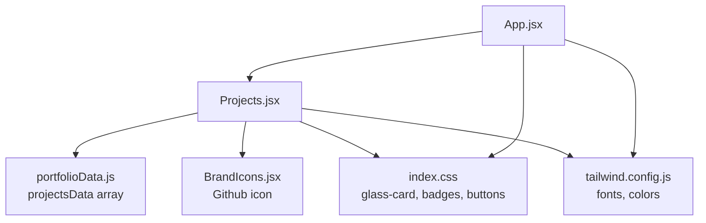
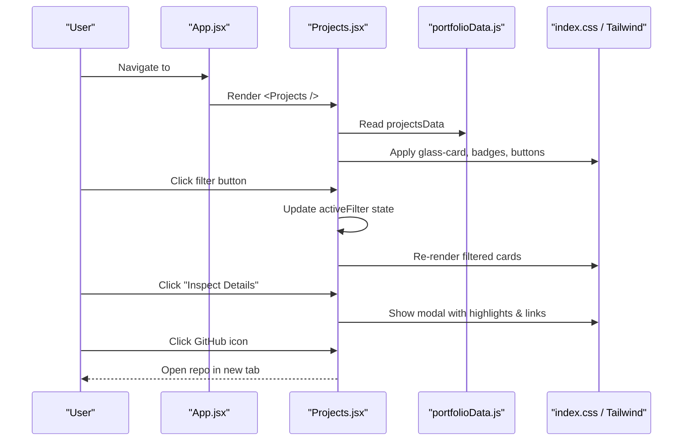
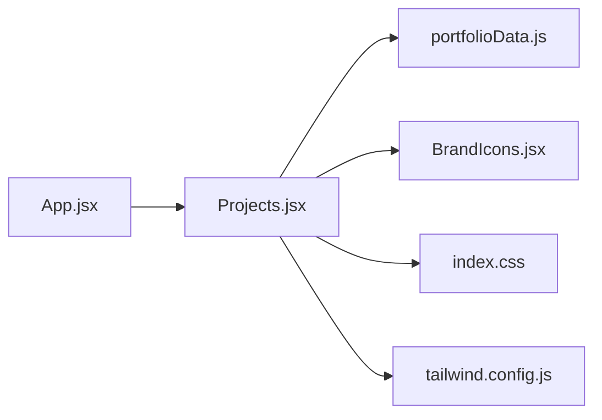

# Projects Showcase

<cite>
**Referenced Files in This Document**
- [Projects.jsx](file://src/components/Projects.jsx)
- [portfolioData.js](file://src/data/portfolioData.js)
- [App.jsx](file://src/App.jsx)
- [BrandIcons.jsx](file://src/components/BrandIcons.jsx)
- [index.css](file://src/index.css)
- [tailwind.config.js](file://tailwind.config.js)
- [package.json](file://package.json)
</cite>

## Table of Contents
1. [Introduction](#introduction)
2. [Project Structure](#project-structure)
3. [Core Components](#core-components)
4. [Architecture Overview](#architecture-overview)
5. [Detailed Component Analysis](#detailed-component-analysis)
6. [Dependency Analysis](#dependency-analysis)
7. [Performance Considerations](#performance-considerations)
8. [Troubleshooting Guide](#troubleshooting-guide)
9. [Conclusion](#conclusion)
10. [Appendices](#appendices)

## Introduction
This document explains the Projects showcase feature: how project data is structured, how cards are rendered and filtered, how details are presented with descriptions, technology stacks, and external repository links, and how to add or customize projects. It also covers responsive design patterns, hover effects, accessibility considerations, and integration with the centralized portfolio data file.

## Project Structure
The Projects feature is implemented as a React component that reads project entries from a central data file and renders them into a responsive card grid with category filtering and a detail modal. The application mounts this component within the main app layout.

**Diagram sources**
- [App.jsx:28-47](file://src/App.jsx#L28-L47)
- [Projects.jsx:1-20](file://src/components/Projects.jsx#L1-L20)
- [portfolioData.js:101-257](file://src/data/portfolioData.js#L101-L257)
- [BrandIcons.jsx:22-38](file://src/components/BrandIcons.jsx#L22-L38)
- [index.css:392-437](file://src/index.css#L392-L437)
- [tailwind.config.js:1-29](file://tailwind.config.js#L1-L29)

**Section sources**
- [App.jsx:28-47](file://src/App.jsx#L28-L47)
- [Projects.jsx:1-20](file://src/components/Projects.jsx#L1-L20)

## Core Components
- Projects component: manages state for active filter, selected project, and simulated matching UI; renders header, filter bar, card grid, and modal.
- Portfolio data: centralized array of project objects defining metadata, highlights, architecture steps, and links.
- Brand icons: reusable SVG icons (e.g., GitHub) used in project cards and modal.
- Styling: CSS variables, glassmorphism, badges, buttons, and responsive utilities via index.css and Tailwind configuration.

Key responsibilities:
- Filter projects by category using a simple state-driven filter.
- Render cards with title, subtitle, description, tools tags, and GitHub link.
- Open a modal with detailed highlights and optional interactive architecture simulator.
- Provide accessible interactions via keyboard-friendly buttons and semantic elements.

**Section sources**
- [Projects.jsx:18-28](file://src/components/Projects.jsx#L18-L28)
- [portfolioData.js:101-257](file://src/data/portfolioData.js#L101-L257)
- [BrandIcons.jsx:22-38](file://src/components/BrandIcons.jsx#L22-L38)
- [index.css:392-437](file://src/index.css#L392-L437)

## Architecture Overview
The Projects section follows a unidirectional data flow:
- Data source: projectsData array in portfolioData.js.
- Rendering: Projects.jsx maps over filtered results to render cards.
- Interaction: Clicking “Inspect Details” opens a modal with deeper content and optional simulation.
- Styling: Glassmorphic cards, badges, and buttons styled via index.css and Tailwind classes.

**Diagram sources**
- [App.jsx:36-44](file://src/App.jsx#L36-L44)
- [Projects.jsx:18-28](file://src/components/Projects.jsx#L18-L28)
- [Projects.jsx:75-147](file://src/components/Projects.jsx#L75-L147)
- [Projects.jsx:149-254](file://src/components/Projects.jsx#L149-L254)
- [portfolioData.js:101-257](file://src/data/portfolioData.js#L101-L257)
- [index.css:392-437](file://src/index.css#L392-L437)

## Detailed Component Analysis

### Project Data Model
Each project entry includes:
- id: unique identifier
- title: project name
- subtitle: short descriptor
- category: used for filtering (e.g., “Java / Systems”, “Full-Stack / Web”, “AI & ML”)
- featured: boolean flag for visual emphasis
- description: concise overview
- tools: array of technologies used
- highlights: array of key technical points
- architecture: optional step-by-step workflow for complex systems
- demoUrl: optional live demo link
- githubUrl: external repository link

Complexity:
- Filtering runs in O(n) per filter change where n is number of projects.
- Modal rendering is conditional and only when a project is selected.

Best practices:
- Keep categories consistent to ensure accurate filtering.
- Use meaningful ids for stable keys in lists.
- Maintain descriptive highlights and tools for discoverability.

**Section sources**
- [portfolioData.js:101-257](file://src/data/portfolioData.js#L101-L257)

### Card-Based Layout Implementation
- Grid: responsive grid using Tailwind classes that adapts from single column on small screens to three columns on large screens.
- Cards: glassmorphic containers with hover effects, badges for category and featured status, tool tags, and action buttons.
- Actions: “Inspect Details” opens modal; GitHub icon opens external repository.

Responsive behavior:
- Single column on mobile, two columns on medium, three on large.
- Padding and typography scale down on smaller viewports.

Hover effects:
- Cards lift and glow on hover using CSS transitions and shadows.
- Buttons have gradient animations and subtle transforms.

Accessibility:
- Buttons are native elements with clear labels.
- Links open in new tabs with appropriate rel attributes.
- Focus states are supported by browser defaults; custom focus styles can be added if needed.

**Section sources**
- [Projects.jsx:75-147](file://src/components/Projects.jsx#L75-L147)
- [index.css:392-437](file://src/index.css#L392-L437)
- [tailwind.config.js:1-29](file://tailwind.config.js#L1-L29)

### Filtering Capabilities
- Categories defined locally in the component.
- Active filter state controls which subset of projects is displayed.
- “All” shows every project; specific categories filter by exact match on project.category.

Extensibility:
- Add new categories by updating the categories array and ensuring project entries include matching category values.
- For advanced filtering (e.g., multi-select), extend state to track multiple filters and adjust filtering logic accordingly.

**Section sources**
- [Projects.jsx:18-28](file://src/components/Projects.jsx#L18-L28)
- [Projects.jsx:57-73](file://src/components/Projects.jsx#L57-L73)

### Modal Detail View
- Displays category badge, id, title, subtitle, description, and highlights.
- Optional architecture section with step-by-step explanation and an interactive “Simulate Match” button for Java mini project.
- Footer includes GitHub link and close button.

Interaction flow:
- Opening modal sets selected project and clears any previous simulation status.
- Simulation toggles a loading state and updates status text after a delay.

**Section sources**
- [Projects.jsx:149-254](file://src/components/Projects.jsx#L149-L254)

### Integration with portfolioData.js
- Centralized management: all project entries are defined in one place for easy maintenance.
- Import pattern: Projects.jsx imports projectsData directly from portfolioData.js.
- Consistency: changes to project structure require updates in both data and component rendering logic.

**Section sources**
- [Projects.jsx:16](file://src/components/Projects.jsx#L16)
- [portfolioData.js:101-257](file://src/data/portfolioData.js#L101-L257)

### Adding New Projects
Steps:
1. Open portfolioData.js and add a new object to the projectsData array following the existing schema.
2. Ensure fields like id, title, subtitle, category, description, tools, highlights, and githubUrl are present.
3. Optionally include architecture steps for complex projects.
4. Save and verify the card appears in the correct category and the modal displays correctly.

Example reference paths:
- See existing entries for structure and formatting.

**Section sources**
- [portfolioData.js:101-257](file://src/data/portfolioData.js#L101-L257)

### Customizing Project Cards
- Visual emphasis: set featured to true to apply special border and shadow styling.
- Tool tags: update the tools array to reflect current tech stack.
- Highlights: refine highlights to emphasize key achievements and technical depth.
- Category: assign a valid category to ensure proper filtering.

Styling hooks:
- Glassmorphism and hover effects are applied via shared CSS classes.
- Tailwind utilities control layout and responsiveness.

**Section sources**
- [Projects.jsx:75-147](file://src/components/Projects.jsx#L75-L147)
- [index.css:392-437](file://src/index.css#L392-L437)

### Implementing Category-Based Filtering
- Current implementation uses exact string matching on project.category.
- To add a new category:
  - Add it to the categories array in the component.
  - Ensure at least one project has that category value.
- For multi-category support:
  - Change state to track multiple active filters.
  - Update filtering logic to check membership in an array of categories.

**Section sources**
- [Projects.jsx:18-28](file://src/components/Projects.jsx#L18-L28)
- [Projects.jsx:57-73](file://src/components/Projects.jsx#L57-L73)

### Responsive Design Patterns
- Grid adapts across breakpoints: single column on small screens, two on medium, three on large.
- Typography scales down on smaller viewports.
- Spacing and padding reduce on mobile for better readability.

**Section sources**
- [Projects.jsx:75-77](file://src/components/Projects.jsx#L75-L77)
- [index.css:775-786](file://src/index.css#L775-L786)

### Hover Effects and Interactions
- Cards lift and glow on hover with enhanced shadows and border color changes.
- Buttons animate gradients and transform slightly on hover.
- Badges highlight on hover with increased opacity and glow.

**Section sources**
- [index.css:392-437](file://src/index.css#L392-L437)
- [index.css:521-575](file://src/index.css#L521-L575)
- [index.css:580-605](file://src/index.css#L580-L605)

### Accessibility Features
- Native buttons provide keyboard navigation and screen reader support.
- External links use target="_blank" with rel="noopener noreferrer" for security.
- Semantic HTML elements (section, h2, h3, p, button, a) improve structure and accessibility.
- Focus-visible styles can be extended for improved keyboard usability.

**Section sources**
- [Projects.jsx:124-142](file://src/components/Projects.jsx#L124-L142)
- [Projects.jsx:232-250](file://src/components/Projects.jsx#L232-L250)

## Dependency Analysis
- Projects.jsx depends on:
  - portfolioData.js for project entries
  - BrandIcons.jsx for GitHub icon
  - index.css for glass-card, badges, buttons, and responsive utilities
  - tailwind.config.js for fonts and brand colors
- App.jsx mounts Projects within the main layout.

**Diagram sources**
- [App.jsx:28-47](file://src/App.jsx#L28-L47)
- [Projects.jsx:1-20](file://src/components/Projects.jsx#L1-L20)
- [portfolioData.js:101-257](file://src/data/portfolioData.js#L101-L257)
- [BrandIcons.jsx:22-38](file://src/components/BrandIcons.jsx#L22-L38)
- [index.css:392-437](file://src/index.css#L392-L437)
- [tailwind.config.js:1-29](file://tailwind.config.js#L1-L29)

**Section sources**
- [package.json:12-27](file://package.json#L12-L27)
- [tailwind.config.js:1-29](file://tailwind.config.js#L1-L29)

## Performance Considerations
- Filtering is lightweight but runs on every filter change; keep the projects array size reasonable.
- Avoid unnecessary re-renders by keeping state minimal and stable.
- Use CSS transitions for smooth hover effects without heavy JavaScript.
- Consider lazy-loading modal content if project details become large.

[No sources needed since this section provides general guidance]

## Troubleshooting Guide
Common issues and resolutions:
- Projects not appearing:
  - Verify projectsData contains entries and categories match the filter list.
  - Check console for import errors in Projects.jsx and portfolioData.js.
- Filters not working:
  - Ensure activeFilter state updates and filtering logic matches project.category values.
- Modal not opening:
  - Confirm setSelectedProject is called and selectedProject state is managed.
- Styling issues:
  - Verify index.css is imported and Tailwind classes are recognized.
  - Check CSS variables and class names for typos.

**Section sources**
- [Projects.jsx:18-28](file://src/components/Projects.jsx#L18-L28)
- [Projects.jsx:75-147](file://src/components/Projects.jsx#L75-L147)
- [Projects.jsx:149-254](file://src/components/Projects.jsx#L149-L254)
- [index.css:392-437](file://src/index.css#L392-L437)

## Conclusion
The Projects showcase provides a clean, responsive, and accessible way to display project portfolios with category filtering, rich details, and external links. Centralized data management simplifies maintenance, while glassmorphic styling and Tailwind utilities deliver a modern user experience. Extending features such as multi-category filtering or additional interactivity can be achieved by augmenting state and filtering logic.

[No sources needed since this section summarizes without analyzing specific files]

## Appendices

### Example: Adding a New Project
- Reference existing entries for structure and formatting.
- Ensure all required fields are present and categories align with the filter list.

**Section sources**
- [portfolioData.js:101-257](file://src/data/portfolioData.js#L101-L257)

### Example: Customizing a Project Card
- Set featured to true for visual emphasis.
- Update tools and highlights to reflect current work.
- Adjust category to ensure correct filtering.

**Section sources**
- [Projects.jsx:75-147](file://src/components/Projects.jsx#L75-L147)
- [index.css:392-437](file://src/index.css#L392-L437)

### Example: Implementing Multi-Category Filtering
- Extend state to track multiple active filters.
- Update filtering logic to check membership in an array of categories.
- Adjust UI to allow selecting multiple categories.

**Section sources**
- [Projects.jsx:18-28](file://src/components/Projects.jsx#L18-L28)
- [Projects.jsx:57-73](file://src/components/Projects.jsx#L57-L73)