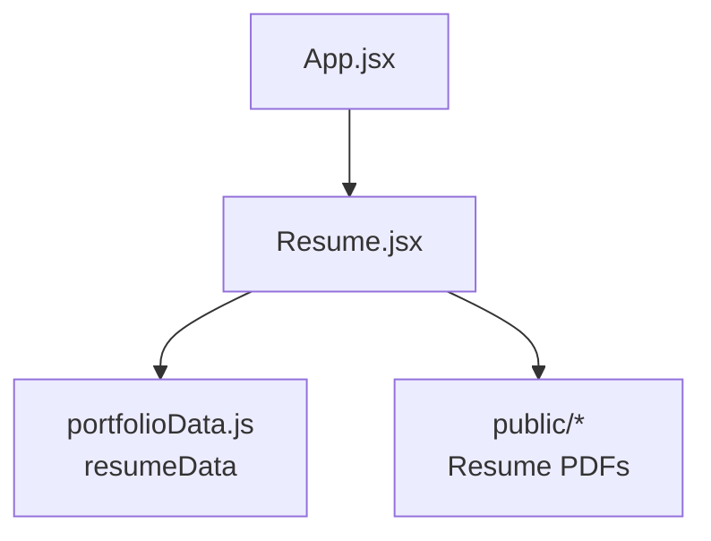
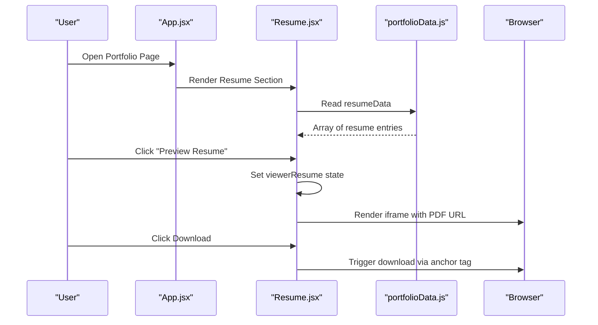
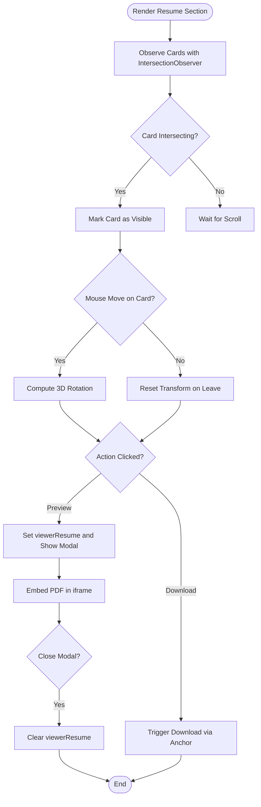
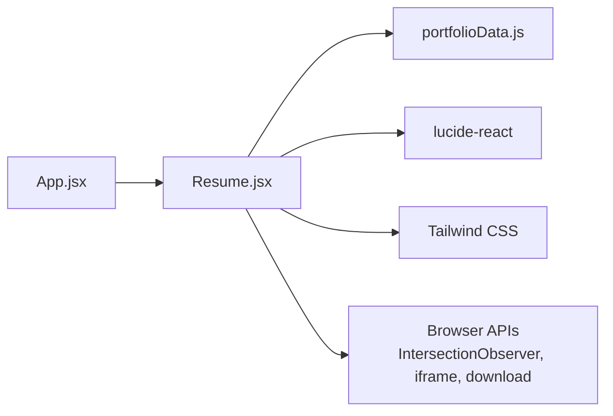

# Resume Management

<cite>
**Referenced Files in This Document**
- [Resume.jsx](file://src/components/Resume.jsx)
- [portfolioData.js](file://src/data/portfolioData.js)
- [App.jsx](file://src/App.jsx)
- [package.json](file://package.json)
- [README.md](file://README.md)
</cite>

## Table of Contents
1. [Introduction](#introduction)
2. [Project Structure](#project-structure)
3. [Core Components](#core-components)
4. [Architecture Overview](#architecture-overview)
5. [Detailed Component Analysis](#detailed-component-analysis)
6. [Dependency Analysis](#dependency-analysis)
7. [Performance Considerations](#performance-considerations)
8. [Troubleshooting Guide](#troubleshooting-guide)
9. [Conclusion](#conclusion)

## Introduction
This document explains the Resume Management feature within a React + Vite portfolio application. It focuses on how resumes are presented, previewed, and downloaded through a dedicated component that renders interactive cards with animations and a fullscreen PDF viewer modal. The data driving the resume section is centralized in a configuration file, making it easy to add or update resume entries without changing UI code.

## Project Structure
The resume management functionality is implemented as a standalone React component integrated into the main application layout. Data for resumes is defined centrally and consumed by the component. Static assets (PDFs) are served from the public directory.

**Diagram sources**
- [App.jsx:29-49](file://src/App.jsx#L29-L49)
- [Resume.jsx:14-14](file://src/components/Resume.jsx#L14-L14)
- [portfolioData.js:1141-1162](file://src/data/portfolioData.js#L1141-L1162)

**Section sources**
- [App.jsx:29-49](file://src/App.jsx#L29-L49)
- [Resume.jsx:79-243](file://src/components/Resume.jsx#L79-L243)
- [portfolioData.js:1141-1162](file://src/data/portfolioData.js#L1141-L1162)

## Core Components
- Resume component: Renders resume cards, handles 3D tilt effects, scroll-based entrance animations, and a fullscreen PDF viewer modal.
- Data layer: Centralized resume metadata including titles, descriptions, formats, page counts, sizes, and file URLs.
- Application shell: Integrates the Resume component into the main page flow alongside other sections.

Key responsibilities:
- Present multiple resume versions with distinct visual accents.
- Provide inline preview via an embedded PDF viewer in a modal.
- Enable direct downloads for each resume version.
- Animate card entrances using IntersectionObserver and apply 3D tilt on hover.

**Section sources**
- [Resume.jsx:1-327](file://src/components/Resume.jsx#L1-L327)
- [portfolioData.js:1141-1162](file://src/data/portfolioData.js#L1141-L1162)
- [App.jsx:29-49](file://src/App.jsx#L29-L49)

## Architecture Overview
The resume feature follows a simple client-side architecture:
- Data-driven rendering: The component reads resume metadata from a central data module.
- Static asset serving: PDF files are referenced via absolute paths under the public directory.
- Modal-based preview: A stateful modal overlays the page to embed the selected PDF.

**Diagram sources**
- [App.jsx:29-49](file://src/App.jsx#L29-L49)
- [Resume.jsx:108-225](file://src/components/Resume.jsx#L108-L225)
- [Resume.jsx:246-323](file://src/components/Resume.jsx#L246-L323)
- [portfolioData.js:1141-1162](file://src/data/portfolioData.js#L1141-L1162)

## Detailed Component Analysis

### Resume Component
Responsibilities:
- Render a responsive grid of resume cards with accent colors and badges.
- Apply scroll-triggered entrance animations using IntersectionObserver.
- Implement 3D tilt effect on hover for enhanced interactivity.
- Provide actions: Preview (opens modal), Download (direct link).
- Manage modal state for fullscreen PDF viewing with download and external open options.

State and interactions:
- State variables track which resume is being previewed and which cards are visible.
- Refs store DOM elements for intersection observation and 3D transforms.
- Event handlers compute mouse position relative to card bounds to calculate rotation angles.

Accessibility and UX:
- Buttons include descriptive labels and icons.
- Modal includes close, download, and open-in-new-tab actions.
- Fallback message guides users if the embedded PDF does not render.

**Diagram sources**
- [Resume.jsx:41-59](file://src/components/Resume.jsx#L41-L59)
- [Resume.jsx:61-77](file://src/components/Resume.jsx#L61-L77)
- [Resume.jsx:108-225](file://src/components/Resume.jsx#L108-L225)
- [Resume.jsx:246-323](file://src/components/Resume.jsx#L246-L323)

**Section sources**
- [Resume.jsx:1-327](file://src/components/Resume.jsx#L1-L327)

### Data Model: resumeData
Structure:
- Each entry defines: id, title, subtitle, description, fileUrl, format, pages, fileSize.
- Two primary entries represent different resume versions (single-page and double-page).

Usage:
- The Resume component maps over this array to render cards and populate modal content.
- File URLs point to static PDFs served from the public directory.

Extensibility:
- Add new resume versions by appending entries to the array.
- Maintain consistent fields to ensure UI compatibility.

**Section sources**
- [portfolioData.js:1141-1162](file://src/data/portfolioData.js#L1141-L1162)

### Integration in App Shell
Placement:
- The Resume component is included in the main layout after Certificates and before Contact.
- Theme context is managed at the app level; the Resume section inherits theme variables.

Navigation:
- Users can navigate to the Resume section via the site’s navigation bar (not shown here), then interact with cards and modal.

**Section sources**
- [App.jsx:29-49](file://src/App.jsx#L29-L49)

## Dependency Analysis
Internal dependencies:
- Resume.jsx depends on portfolioData.js for resume metadata.
- App.jsx composes Resume.jsx into the overall page structure.

External dependencies:
- lucide-react provides icons used across the UI.
- Tailwind CSS classes style components (via project configuration).
- Browser APIs: IntersectionObserver for scroll animations; iframe for PDF embedding; anchor tags with download attribute for file downloads.

Runtime behavior:
- No server-side logic; all operations occur in the browser.
- PDFs are loaded directly from static assets.

**Diagram sources**
- [Resume.jsx:1-13](file://src/components/Resume.jsx#L1-L13)
- [Resume.jsx:14-14](file://src/components/Resume.jsx#L14-L14)
- [App.jsx:29-49](file://src/App.jsx#L29-L49)
- [package.json:12-17](file://package.json#L12-L17)

**Section sources**
- [package.json:12-17](file://package.json#L12-L17)
- [Resume.jsx:1-327](file://src/components/Resume.jsx#L1-L327)
- [App.jsx:29-49](file://src/App.jsx#L29-L49)

## Performance Considerations
- IntersectionObserver usage is efficient for scroll-based animations; ensure cleanup on unmount to avoid memory leaks.
- 3D tilt calculations run on mousemove; consider throttling or requestAnimationFrame for smoother performance on lower-end devices.
- Embedding large PDFs in iframes may increase initial load time; lazy-loading or progressive loading could be considered for very large documents.
- Avoid unnecessary re-renders by keeping state minimal and stable; current implementation uses focused state for viewer and visibility sets.

[No sources needed since this section provides general guidance]

## Troubleshooting Guide
Common issues and resolutions:
- PDF not rendering in modal:
  - Some browsers restrict certain PDFs due to security policies or MIME types. Use the “Open in New Tab” action as a fallback.
  - Ensure the PDF path exists under the public directory and is correctly referenced in resumeData.
- Download not triggering:
  - Verify the anchor tag has the download attribute and points to a valid file URL.
  - Check network requests in the browser dev tools to confirm the file is accessible.
- Animations not appearing:
  - Confirm IntersectionObserver is initialized and observing correct elements.
  - Ensure refs are attached to DOM nodes and observer disconnects properly on cleanup.
- Modal not closing:
  - Verify click handlers on overlay and close button clear the viewerResume state.

**Section sources**
- [Resume.jsx:246-323](file://src/components/Resume.jsx#L246-L323)
- [Resume.jsx:41-59](file://src/components/Resume.jsx#L41-L59)
- [Resume.jsx:61-77](file://src/components/Resume.jsx#L61-L77)

## Conclusion
The Resume Management feature provides a clean, interactive way to present and access resume documents. By centralizing resume metadata and leveraging modern browser capabilities, it delivers a smooth user experience with animations, previews, and downloads. The modular design makes it straightforward to extend with additional resume versions or enhance interactivity while maintaining maintainability.

[No sources needed since this section summarizes without analyzing specific files]