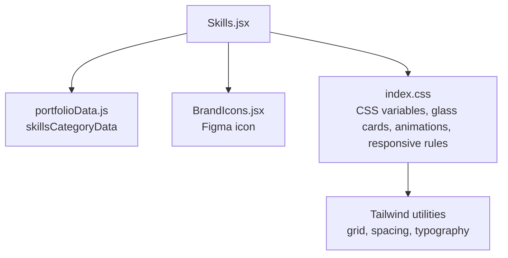
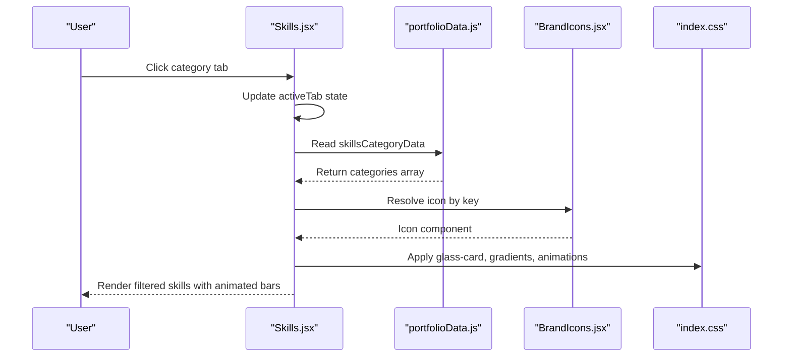
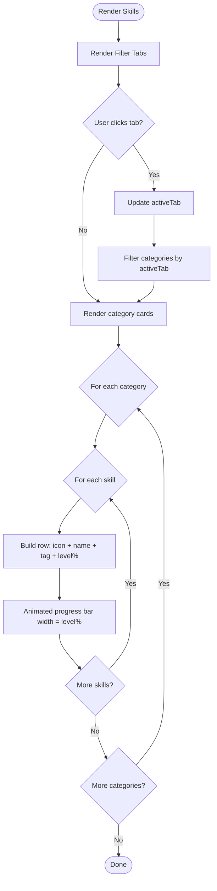
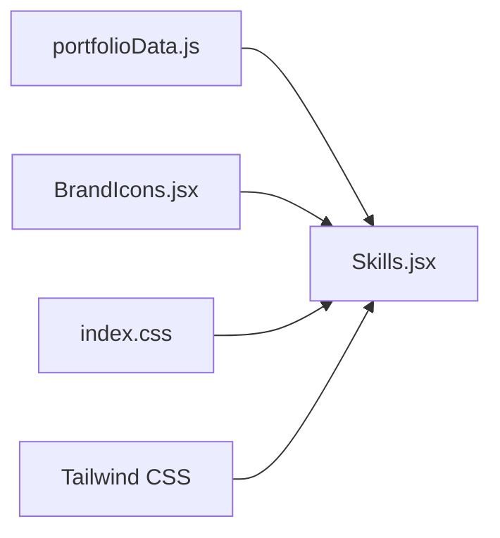

# Skills Visualization

<cite>
**Referenced Files in This Document**
- [Skills.jsx](file://src/components/Skills.jsx)
- [portfolioData.js](file://src/data/portfolioData.js)
- [BrandIcons.jsx](file://src/components/BrandIcons.jsx)
- [index.css](file://src/index.css)
</cite>

## Table of Contents
1. [Introduction](#introduction)
2. [Project Structure](#project-structure)
3. [Core Components](#core-components)
4. [Architecture Overview](#architecture-overview)
5. [Detailed Component Analysis](#detailed-component-analysis)
6. [Dependency Analysis](#dependency-analysis)
7. [Performance Considerations](#performance-considerations)
8. [Troubleshooting Guide](#troubleshooting-guide)
9. [Conclusion](#conclusion)
10. [Appendices](#appendices)

## Introduction
This document explains the Skills visualization component used to present categorized skills, proficiency indicators, and interactive filtering. It covers the data structure for organizing skills, visual representation patterns, responsive design implementation, accessibility considerations, animation effects, and guidance for extending or customizing the display.

## Project Structure
The Skills visualization is implemented as a React component that consumes structured skill data and renders a categorized grid with animated progress bars and filter tabs. Styling is provided via Tailwind CSS utilities and project-wide CSS variables and animations defined in the global stylesheet.

**Diagram sources**
- [Skills.jsx:1-27](file://src/components/Skills.jsx#L1-L27)
- [portfolioData.js:57-99](file://src/data/portfolioData.js#L57-L99)
- [BrandIcons.jsx:40-58](file://src/components/BrandIcons.jsx#L40-L58)
- [index.css:12-74](file://src/index.css#L12-L74)
- [index.css:392-418](file://src/index.css#L392-L418)
- [index.css:646-661](file://src/index.css#L646-L661)
- [index.css:775-786](file://src/index.css#L775-L786)

**Section sources**
- [Skills.jsx:1-27](file://src/components/Skills.jsx#L1-L27)
- [portfolioData.js:57-99](file://src/data/portfolioData.js#L57-L99)
- [BrandIcons.jsx:40-58](file://src/components/BrandIcons.jsx#L40-L58)
- [index.css:12-74](file://src/index.css#L12-L74)
- [index.css:392-418](file://src/index.css#L392-L418)
- [index.css:646-661](file://src/index.css#L646-L661)
- [index.css:775-786](file://src/index.css#L775-L786)

## Core Components
- Skills component: Renders the section header, category filter tabs, categorized skill cards, and a bottom highlight banner. It manages active tab state and filters categories accordingly.
- Data model: The skills are organized into categories, each containing an array of skill objects with name, level (percentage), icon key, and tag metadata.
- Icon system: Uses a mapping from icon keys to Lucide icons and includes a custom Figma icon for design-related skills.
- Styling: Leverages Tailwind utility classes and global CSS variables for colors, gradients, glassmorphism, and animations. Responsive behavior is handled through Tailwind breakpoints and media queries.

Key responsibilities:
- Stateful filtering by category tabs
- Rendering grouped skill cards with animated proficiency meters
- Consistent visual language using shared CSS variables and components

**Section sources**
- [Skills.jsx:36-151](file://src/components/Skills.jsx#L36-L151)
- [portfolioData.js:57-99](file://src/data/portfolioData.js#L57-L99)
- [BrandIcons.jsx:40-58](file://src/components/BrandIcons.jsx#L40-L58)
- [index.css:12-74](file://src/index.css#L12-L74)
- [index.css:392-418](file://src/index.css#L392-L418)
- [index.css:646-661](file://src/index.css#L646-L661)

## Architecture Overview
The Skills component reads structured data, applies client-side filtering based on user interaction, and renders a responsive grid of skill cards. Each card displays a skill’s icon, name, tag, and a percentage-based proficiency indicator with an animated fill.

**Diagram sources**
- [Skills.jsx:36-151](file://src/components/Skills.jsx#L36-L151)
- [portfolioData.js:57-99](file://src/data/portfolioData.js#L57-L99)
- [BrandIcons.jsx:40-58](file://src/components/BrandIcons.jsx#L40-L58)
- [index.css:392-418](file://src/index.css#L392-L418)
- [index.css:646-661](file://src/index.css#L646-L661)

## Detailed Component Analysis

### Data Model: skillsCategoryData
- Structure: An array of category objects. Each category has:
  - category: string label
  - skills: array of skill objects with:
    - name: string
    - level: number (percentage)
    - icon: string key mapped to an icon component
    - tag: string descriptor
- Purpose: Centralized source of truth for skills displayed across the UI.

Extensibility tips:
- Add new categories by appending a new object to the array.
- Add new skills within any category by adding a new skill object.
- Ensure the icon key exists in the icon map; otherwise, a fallback icon is used.

**Section sources**
- [portfolioData.js:57-99](file://src/data/portfolioData.js#L57-L99)

### Skills Component: Filtering and Rendering
- Tabs: “All” plus four predefined categories. Clicking a tab updates state and filters categories.
- Grid layout: Two-column grid on medium screens and above; single column on small screens.
- Card content: Category header with skill count, followed by a list of skills.
- Proficiency meter: Animated bar whose width equals the skill’s level percentage. Hover transitions apply gradient shifts.
- Bottom banner: Highlights readiness and links to projects.

**Diagram sources**
- [Skills.jsx:36-151](file://src/components/Skills.jsx#L36-L151)

**Section sources**
- [Skills.jsx:36-151](file://src/components/Skills.jsx#L36-L151)

### Visual Representation Patterns
- Glass cards: Semi-transparent backgrounds with blur and subtle borders; hover states elevate and glow.
- Gradients: Brand and vibrant gradients applied to text highlights and progress bars.
- Section theme: The Skills section uses emerald/cyan/blue accents for titles, subtitle, and title bar.
- Progress bars: Track and fill elements styled with rounded corners and animated gradients.

Implementation references:
- Glass card styles and hover effects
- Skill progress bar track and fill
- Section-specific background and title bar styling

**Section sources**
- [index.css:392-418](file://src/index.css#L392-L418)
- [index.css:646-661](file://src/index.css#L646-L661)
- [index.css:186-192](file://src/index.css#L186-L192)
- [index.css:501-507](file://src/index.css#L501-L507)

### Interactive Elements
- Category tabs: Toggle visibility of categories via state-driven filtering.
- Hover interactions: Cards lift and glow; skill rows change icon color; progress bars transition smoothly.
- Link navigation: Bottom banner provides a link to the Projects section.

Accessibility notes:
- Buttons are native HTML buttons with clear labels.
- Focus-visible outlines are available globally for keyboard navigation.
- Color contrast relies on CSS variables; ensure sufficient contrast when customizing.

**Section sources**
- [Skills.jsx:63-78](file://src/components/Skills.jsx#L63-L78)
- [Skills.jsx:81-130](file://src/components/Skills.jsx#L81-L130)
- [Skills.jsx:132-146](file://src/components/Skills.jsx#L132-L146)
- [index.css:14-18](file://src/index.css#L14-L18)

### Responsive Design Implementation
- Grid: Single column on small screens; two columns on medium and up.
- Typography: Title size scales down at smaller breakpoints.
- Spacing: Section padding reduces on mobile.
- Background orbs: Blur reduced on mobile for performance.

**Section sources**
- [Skills.jsx:82-83](file://src/components/Skills.jsx#L82-L83)
- [index.css:775-786](file://src/index.css#L775-L786)

### Animation Effects
- Progress bar fill: Smooth width transition with gradient shift and shimmer.
- Card hover: Lift, border glow, and shadow enhancement.
- Section title bar: Animated gradient underline.
- Background orbs: Drifting animations for ambient visuals.

**Section sources**
- [index.css:646-661](file://src/index.css#L646-L661)
- [index.css:392-418](file://src/index.css#L392-L418)
- [index.css:488-507](file://src/index.css#L488-L507)
- [index.css:128-164](file://src/index.css#L128-L164)

### Accessibility Features
- Keyboard navigation: Native button elements support focus and activation.
- Focus indicators: Global focus-visible styles provide visible outlines.
- Semantic structure: Headings and descriptive text improve screen reader experience.
- Color usage: Accent colors are defined via CSS variables; ensure adequate contrast when customizing.

**Section sources**
- [index.css:14-18](file://src/index.css#L14-L18)
- [Skills.jsx:63-78](file://src/components/Skills.jsx#L63-L78)
- [Skills.jsx:49-79](file://src/components/Skills.jsx#L49-L79)

## Dependency Analysis
- Skills.jsx depends on:
  - portfolioData.js for skillsCategoryData
  - BrandIcons.jsx for the Figma icon
  - index.css for global styles, variables, and animations
- Tailwind CSS utilities drive layout and spacing without additional CSS.

**Diagram sources**
- [Skills.jsx:1-27](file://src/components/Skills.jsx#L1-L27)
- [portfolioData.js:57-99](file://src/data/portfolioData.js#L57-L99)
- [BrandIcons.jsx:40-58](file://src/components/BrandIcons.jsx#L40-L58)
- [index.css:12-74](file://src/index.css#L12-L74)

**Section sources**
- [Skills.jsx:1-27](file://src/components/Skills.jsx#L1-L27)
- [portfolioData.js:57-99](file://src/data/portfolioData.js#L57-L99)
- [BrandIcons.jsx:40-58](file://src/components/BrandIcons.jsx#L40-L58)
- [index.css:12-74](file://src/index.css#L12-L74)

## Performance Considerations
- Client-side filtering: Lightweight state update and array filtering; suitable for current dataset size.
- Animations: CSS transitions and transforms are GPU-friendly; avoid excessive heavy effects on low-end devices.
- Mobile optimizations: Reduced blur on background orbs at smaller viewports to improve performance.

[No sources needed since this section provides general guidance]

## Troubleshooting Guide
- Missing icon: If a skill’s icon key is not found in the icon map, a default icon is rendered. Verify the icon key matches one of the imported icons or add it to the map.
- Incorrect level value: Levels should be numbers between 0 and 100. Values outside this range may render unexpectedly.
- Styling issues: Ensure CSS variables and Tailwind utilities are loaded. Check that the global stylesheet is included and that no conflicting styles override glass-card or progress bar styles.
- Accessibility: When customizing colors, verify sufficient contrast for text and icons. Use focus-visible styles to maintain keyboard navigation clarity.

**Section sources**
- [Skills.jsx:28-34](file://src/components/Skills.jsx#L28-L34)
- [Skills.jsx:101-125](file://src/components/Skills.jsx#L101-L125)
- [index.css:392-418](file://src/index.css#L392-L418)
- [index.css:646-661](file://src/index.css#L646-L661)

## Conclusion
The Skills visualization component provides a clean, interactive, and accessible way to showcase categorized technical and soft competencies. Its data-driven architecture makes it easy to extend with new skills and categories, while its styling system ensures consistent visual presentation and responsive behavior across devices. Animations enhance engagement without compromising performance, and accessibility features support inclusive use.

[No sources needed since this section summarizes without analyzing specific files]

## Appendices

### How to Add a New Skill
- Open the data file and locate the target category.
- Add a new skill object with name, level (0–100), icon key, and tag.
- Ensure the icon key maps to an existing icon in the component’s icon map or add a new mapping if necessary.

**Section sources**
- [portfolioData.js:57-99](file://src/data/portfolioData.js#L57-L99)
- [Skills.jsx:28-34](file://src/components/Skills.jsx#L28-L34)

### How to Customize Proficiency Levels
- Adjust the level field in the relevant skill object to reflect updated proficiency.
- The animated progress bar will automatically reflect the new percentage on render.

**Section sources**
- [portfolioData.js:57-99](file://src/data/portfolioData.js#L57-L99)
- [Skills.jsx:101-125](file://src/components/Skills.jsx#L101-L125)

### How to Modify Visual Presentation
- Colors and gradients: Edit CSS variables in the global stylesheet to adjust accent colors, gradients, and shadows.
- Card appearance: Modify glass-card styles for background, borders, and hover effects.
- Progress bars: Adjust track and fill styles, including animation timing and gradients.
- Section theme: Update section-specific background and title bar styles to match branding.

**Section sources**
- [index.css:12-74](file://src/index.css#L12-L74)
- [index.css:392-418](file://src/index.css#L392-L418)
- [index.css:646-661](file://src/index.css#L646-L661)
- [index.css:186-192](file://src/index.css#L186-L192)
- [index.css:501-507](file://src/index.css#L501-L507)