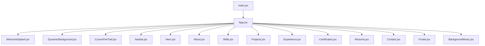
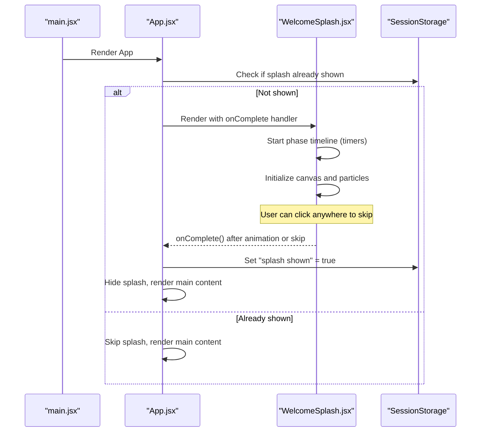
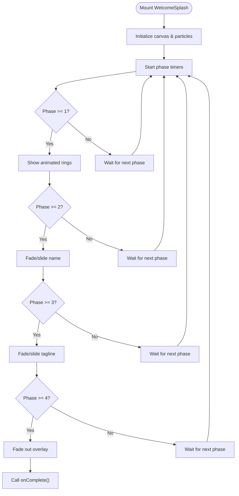
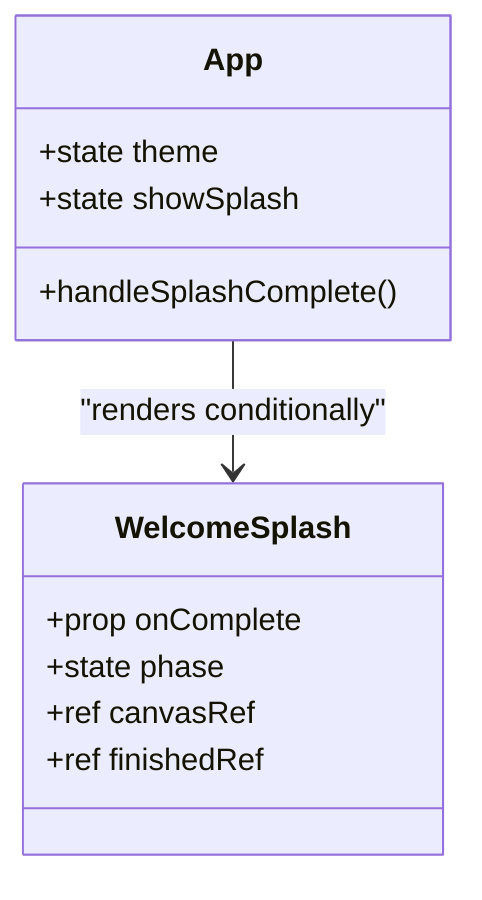
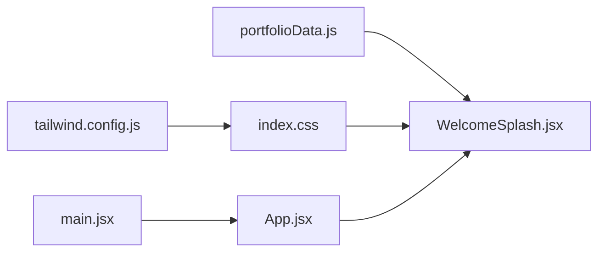

# Welcome Splash Screen

<cite>
**Referenced Files in This Document**
- [WelcomeSplash.jsx](file://src/components/WelcomeSplash.jsx)
- [App.jsx](file://src/App.jsx)
- [main.jsx](file://src/main.jsx)
- [portfolioData.js](file://src/data/portfolioData.js)
- [index.css](file://src/index.css)
- [tailwind.config.js](file://tailwind.config.js)
- [package.json](file://package.json)
</cite>

## Table of Contents
1. [Introduction](#introduction)
2. [Project Structure](#project-structure)
3. [Core Components](#core-components)
4. [Architecture Overview](#architecture-overview)
5. [Detailed Component Analysis](#detailed-component-analysis)
6. [Dependency Analysis](#dependency-analysis)
7. [Performance Considerations](#performance-considerations)
8. [Troubleshooting Guide](#troubleshooting-guide)
9. [Conclusion](#conclusion)

## Introduction
This document explains the Welcome Splash Screen feature implemented as a React component that plays an animated intro with particle effects, animated rings, and staged text reveals. It covers how the splash integrates into the application lifecycle, how user interactions are handled, and how styling and configuration support the visual experience.

## Project Structure
The splash screen is a self-contained component integrated at the root of the app. The entry point renders the App, which conditionally shows the splash before mounting the rest of the portfolio content.

**Diagram sources**
- [main.jsx:1-11](file://src/main.jsx#L1-L11)
- [App.jsx:1-70](file://src/App.jsx#L1-L70)

**Section sources**
- [main.jsx:1-11](file://src/main.jsx#L1-L11)
- [App.jsx:1-70](file://src/App.jsx#L1-L70)

## Core Components
- WelcomeSplash: Renders the full-screen animated intro with canvas particles, pulsing rings, and staged text transitions. Accepts an onComplete callback to signal completion.
- App: Controls whether the splash is shown using session storage to ensure it appears once per browser session. On completion, it hides the splash and continues rendering the main content.

Key responsibilities:
- WelcomeSplash manages phase-based animations and a canvas particle burst.
- App persists splash visibility state and orchestrates the transition from splash to main content.

**Section sources**
- [WelcomeSplash.jsx:1-154](file://src/components/WelcomeSplash.jsx#L1-L154)
- [App.jsx:17-43](file://src/App.jsx#L17-L43)

## Architecture Overview
The splash runs as an overlay on top of the app. It uses a phase system to orchestrate timed animations and a canvas for particle effects. When complete (either by timer or user click), it calls back into App to hide itself and persist the “shown” flag.

**Diagram sources**
- [App.jsx:21-29](file://src/App.jsx#L21-L29)
- [WelcomeSplash.jsx:9-25](file://src/components/WelcomeSplash.jsx#L9-L25)
- [WelcomeSplash.jsx:27-89](file://src/components/WelcomeSplash.jsx#L27-L89)

## Detailed Component Analysis

### WelcomeSplash Component
- State and refs:
  - Phase state drives staged animations (hidden, particles, name, tagline, exit).
  - Canvas ref for drawing particles.
  - Finished ref to prevent duplicate completions.
- Timed phases:
  - Uses multiple timeouts to transition through phases and call onComplete when done.
- Interaction:
  - Click-to-skip sets the final phase and triggers completion after a short delay.
- Canvas particle system:
  - Initializes canvas to viewport size.
  - Creates a set of particles with randomized colors, velocities, sizes, and decay.
  - Animation loop updates positions, applies drag, fades life, draws circles with glow gradients, and cancels RAF when empty.
- Visual layers:
  - Particle canvas behind content.
  - Animated concentric rings with staggered durations.
  - Staggered fade/slide-in for greeting, name, and tagline.
  - Corner decorations with opacity transitions.
  - Radial gradient background.

**Diagram sources**
- [WelcomeSplash.jsx:17-25](file://src/components/WelcomeSplash.jsx#L17-L25)
- [WelcomeSplash.jsx:27-89](file://src/components/WelcomeSplash.jsx#L27-L89)
- [WelcomeSplash.jsx:91-151](file://src/components/WelcomeSplash.jsx#L91-L151)

**Section sources**
- [WelcomeSplash.jsx:1-154](file://src/components/WelcomeSplash.jsx#L1-L154)

### App Integration
- Splash visibility:
  - Controlled by session storage to show only once per session.
- Completion handling:
  - Sets session storage flag and hides splash to reveal main content.
- Content ordering:
  - Splash overlays all other components; after completion, the main layout renders normally.

**Diagram sources**
- [App.jsx:17-43](file://src/App.jsx#L17-L43)
- [WelcomeSplash.jsx:4-15](file://src/components/WelcomeSplash.jsx#L4-L15)

**Section sources**
- [App.jsx:17-43](file://src/App.jsx#L17-L43)

### Data and Styling
- Personalization:
  - Name and taglines are sourced from a data module and rendered within the splash.
- Theme and typography:
  - Tailwind config defines brand colors and font families used across the UI.
  - Global CSS provides color variables, gradients, and keyframe animations used by the splash and other components.

**Section sources**
- [portfolioData.js:1-25](file://src/data/portfolioData.js#L1-L25)
- [tailwind.config.js:1-29](file://tailwind.config.js#L1-L29)
- [index.css:12-75](file://src/index.css#L12-L75)

## Dependency Analysis
- Component dependencies:
  - WelcomeSplash depends on personalInfo from the data module for dynamic content.
  - App depends on WelcomeSplash and manages its lifecycle via props and state.
- External libraries:
  - React and ReactDOM provide the runtime.
  - Tailwind CSS powers utility classes and custom theme tokens.
  - No additional animation libraries are required; animations are built with CSS and Canvas API.

**Diagram sources**
- [WelcomeSplash.jsx:2](file://src/components/WelcomeSplash.jsx#L2)
- [App.jsx:15](file://src/App.jsx#L15)
- [main.jsx:1-11](file://src/main.jsx#L1-L11)
- [tailwind.config.js:1-29](file://tailwind.config.js#L1-L29)
- [index.css:1-75](file://src/index.css#L1-L75)

**Section sources**
- [package.json:12-17](file://package.json#L12-L17)
- [WelcomeSplash.jsx:1-3](file://src/components/WelcomeSplash.jsx#L1-L3)
- [App.jsx:1-15](file://src/App.jsx#L1-L15)

## Performance Considerations
- Canvas animation:
  - Particles are created once and updated per frame; cleanup occurs when particles expire and RAF is canceled.
  - Ensure canvas dimensions match viewport to avoid unnecessary redraws.
- Timers:
  - Multiple setTimeout calls drive phase transitions; they are cleared on unmount to prevent memory leaks.
- DOM transitions:
  - CSS transitions and transforms are GPU-accelerated where possible.
- Session storage:
  - Avoids repeated splash playback, improving perceived performance on subsequent visits.

[No sources needed since this section provides general guidance]

## Troubleshooting Guide
- Splash does not disappear:
  - Verify that onComplete is called after the final phase or on click-to-skip.
  - Confirm that App’s handleSplashComplete sets session storage and toggles showSplash state.
- Canvas not visible or blank:
  - Ensure canvas width/height are set to window dimensions on mount.
  - Check that requestAnimationFrame loop is running and not canceled prematurely.
- Animations feel choppy:
  - Reduce particle count or complexity if targeting low-end devices.
  - Ensure no heavy synchronous work blocks the main thread during animation frames.
- Theme mismatch:
  - Verify global CSS variables and Tailwind theme tokens are applied correctly.

**Section sources**
- [WelcomeSplash.jsx:9-25](file://src/components/WelcomeSplash.jsx#L9-L25)
- [WelcomeSplash.jsx:27-89](file://src/components/WelcomeSplash.jsx#L27-L89)
- [App.jsx:21-29](file://src/App.jsx#L21-L29)

## Conclusion
The Welcome Splash Screen delivers a visually engaging introduction using a phase-driven animation sequence, a lightweight canvas particle system, and responsive design. It integrates cleanly with the app’s lifecycle, respects user interaction for skipping, and leverages existing theme and typography configurations for consistency.

[No sources needed since this section summarizes without analyzing specific files]