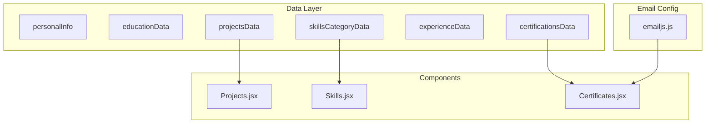
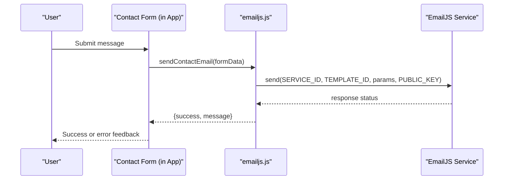
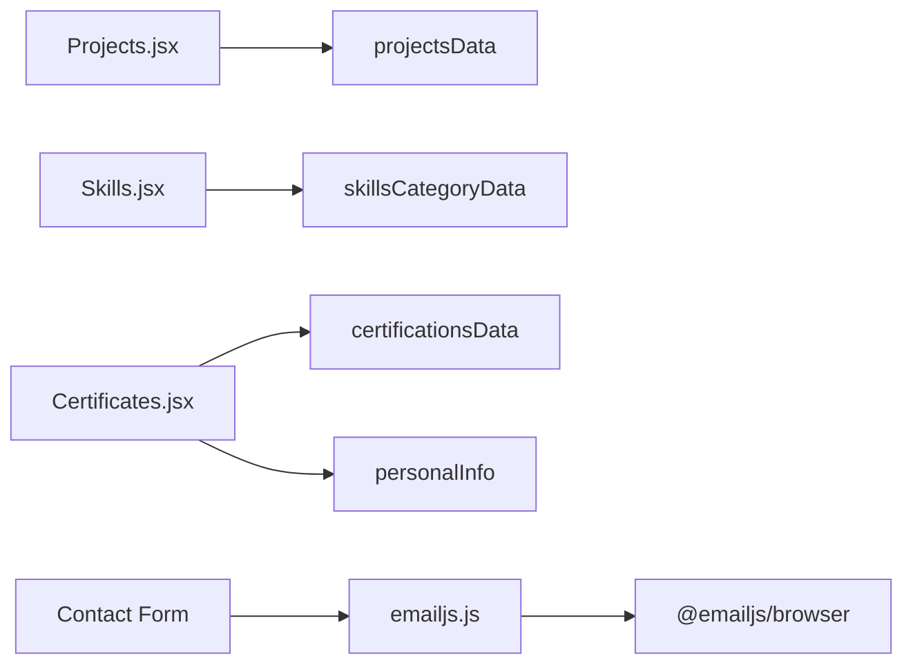

# Data Management

<cite>
**Referenced Files in This Document**
- [portfolioData.js](file://src/data/portfolioData.js)
- [emailjs.js](file://src/config/emailjs.js)
- [Projects.jsx](file://src/components/Projects.jsx)
- [Skills.jsx](file://src/components/Skills.jsx)
- [Certificates.jsx](file://src/components/Certificates.jsx)
- [package.json](file://package.json)
</cite>

## Table of Contents
1. Introduction
2. Project Structure
3. Core Components
4. Architecture Overview
5. Detailed Component Analysis
6. Dependency Analysis
7. Performance Considerations
8. Troubleshooting Guide
9. Conclusion
10. Appendices

## Introduction
This document explains the centralized data model and email configuration for the portfolio application. It focuses on how personal information, projects, skills, experience, and certifications are structured and consumed by UI components, and how contact form emails are sent via EmailJS. It also provides guidance for adding new content, updating existing entries, and managing certificates safely and efficiently.

## Project Structure
The data layer is centralized in a single module that exports multiple datasets used across the app:
- Personal profile and social links
- Education timeline
- Skills grouped by category with proficiency levels
- Projects with metadata, highlights, tools, and optional architecture steps
- Experience timeline entries
- Certifications database with issuer details and file references

UI components consume these datasets to render sections such as Projects, Skills, and Certificates. Contact form functionality uses a dedicated EmailJS configuration module.

**Diagram sources**
- [portfolioData.js:1-1123](file://src/data/portfolioData.js#L1-L1123)
- [Projects.jsx:16-29](file://src/components/Projects.jsx#L16-L29)
- [Skills.jsx:26-43](file://src/components/Skills.jsx#L26-L43)
- [Certificates.jsx:20-21](file://src/components/Certificates.jsx#L20-L21)
- [emailjs.js:12-18](file://src/config/emailjs.js#L12-L18)

**Section sources**
- [portfolioData.js:1-1123](file://src/data/portfolioData.js#L1-L1123)
- [Projects.jsx:16-29](file://src/components/Projects.jsx#L16-L29)
- [Skills.jsx:26-43](file://src/components/Skills.jsx#L26-L43)
- [Certificates.jsx:20-21](file://src/components/Certificates.jsx#L20-L21)
- [emailjs.js:12-18](file://src/config/emailjs.js#L12-L18)

## Core Components
- Centralized data module exports:
  - personalInfo: name, role, taglines, contact info, social links, summary, CGPA, languages, hobbies
  - educationData: array of education entries with degree, institution, year, score, badge, highlight, icon
  - skillsCategoryData: array of categories, each containing an array of skill objects with name, level, icon, tag
  - projectsData: array of project objects with id, title, subtitle, category, featured flag, description, tools, highlights, optional architecture steps, demoUrl, githubUrl
  - experienceData: array of experience entries with organization, role, type, duration, period, location, responsibilities
  - certificationsData: array of certification objects with id, title, issuer, score, tag, category, fileUrl, description, icon

- UI consumption:
  - Projects component filters and renders projects from projectsData
  - Skills component groups and renders skills from skillsCategoryData
  - Certificates component filters, searches, and displays certifications from certificationsData

**Section sources**
- [portfolioData.js:1-1123](file://src/data/portfolioData.js#L1-L1123)
- [Projects.jsx:16-29](file://src/components/Projects.jsx#L16-L29)
- [Skills.jsx:26-43](file://src/components/Skills.jsx#L26-L43)
- [Certificates.jsx:20-21](file://src/components/Certificates.jsx#L20-L21)

## Architecture Overview
The application follows a unidirectional data flow:
- Static data is defined in a central module
- Components import and render this data
- The contact form sends messages using EmailJS configuration

**Diagram sources**
- [emailjs.js:25-81](file://src/config/emailjs.js#L25-L81)

**Section sources**
- [emailjs.js:25-81](file://src/config/emailjs.js#L25-L81)

## Detailed Component Analysis

### Data Model: Personal Information
- Fields include name, role, taglines, email, phone, phoneRaw, location, social links (LinkedIn, GitHub, Twitter/X, LeetCode, HackerRank), zipBundleUrl, summary, cgpa, languages, hobbies
- Used by UI for header/profile display and certificate page social links

Validation rules and constraints:
- Ensure all required fields are present before rendering
- Validate URLs for social links to avoid broken navigation
- Keep phoneRaw numeric for potential dialer usage

Update procedure:
- Edit the personalInfo object in the data module
- Verify social link formats and ensure zipBundleUrl points to a valid asset

**Section sources**
- [portfolioData.js:1-25](file://src/data/portfolioData.js#L1-L25)
- [Certificates.jsx:473-499](file://src/components/Certificates.jsx#L473-L499)

### Data Model: Education Timeline
- Array of education entries with degree, institution, year, score, badge, highlight, icon
- Used to present academic background in a timeline format

Validation rules and constraints:
- Ensure years are chronological and consistent
- Badge values should be meaningful and unique per entry

Update procedure:
- Add new education entries at the top or appropriate position
- Update icons and badges consistently

**Section sources**
- [portfolioData.js:27-55](file://src/data/portfolioData.js#L27-L55)

### Data Model: Skills Categorization
- Grouped into categories like Programming & Core CS, Machine Learning & Data Analytics, Web & Developer Tools, Design & Soft Competencies
- Each skill has name, level (percentage), icon, and tag
- Used by Skills component to render categorized skill cards with animated progress bars

Validation rules and constraints:
- Level must be between 0 and 100
- Tags should be concise and descriptive
- Icons should map to available icon names

Update procedure:
- Add new skills within the appropriate category
- Adjust levels to reflect current proficiency
- Optionally add new categories if needed

**Section sources**
- [portfolioData.js:57-99](file://src/data/portfolioData.js#L57-L99)
- [Skills.jsx:36-43](file://src/components/Skills.jsx#L36-L43)

### Data Model: Projects Schema
- Each project includes id, title, subtitle, category, featured flag, description, tools, highlights, optional architecture steps, demoUrl, githubUrl
- Used by Projects component to render cards, filter by category, and open detail modal with interactive architecture simulation

Validation rules and constraints:
- Unique id per project
- Category values should match filter options
- Tools and highlights arrays should contain strings
- Optional architecture steps should follow step/detail structure

Update procedure:
- Add new project entries with complete metadata
- Set featured flag selectively for emphasis
- Provide accurate githubUrl and demoUrl

**Section sources**
- [portfolioData.js:101-257](file://src/data/portfolioData.js#L101-L257)
- [Projects.jsx:16-29](file://src/components/Projects.jsx#L16-L29)

### Data Model: Experience Timeline
- Array of experience entries with organization, role, type, duration, period, location, responsibilities
- Used to showcase professional experience and internships

Validation rules and constraints:
- Periods should not overlap unless intentional
- Responsibilities should be concise and action-oriented

Update procedure:
- Add new experiences chronologically
- Update roles and responsibilities as career progresses

**Section sources**
- [portfolioData.js:259-273](file://src/data/portfolioData.js#L259-L273)

### Data Model: Certifications Database
- Extensive list of certifications from multiple issuers including HackerRank, HCL GUVI, AICTE PARAKH, LinkedIn & Microsoft, Google, Infosys Springboard, TCS iON, NPTEL & Academics, Simplilearn, IEEE & Badges, IIT Bombay
- Each entry includes id, title, issuer, score, tag, category, fileUrl, description, icon
- Used by Certificates component to render cards, filter by category, search by text, and view/download PDFs or images

Validation rules and constraints:
- Unique id per certification
- fileUrl must point to a valid asset under public/certificates
- Category and tag should be consistent for filtering and styling

Update procedure:
- Add new certification entries with accurate metadata
- Place corresponding files under public/certificates and update fileUrl accordingly
- Use consistent categories and tags for effective filtering

**Section sources**
- [portfolioData.js:275-1123](file://src/data/portfolioData.js#L275-L1123)
- [Certificates.jsx:139-171](file://src/components/Certificates.jsx#L139-L171)

### EmailJS Configuration and Contact Form
- Configuration object holds SERVICE_ID, TEMPLATE_ID, PUBLIC_KEY, and RECIPIENT_EMAIL
- sendContactEmail function checks if keys are configured; if so, sends real emails via EmailJS; otherwise simulates sending for demo
- Template parameters include from_name, from_email, subject, message, to_name, reply_to

Setup steps:
- Create an EmailJS account and service (e.g., Gmail)
- Create an email template with placeholders matching template parameters
- Replace placeholder values in EMAILJS_CONFIG with actual credentials
- Ensure recipient email is correct

Customization:
- Modify template parameters to include additional fields if needed
- Update to_name and reply_to behavior according to requirements

Security considerations:
- Do not commit sensitive keys to version control; use environment variables where possible
- Restrict template access to authorized services only

**Section sources**
- [emailjs.js:12-18](file://src/config/emailjs.js#L12-L18)
- [emailjs.js:25-81](file://src/config/emailjs.js#L25-L81)

## Dependency Analysis
- Data module dependencies: none (pure data export)
- Component dependencies:
  - Projects.jsx depends on projectsData
  - Skills.jsx depends on skillsCategoryData
  - Certificates.jsx depends on certificationsData and personalInfo
- EmailJS dependency:
  - emailjs.js depends on @emailjs/browser package

**Diagram sources**
- [Projects.jsx:16-29](file://src/components/Projects.jsx#L16-L29)
- [Skills.jsx:26-43](file://src/components/Skills.jsx#L26-L43)
- [Certificates.jsx:20-21](file://src/components/Certificates.jsx#L20-L21)
- [emailjs.js:1-1](file://src/config/emailjs.js#L1-L1)
- [package.json:12-17](file://package.json#L12-L17)

**Section sources**
- [Projects.jsx:16-29](file://src/components/Projects.jsx#L16-L29)
- [Skills.jsx:26-43](file://src/components/Skills.jsx#L26-L43)
- [Certificates.jsx:20-21](file://src/components/Certificates.jsx#L20-L21)
- [emailjs.js:1-1](file://src/config/emailjs.js#L1-L1)
- [package.json:12-17](file://package.json#L12-L17)

## Performance Considerations
- Large datasets:
  - Certifications list is extensive; consider pagination or virtualization if performance degrades
- Filtering and searching:
  - Use memoization for computed categories and filtered lists to avoid re-renders
- Asset loading:
  - Optimize certificate files (PDFs/images) for faster loading
  - Consider lazy-loading certificate previews

[No sources needed since this section provides general guidance]

## Troubleshooting Guide
- EmailJS issues:
  - If keys are placeholders, the function simulates sending; replace with real credentials to send actual emails
  - Check console errors for EmailJS responses and handle non-200 statuses appropriately
- Certificate assets:
  - Ensure fileUrl paths exist under public/certificates; missing files will cause viewer errors
  - Use download buttons to verify asset availability
- Data consistency:
  - Validate category and tag values to maintain consistent filtering and styling
  - Ensure unique ids for projects and certifications to prevent rendering conflicts

**Section sources**
- [emailjs.js:29-81](file://src/config/emailjs.js#L29-L81)
- [Certificates.jsx:503-593](file://src/components/Certificates.jsx#L503-L593)

## Conclusion
The portfolio application uses a centralized data model to manage personal information, education, skills, projects, experience, and certifications. UI components consume this data to render rich, interactive sections. EmailJS configuration enables contact form messaging with fallback simulation for development. Following the update procedures and validation guidelines ensures maintainability, performance, and security.

[No sources needed since this section summarizes without analyzing specific files]

## Appendices

### Adding a New Project
Steps:
- Open the data module and append a new project object to projectsData
- Include required fields: id, title, subtitle, category, description, tools, highlights, githubUrl
- Optionally add architecture steps for complex projects
- Ensure category matches existing filter options

Example reference path:
- [portfolioData.js:101-257](file://src/data/portfolioData.js#L101-L257)

**Section sources**
- [portfolioData.js:101-257](file://src/data/portfolioData.js#L101-L257)
- [Projects.jsx:16-29](file://src/components/Projects.jsx#L16-L29)

### Updating Skills
Steps:
- Locate the relevant category in skillsCategoryData
- Add or modify skill entries with name, level (0-100), icon, and tag
- Ensure icon names correspond to available icons used by the Skills component

Example reference path:
- [portfolioData.js:57-99](file://src/data/portfolioData.js#L57-L99)
- [Skills.jsx:26-43](file://src/components/Skills.jsx#L26-L43)

**Section sources**
- [portfolioData.js:57-99](file://src/data/portfolioData.js#L57-L99)
- [Skills.jsx:26-43](file://src/components/Skills.jsx#L26-L43)

### Managing Certificates
Steps:
- Add a new certification object to certificationsData with id, title, issuer, score, tag, category, fileUrl, description, icon
- Place the certificate file under public/certificates and set fileUrl accordingly
- Use consistent categories and tags for effective filtering and styling

Example reference path:
- [portfolioData.js:275-1123](file://src/data/portfolioData.js#L275-L1123)
- [Certificates.jsx:139-171](file://src/components/Certificates.jsx#L139-L171)

**Section sources**
- [portfolioData.js:275-1123](file://src/data/portfolioData.js#L275-L1123)
- [Certificates.jsx:139-171](file://src/components/Certificates.jsx#L139-L171)

### EmailJS Setup Checklist
- Sign up at EmailJS and create a service (e.g., Gmail)
- Create an email template with placeholders matching template parameters
- Replace SERVICE_ID, TEMPLATE_ID, PUBLIC_KEY in EMAILJS_CONFIG
- Verify RECIPIENT_EMAIL is correct
- Test sending via the contact form and check console for errors

Example reference path:
- [emailjs.js:12-18](file://src/config/emailjs.js#L12-L18)
- [emailjs.js:25-81](file://src/config/emailjs.js#L25-L81)

**Section sources**
- [emailjs.js:12-18](file://src/config/emailjs.js#L12-L18)
- [emailjs.js:25-81](file://src/config/emailjs.js#L25-L81)

### Data Security and Best Practices
- Avoid committing sensitive EmailJS keys to version control; prefer environment variables
- Validate user input in contact forms before sending emails
- Sanitize and validate data updates to prevent malformed entries
- Optimize certificate assets for size and load performance
- Maintain consistent categorization and tagging for reliable filtering

[No sources needed since this section provides general guidance]