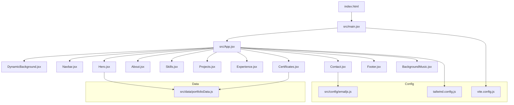
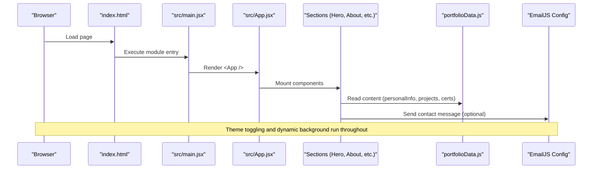
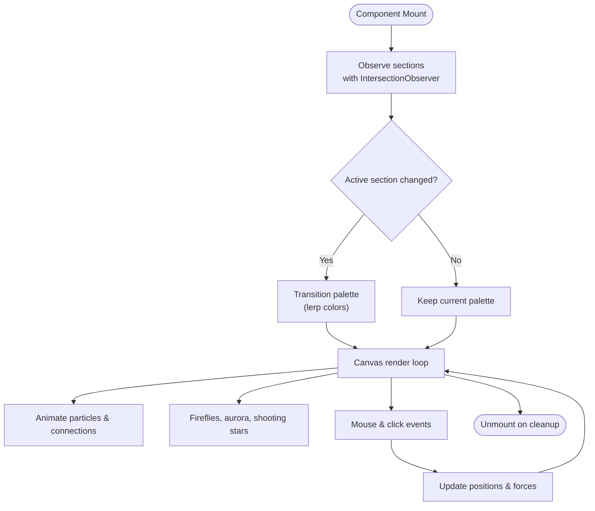
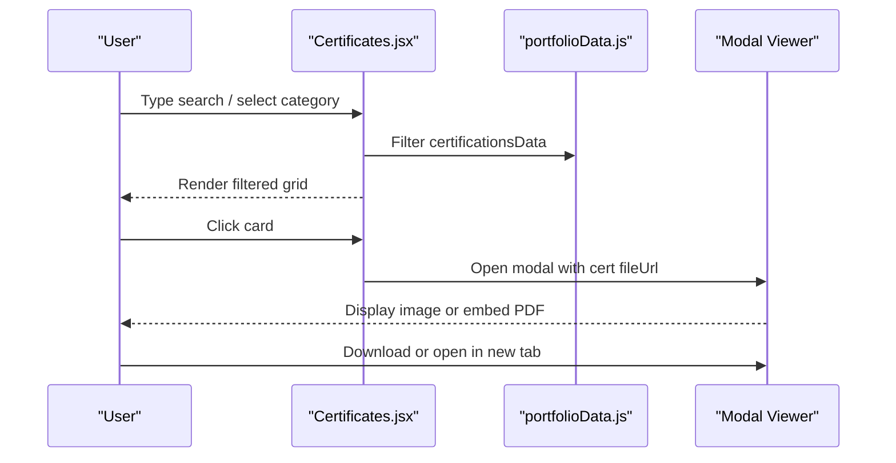
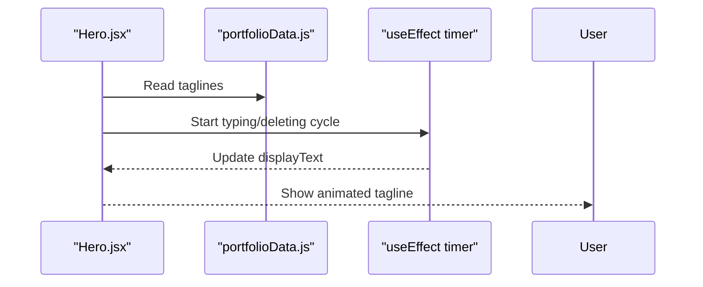
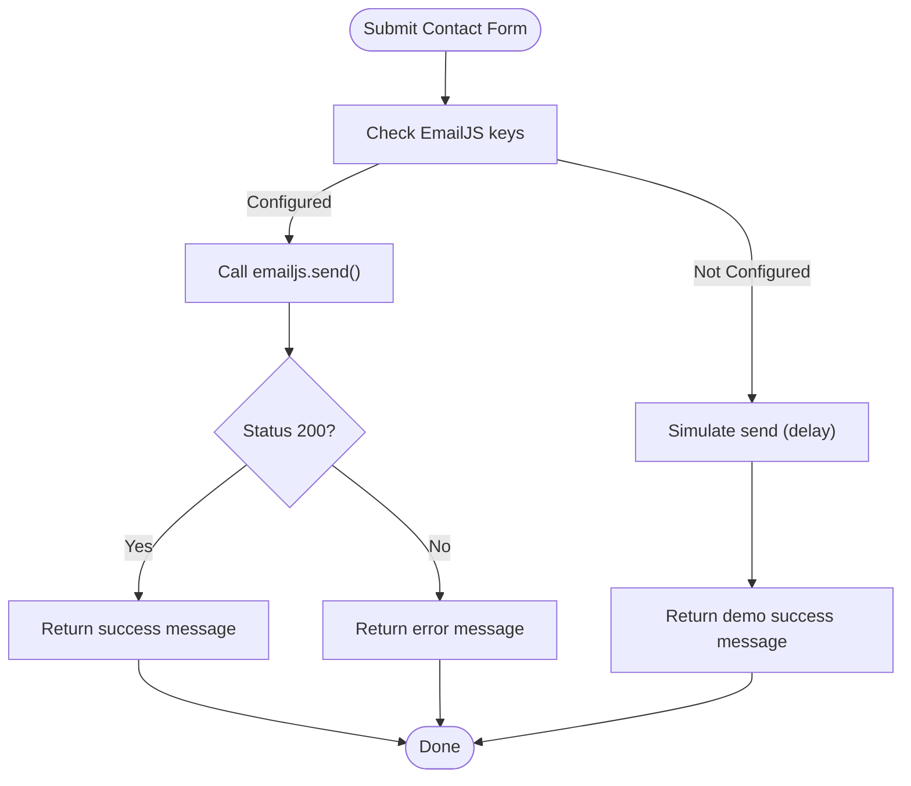
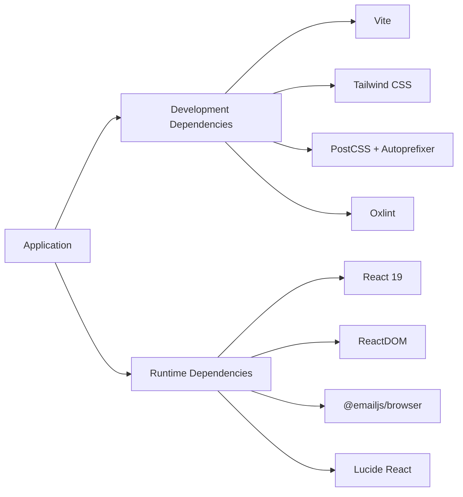

# Project Overview

<cite>
**Referenced Files in This Document**
- [README.md](file://README.md)
- [package.json](file://package.json)
- [vite.config.js](file://vite.config.js)
- [tailwind.config.js](file://tailwind.config.js)
- [index.html](file://index.html)
- [src/main.jsx](file://src/main.jsx)
- [src/App.jsx](file://src/App.jsx)
- [src/data/portfolioData.js](file://src/data/portfolioData.js)
- [src/config/emailjs.js](file://src/config/emailjs.js)
- [src/components/Hero.jsx](file://src/components/Hero.jsx)
- [src/components/DynamicBackground.jsx](file://src/components/DynamicBackground.jsx)
- [src/components/Certificates.jsx](file://src/components/Certificates.jsx)
- [PORTFOLIO.txt](file://PORTFOLIO.txt)
</cite>

## Table of Contents
1. Introduction
2. Project Structure
3. Core Components
4. Architecture Overview
5. Detailed Component Analysis
6. Dependency Analysis
7. Performance Considerations
8. Troubleshooting Guide
9. Conclusion
10. Appendices

## Introduction
This is a modern, interactive personal portfolio website built with React 19 and Vite. It showcases projects, skills, experience, certifications, and contact information for Gokulnath M, an AI & Data Science Engineer and Full-Stack Developer. The site emphasizes responsive design, dynamic visual effects, and smooth user interactions to serve as a professional showcase platform.

Key highlights:
- Interactive sections with animated backgrounds and scroll-aware visuals
- Dynamic certificate viewer with filtering, search, and download options
- EmailJS integration for contact form messaging (configurable via environment keys)
- Tailwind CSS-based theming with light/dark mode support
- Fast development workflow powered by Vite with Hot Module Replacement

[No sources needed since this section provides a high-level overview]

## Project Structure
The project follows a clean, component-driven structure:
- src/components: Feature-specific UI components (Hero, About, Skills, Projects, Experience, Certificates, Contact, Footer, DynamicBackground, BackgroundMusic, BrandIcons, GokulLogo)
- src/data: Centralized content data (portfolioData.js) including personal info, education, skills, projects, experience, and certifications
- src/config: External service configuration (emailjs.js)
- Root config files: vite.config.js, tailwind.config.js, postcss.config.js, package.json
- Public assets: index.html, favicon, and certificates folder for downloadable PDFs/images

**Diagram sources**
- [index.html:25-28](file://index.html#L25-L28)
- [src/main.jsx:1-11](file://src/main.jsx#L1-L11)
- [src/App.jsx:1-51](file://src/App.jsx#L1-L51)
- [src/components/Hero.jsx:1-245](file://src/components/Hero.jsx#L1-L245)
- [src/components/Certificates.jsx:1-597](file://src/components/Certificates.jsx#L1-L597)
- [src/data/portfolioData.js:1-800](file://src/data/portfolioData.js#L1-L800)
- [src/config/emailjs.js:1-82](file://src/config/emailjs.js#L1-L82)
- [tailwind.config.js:1-29](file://tailwind.config.js#L1-L29)
- [vite.config.js:1-13](file://vite.config.js#L1-L13)

**Section sources**
- [index.html:1-30](file://index.html#L1-L30)
- [src/main.jsx:1-11](file://src/main.jsx#L1-L11)
- [src/App.jsx:1-51](file://src/App.jsx#L1-L51)
- [tailwind.config.js:1-29](file://tailwind.config.js#L1-L29)
- [vite.config.js:1-13](file://vite.config.js#L1-L13)
- [package.json:1-30](file://package.json#L1-L30)

## Core Components
- App: Orchestrates theme state, mounts all sections, and composes the page layout with a dynamic background and navigation.
- Hero: Presents a typing tagline effect, social links, quick stats, and call-to-action buttons.
- DynamicBackground: Canvas-based animated background with particles, shooting stars, fireflies, aurora waves, mouse interaction, and click bursts; transitions color palettes per section.
- Certificates: Displays a searchable, filterable grid of certifications with animated counters, 3D tilt cards, and a fullscreen viewer for images/PDFs plus bulk download.
- Contact: Uses EmailJS to send messages or simulates sending when placeholder keys are present.

These components collectively deliver a polished, responsive, and engaging portfolio experience.

**Section sources**
- [src/App.jsx:14-51](file://src/App.jsx#L14-L51)
- [src/components/Hero.jsx:16-245](file://src/components/Hero.jsx#L16-L245)
- [src/components/DynamicBackground.jsx:32-341](file://src/components/DynamicBackground.jsx#L32-L341)
- [src/components/Certificates.jsx:139-597](file://src/components/Certificates.jsx#L139-L597)
- [src/config/emailjs.js:25-82](file://src/config/emailjs.js#L25-L82)

## Architecture Overview
The application uses a single-page architecture with React rendering into a root element defined in index.html. Vite serves the app during development and builds optimized assets for production. Tailwind CSS handles styling with custom brand colors and fonts. Data is centralized in a single module for easy maintenance.

**Diagram sources**
- [index.html:25-28](file://index.html#L25-L28)
- [src/main.jsx:1-11](file://src/main.jsx#L1-L11)
- [src/App.jsx:14-51](file://src/App.jsx#L14-L51)
- [src/data/portfolioData.js:1-800](file://src/data/portfolioData.js#L1-L800)
- [src/config/emailjs.js:12-18](file://src/config/emailjs.js#L12-L18)

## Detailed Component Analysis

### DynamicBackground
- Observes visible sections using IntersectionObserver and switches color palettes smoothly.
- Renders canvas animations: particles, connections, shooting stars, fireflies, aurora bands.
- Adds interactivity: mouse repulsion, beam lines, and click burst effects.
- Manages lifecycle and cleanup on unmount.

**Diagram sources**
- [src/components/DynamicBackground.jsx:39-59](file://src/components/DynamicBackground.jsx#L39-L59)
- [src/components/DynamicBackground.jsx:61-313](file://src/components/DynamicBackground.jsx#L61-L313)

**Section sources**
- [src/components/DynamicBackground.jsx:1-341](file://src/components/DynamicBackground.jsx#L1-L341)

### Certificates
- Provides category filters and search across title, issuer, and description.
- Computes categories and counts dynamically.
- Animates counters when the stats area enters the viewport.
- Implements 3D tilt on hover for cards and lazy reveal via IntersectionObserver.
- Includes a fullscreen viewer that supports both image and PDF formats, with download and open-in-new-tab actions.

**Diagram sources**
- [src/components/Certificates.jsx:149-171](file://src/components/Certificates.jsx#L149-L171)
- [src/components/Certificates.jsx:189-219](file://src/components/Certificates.jsx#L189-L219)
- [src/components/Certificates.jsx:348-449](file://src/components/Certificates.jsx#L348-L449)
- [src/components/Certificates.jsx:503-593](file://src/components/Certificates.jsx#L503-L593)
- [src/data/portfolioData.js:275-800](file://src/data/portfolioData.js#L275-L800)

**Section sources**
- [src/components/Certificates.jsx:1-597](file://src/components/Certificates.jsx#L1-L597)
- [src/data/portfolioData.js:275-800](file://src/data/portfolioData.js#L275-L800)

### Hero
- Typing animation cycles through taglines from portfolioData.
- Displays quick stats, social links, and CTAs.
- Integrates with global theme variables for consistent styling.

**Diagram sources**
- [src/components/Hero.jsx:16-43](file://src/components/Hero.jsx#L16-L43)
- [src/data/portfolioData.js:1-25](file://src/data/portfolioData.js#L1-L25)

**Section sources**
- [src/components/Hero.jsx:1-245](file://src/components/Hero.jsx#L1-L245)
- [src/data/portfolioData.js:1-25](file://src/data/portfolioData.js#L1-L25)

### Contact and EmailJS Integration
- Validates whether real EmailJS credentials are configured.
- If configured, sends email via EmailJS with template parameters.
- If not configured, simulates sending and returns a demo success response.

**Diagram sources**
- [src/config/emailjs.js:25-82](file://src/config/emailjs.js#L25-L82)

**Section sources**
- [src/config/emailjs.js:1-82](file://src/config/emailjs.js#L1-L82)

## Dependency Analysis
- Runtime dependencies include React 19, ReactDOM, EmailJS browser client, canvas-confetti, and Lucide icons.
- Development dependencies include Vite, Tailwind CSS, PostCSS, Autoprefixer, Oxlint, and TypeScript types for React.
- Build tooling:
  - Vite plugin for React enables JSX/TSX transformation and fast dev server.
  - Tailwind scans source files for classes and applies styles based on theme configuration.
  - Vite server ignores large or irrelevant files to improve performance.

**Diagram sources**
- [package.json:12-28](file://package.json#L12-L28)
- [vite.config.js:1-13](file://vite.config.js#L1-L13)
- [tailwind.config.js:1-29](file://tailwind.config.js#L1-L29)

**Section sources**
- [package.json:1-30](file://package.json#L1-L30)
- [vite.config.js:1-13](file://vite.config.js#L1-L13)
- [tailwind.config.js:1-29](file://tailwind.config.js#L1-L29)

## Performance Considerations
- Use Vite’s dev server with ignored patterns to avoid watching large assets like certificates and archives.
- Prefer memoization and computed values for expensive operations (e.g., filtering and category counts).
- Optimize canvas rendering by limiting particle counts based on viewport size and using requestAnimationFrame efficiently.
- Lazy-load heavy components or media where appropriate to reduce initial bundle size and improve Time to Interactive.
- Leverage Tailwind’s JIT compilation to minimize CSS output.

[No sources needed since this section provides general guidance]

## Troubleshooting Guide
- EmailJS not sending emails:
  - Ensure SERVICE_ID, TEMPLATE_ID, and PUBLIC_KEY are set to real values in the configuration file.
  - When placeholders remain, the app falls back to simulated sending; check console warnings for guidance.
- Certificate viewer not loading PDFs:
  - Some browsers restrict inline PDF previews; use the “Open in New Tab” or “Download” actions provided in the viewer.
- Dynamic background lagging on low-end devices:
  - Reduce particle count or disable certain effects if necessary; consider lowering animation complexity.
- Theme not persisting:
  - Verify localStorage access and ensure no browser extensions block storage.

**Section sources**
- [src/config/emailjs.js:25-82](file://src/config/emailjs.js#L25-L82)
- [src/components/Certificates.jsx:503-593](file://src/components/Certificates.jsx#L503-L593)
- [src/components/DynamicBackground.jsx:61-313](file://src/components/DynamicBackground.jsx#L61-L313)

## Conclusion
This portfolio application combines a modern tech stack with thoughtful UX to create a compelling professional showcase. With Vite-powered development, React 19 components, Tailwind CSS theming, and rich interactive features like dynamic backgrounds and a certificate viewer, it offers both a strong developer experience and an impressive presentation layer. The modular structure and centralized data make it easy to extend and maintain.

[No sources needed since this section summarizes without analyzing specific files]

## Appendices

### Installation and Setup
- Prerequisites: Node.js and npm installed locally.
- Steps:
  - Install dependencies: npm install
  - Start development server: npm run dev
  - Preview production build locally: npm run preview
  - Lint code: npm run lint
  - Build for production: npm run build

**Section sources**
- [package.json:6-11](file://package.json#L6-L11)

### Development Workflow
- Edit components under src/components and data under src/data.
- Use Tailwind utility classes for styling; customize theme in tailwind.config.js.
- Configure EmailJS credentials in src/config/emailjs.js to enable real email sending.
- Add or update portfolio content in src/data/portfolioData.js.

**Section sources**
- [tailwind.config.js:1-29](file://tailwind.config.js#L1-L29)
- [src/config/emailjs.js:12-18](file://src/config/emailjs.js#L12-L18)
- [src/data/portfolioData.js:1-800](file://src/data/portfolioData.js#L1-L800)

### Usage Examples
- Toggle theme: The app persists theme preference in localStorage and applies it globally.
- Navigate sections: Anchor links in the navbar jump to corresponding sections (e.g., #projects, #certificates).
- View certificates: Click any certificate card to open the fullscreen viewer; download or open in a new tab as needed.
- Contact form: Fill out the form and submit; if EmailJS is configured, an email will be sent; otherwise, a simulated success is returned.

**Section sources**
- [src/App.jsx:14-51](file://src/App.jsx#L14-L51)
- [src/components/Certificates.jsx:348-449](file://src/components/Certificates.jsx#L348-L449)
- [src/config/emailjs.js:25-82](file://src/config/emailjs.js#L25-L82)

### Technology Stack Summary
- Frontend: React 19, ReactDOM
- Build Tool: Vite with React plugin
- Styling: Tailwind CSS with custom brand colors and fonts
- Utilities: EmailJS for messaging, canvas-confetti for effects, Lucide icons
- Linting: Oxlint

**Section sources**
- [package.json:12-28](file://package.json#L12-L28)
- [tailwind.config.js:1-29](file://tailwind.config.js#L1-L29)
- [vite.config.js:1-13](file://vite.config.js#L1-L13)