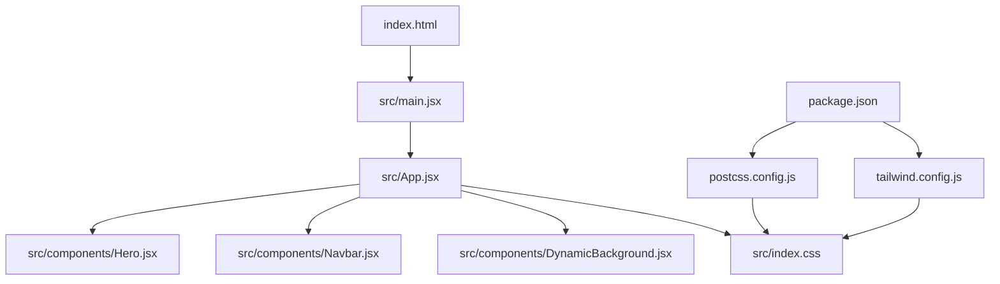
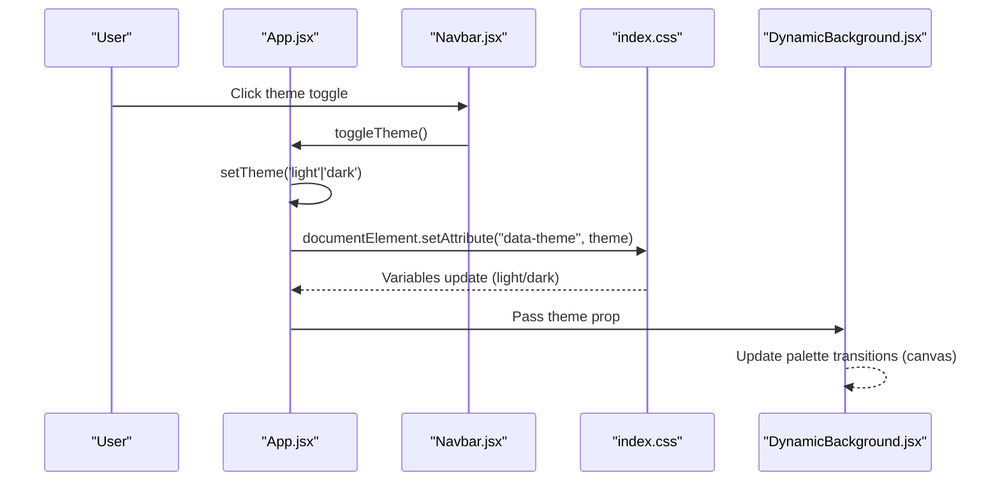
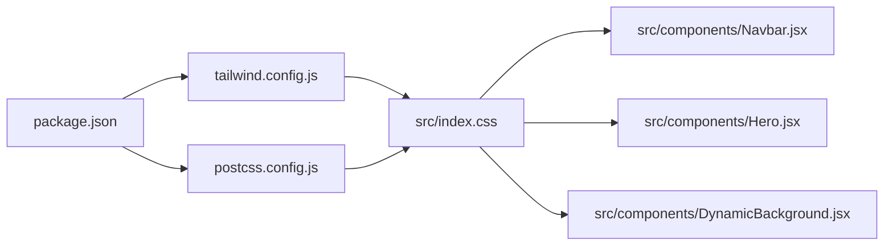

# Styling & Theming

<cite>
**Referenced Files in This Document**
- [tailwind.config.js](file://tailwind.config.js)
- [postcss.config.js](file://postcss.config.js)
- [package.json](file://package.json)
- [index.html](file://index.html)
- [src/index.css](file://src/index.css)
- [src/App.jsx](file://src/App.jsx)
- [src/components/DynamicBackground.jsx](file://src/components/DynamicBackground.jsx)
- [src/components/Navbar.jsx](file://src/components/Navbar.jsx)
- [src/components/Hero.jsx](file://src/components/Hero.jsx)
</cite>

## Table of Contents
1. Introduction
2. Project Structure
3. Core Components
4. Architecture Overview
5. Detailed Component Analysis
6. Dependency Analysis
7. Performance Considerations
8. Troubleshooting Guide
9. Conclusion
10. Appendices

## Introduction
This document explains the styling and theming system for the portfolio website. It covers Tailwind CSS configuration, custom theme setup, dark/light mode implementation, responsive design patterns, dynamic background system, CSS custom properties usage, component styling approaches, customization examples, naming conventions, best practices, performance considerations, and browser compatibility.

## Project Structure
The styling system is centered around:
- Tailwind CSS with a custom theme and brand palette
- A global stylesheet defining CSS custom properties, animations, glassmorphism, section-specific styles, and responsive rules
- A React application that toggles themes via a data attribute on the root element
- A canvas-based dynamic background that adapts to sections and user interactions

**Diagram sources**
- [index.html:1-30](file://index.html#L1-L30)
- [src/main.jsx:1-11](file://src/main.jsx#L1-L11)
- [src/App.jsx:1-51](file://src/App.jsx#L1-L51)
- [src/index.css:1-787](file://src/index.css#L1-L787)
- [src/components/DynamicBackground.jsx:1-341](file://src/components/DynamicBackground.jsx#L1-L341)
- [src/components/Navbar.jsx:1-163](file://src/components/Navbar.jsx#L1-L163)
- [src/components/Hero.jsx:1-245](file://src/components/Hero.jsx#L1-L245)
- [tailwind.config.js:1-29](file://tailwind.config.js#L1-L29)
- [postcss.config.js:1-7](file://postcss.config.js#L1-L7)
- [package.json:1-30](file://package.json#L1-L30)

**Section sources**
- [tailwind.config.js:1-29](file://tailwind.config.js#L1-L29)
- [postcss.config.js:1-7](file://postcss.config.js#L1-L7)
- [package.json:1-30](file://package.json#L1-L30)
- [index.html:1-30](file://index.html#L1-L30)
- [src/index.css:1-787](file://src/index.css#L1-L787)
- [src/App.jsx:1-51](file://src/App.jsx#L1-L51)

## Core Components
- Tailwind CSS configuration defines content scanning paths, dark mode strategy, extended color tokens, and font families.
- Global CSS defines CSS custom properties (theme variables), gradients, shadows, radii, fonts, section backgrounds, keyframe animations, reusable UI primitives (glass cards, buttons, badges), and responsive breakpoints.
- Theme toggle sets a data attribute on the document element to switch between light and dark themes.
- Dynamic background uses a canvas to render particles, aurora waves, fireflies, shooting stars, and click bursts; it also includes large blurred orbs and vignette overlays.
- Navbar and Hero components demonstrate usage of Tailwind utilities, CSS custom properties, and shared UI primitives.

**Section sources**
- [tailwind.config.js:1-29](file://tailwind.config.js#L1-L29)
- [src/index.css:12-90](file://src/index.css#L12-L90)
- [src/App.jsx:14-26](file://src/App.jsx#L14-L26)
- [src/components/DynamicBackground.jsx:1-341](file://src/components/DynamicBackground.jsx#L1-L341)
- [src/components/Navbar.jsx:50-163](file://src/components/Navbar.jsx#L50-L163)
- [src/components/Hero.jsx:44-245](file://src/components/Hero.jsx#L44-L245)

## Architecture Overview
The styling architecture combines utility-first CSS (Tailwind) with a robust design token system via CSS custom properties. The theme state is managed at the app level and applied as a data attribute, enabling both Tailwind’s dark mode selector and CSS variable overrides. The dynamic background runs independently but respects section palettes and theme context.

**Diagram sources**
- [src/App.jsx:14-26](file://src/App.jsx#L14-L26)
- [src/components/Navbar.jsx:88-116](file://src/components/Navbar.jsx#L88-L116)
- [src/index.css:76-90](file://src/index.css#L76-L90)
- [src/components/DynamicBackground.jsx:32-59](file://src/components/DynamicBackground.jsx#L32-L59)

## Detailed Component Analysis

### Tailwind CSS Configuration
- Content scanning targets HTML and all source files under src to enable JIT compilation.
- Dark mode is enabled via class and a data attribute selector for consistent behavior across CSS and Tailwind utilities.
- Extended colors define a cohesive brand palette used throughout components.
- Font families are centralized to ensure typographic consistency.

Best practices demonstrated:
- Centralized tokens for colors and fonts reduce duplication.
- Using a data attribute enables seamless integration with CSS custom properties and Tailwind’s dark mode.

**Section sources**
- [tailwind.config.js:1-29](file://tailwind.config.js#L1-L29)

### PostCSS and Build Integration
- PostCSS pipeline includes Tailwind CSS and Autoprefixer for cross-browser compatibility.
- Dependencies are declared in package.json, ensuring deterministic builds.

**Section sources**
- [postcss.config.js:1-7](file://postcss.config.js#L1-L7)
- [package.json:19-28](file://package.json#L19-L28)

### Global Styles and CSS Architecture
- CSS custom properties define core palette, accents, section-specific theme colors, gradients, shadows, radii, and fonts.
- Light theme overrides are scoped to a data attribute selector, allowing smooth transitions and consistent variable usage.
- Reset and base styles normalize defaults and apply global typography and scroll behavior.
- Section-specific backgrounds use radial gradients keyed by section IDs to provide subtle visual distinction.
- Keyframes define reusable motion effects (floating, shimmer, glow, gradient shift, marquee).
- Reusable UI primitives include glass cards, pills, badges, buttons, progress bars, timeline connectors, and toast alerts.
- Responsive rules adjust spacing, typography, and orb blur for smaller screens.

Naming conventions:
- Semantic class names for components and utilities (e.g., glass-card, btn-primary, badge-cyan).
- Section-scoped selectors using IDs for targeted overrides without polluting global scope.
- Consistent use of CSS variables for colors, gradients, and shadows to maintain theme coherence.

Performance notes:
- Animations leverage will-change and transform for GPU acceleration where applicable.
- Scrollbar hide utilities prevent unwanted scrollbars in specific contexts.
- Media queries optimize visuals for mobile devices.

**Section sources**
- [src/index.css:12-90](file://src/index.css#L12-L90)
- [src/index.css:95-123](file://src/index.css#L95-L123)
- [src/index.css:128-224](file://src/index.css#L128-L224)
- [src/index.css:229-313](file://src/index.css#L229-L313)
- [src/index.css:322-387](file://src/index.css#L322-L387)
- [src/index.css:392-456](file://src/index.css#L392-L456)
- [src/index.css:461-516](file://src/index.css#L461-L516)
- [src/index.css:521-575](file://src/index.css#L521-L575)
- [src/index.css:580-639](file://src/index.css#L580-L639)
- [src/index.css:646-770](file://src/index.css#L646-L770)
- [src/index.css:775-787](file://src/index.css#L775-L787)

### Theme Toggle Implementation
- Theme state persists in localStorage and is applied to the document element via a data attribute.
- Both Tailwind’s dark mode and CSS custom properties respond to this attribute, ensuring consistent theme switching across utilities and custom styles.
- Navbar exposes a theme toggle button that calls the parent’s toggle function.

Accessibility considerations:
- Buttons include aria-labels for screen readers.
- Focus-visible outlines are defined for keyboard navigation.

**Section sources**
- [src/App.jsx:14-26](file://src/App.jsx#L14-L26)
- [src/components/Navbar.jsx:88-116](file://src/components/Navbar.jsx#L88-L116)
- [src/index.css:76-90](file://src/index.css#L76-L90)

### Dynamic Background System
- Canvas-based rendering creates an immersive background with:
  - Aurora bands with wave-like motion
  - Fireflies with pulsing glows
  - Particles with mouse repulsion and connection lines
  - Shooting stars with trails
  - Click bursts for interactivity
- Section palettes transition smoothly when different sections become visible using IntersectionObserver.
- Large blurred orbs and a vignette overlay add depth and focus.

Performance considerations:
- Particle counts scale with viewport width to balance visuals and performance.
- requestAnimationFrame drives efficient animation loops.
- Event listeners are cleaned up on unmount to prevent memory leaks.

**Section sources**
- [src/components/DynamicBackground.jsx:1-341](file://src/components/DynamicBackground.jsx#L1-L341)
- [src/index.css:128-164](file://src/index.css#L128-L164)

### Component Styling Approaches
- Navbar:
  - Uses Tailwind utilities for layout and spacing.
  - Applies glassmorphism and backdrop blur for a modern look.
  - Highlights active sections based on scroll position.
  - Integrates theme toggle and responsive menu.
- Hero:
  - Leverages shared primitives like glass-card, badges, and buttons.
  - Uses CSS custom properties for text and accent colors.
  - Combines Tailwind classes with semantic classes for clarity.

Consistency patterns:
- Reuse of shared classes ensures uniform appearance across components.
- CSS variables centralize theme values, making updates straightforward.

**Section sources**
- [src/components/Navbar.jsx:50-163](file://src/components/Navbar.jsx#L50-L163)
- [src/components/Hero.jsx:44-245](file://src/components/Hero.jsx#L44-L245)
- [src/index.css:392-456](file://src/index.css#L392-L456)
- [src/index.css:521-575](file://src/index.css#L521-L575)

## Dependency Analysis
- Tailwind CSS processes styles based on configured content paths and extends the default theme with brand colors and fonts.
- PostCSS integrates Tailwind and Autoprefixer to generate optimized, compatible CSS.
- The application imports the global stylesheet, which applies CSS variables and utilities used by components.
- Components consume Tailwind utilities and CSS classes to achieve consistent styling.

**Diagram sources**
- [package.json:19-28](file://package.json#L19-L28)
- [tailwind.config.js:1-29](file://tailwind.config.js#L1-L29)
- [postcss.config.js:1-7](file://postcss.config.js#L1-L7)
- [src/index.css:1-787](file://src/index.css#L1-L787)
- [src/components/Navbar.jsx:1-163](file://src/components/Navbar.jsx#L1-L163)
- [src/components/Hero.jsx:1-245](file://src/components/Hero.jsx#L1-L245)
- [src/components/DynamicBackground.jsx:1-341](file://src/components/DynamicBackground.jsx#L1-L341)

**Section sources**
- [package.json:19-28](file://package.json#L19-L28)
- [tailwind.config.js:1-29](file://tailwind.config.js#L1-L29)
- [postcss.config.js:1-7](file://postcss.config.js#L1-L7)
- [src/index.css:1-787](file://src/index.css#L1-L787)

## Performance Considerations
- Use GPU-accelerated transforms and opacity changes for animations to minimize reflows.
- Limit particle counts based on device capabilities; current implementation scales with viewport width.
- Debounce or throttle expensive operations if adding more scroll-driven features.
- Prefer CSS variables for theme changes to avoid heavy DOM manipulations.
- Ensure event listeners are removed on component unmount to prevent memory leaks.
- Autoprefixer handles vendor prefixes, improving cross-browser support without manual maintenance.

[No sources needed since this section provides general guidance]

## Troubleshooting Guide
- Theme not applying:
  - Verify that the data attribute is set on the document element and matches the selector in CSS and Tailwind config.
  - Check that the theme toggle function updates state and persists to localStorage.
- Inconsistent colors:
  - Ensure components reference CSS variables rather than hardcoded colors for theme-aware styling.
  - Confirm Tailwind’s extended colors align with CSS variables for brand consistency.
- Animation jank:
  - Reduce particle count or disable complex effects on low-end devices.
  - Avoid animating layout-affecting properties; prefer transform and opacity.
- Mobile responsiveness issues:
  - Review media queries and ensure breakpoints match design intent.
  - Test on multiple devices to validate touch interactions and performance.

**Section sources**
- [src/App.jsx:14-26](file://src/App.jsx#L14-L26)
- [src/index.css:76-90](file://src/index.css#L76-L90)
- [src/components/DynamicBackground.jsx:100-117](file://src/components/DynamicBackground.jsx#L100-L117)
- [src/index.css:775-787](file://src/index.css#L775-L787)

## Conclusion
The styling and theming system combines Tailwind CSS utilities with a comprehensive design token layer via CSS custom properties. Theme switching is handled through a data attribute, enabling consistent behavior across utilities and custom styles. The dynamic background enhances visual appeal while maintaining performance. Clear naming conventions, modular CSS architecture, and responsive patterns ensure maintainability and scalability.

[No sources needed since this section summarizes without analyzing specific files]

## Appendices

### Theme Customization Examples
- Add a new brand color:
  - Extend the brand palette in the Tailwind configuration file.
  - Define corresponding CSS variables for use in custom styles.
- Create a new section theme:
  - Add section-specific accent variables in the global stylesheet.
  - Apply section backgrounds and title bar colors using existing patterns.
- Adjust breakpoints:
  - Modify media queries in the global stylesheet to refine responsive behavior.

**Section sources**
- [tailwind.config.js:10-24](file://tailwind.config.js#L10-L24)
- [src/index.css:38-54](file://src/index.css#L38-L54)
- [src/index.css:170-224](file://src/index.css#L170-L224)
- [src/index.css:775-787](file://src/index.css#L775-L787)

### Browser Compatibility
- Autoprefixer ensures vendor prefixes for modern CSS features.
- CSS variables and backdrop-filter are widely supported; test older browsers if necessary.
- Canvas APIs are supported across modern browsers; fallbacks can be added if targeting legacy environments.

**Section sources**
- [postcss.config.js:1-7](file://postcss.config.js#L1-L7)
- [package.json:19-28](file://package.json#L19-L28)